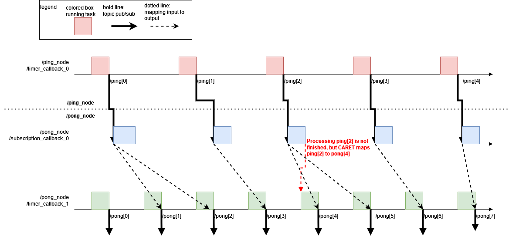
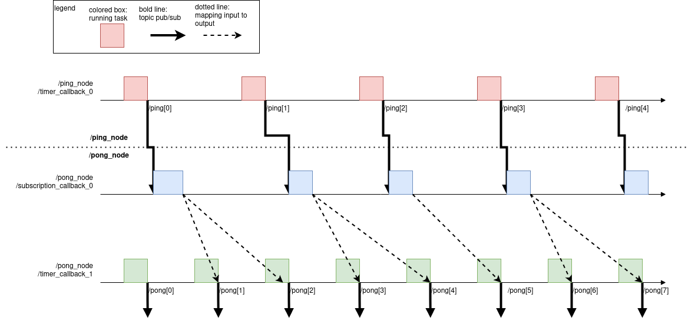

# How to define intra-node data path

In the previous section, you learned how to define inter-node data path. CARET can calculate response time for a simple path using only inter-node data path definition. However, when a target application or path becomes complicated, intra-node-data path needs to be defined as well as inter-node data path.

CARET assume that intra-node data path is mapping of topic subscription and publish in a node. This is not defined simply because the definition depends on implementation.

This section will explain how to find which intra-node data path you have to define, and how to define it.

## Find which intra-node data path to define

Before defining intra-node data path, you have to check whether latency of the target path is calculable. This can be checked with `Path.verify()` method as the following sample code shows.

```python
arch = Architecture('yaml', '/path/to/architecture.yaml')

path = arch.get_path('target_path')
path.verify()
```

Here, `path.verify()` returns `True` if path latency for `path` is calculable. Otherwise, you will confront with warning messages as shown below.

Example 1.

```python
WARNING : 2021-12-20 19:14:03 | Detected "message_contest is None". Correct these node_path definitions.
To see node definition and procedure,execute :
>> check_procedure('yaml', '/path/to/yaml', arch, '/message_driven_node')
message_context: null
node: /message_driven_node
publish_topic_name: /topic3
subscribe_topic_name: /topic2

WARNING : 2021-12-20 19:14:03 | Detected "message_contest is None". Correct these node_path definitions.
To see node definition and procedure,execute :
>> check_procedure('yaml', '/path/to/yaml', arch, '/timer_driven_node')
message_context: null
node: /timer_driven_node
publish_topic_name: /topic4
subscribe_topic_name: /topic3
```

Example 2.

```python
WARNING : 2022-03-18 12:53:54 | 'caret/rclcpp' may not be used in subscriber of '/topic/name'.
```

On the sample warning message of `Example 1`, `/message_driven_node` and `/timer_driven_node` have undefined intra-node data path. You will add the intra-node data path in next step.

On the other message, `Example 2`, the node which subscribes `/topic/name` topic has not compiled with caret/rclcpp.
Please check [here](../recording/build_check.md#how-to-fix).

## Message Context

CARET assumes that node latency is defined as duration from subscription time to publish time. The definition looks simple, but node latency is difficult to define mechanically because some nodes have multiple inputs or multiple outputs.

CARET require users to define **`message_context`** to calculate node latency. One of the following policies is acceptable for `message_context`.

- `use_latest_message`
- `callback_chain`

They have different capability to measure node latency, and the selected `message_context` policy decides how to calculate node latency. However, `message_context` is a little difficult for CARET beginners without any example. The subsequence section introduces an example issue before explaining the policies.

These two policies are not enough to cover the arbitrary node latency, and some implementations have node latency that cannot be measured.
For example, message filter is currently unable to measure.

### Example issue

An example issue on `/ping_node` and `/pong_node` is given as the below figure shows.


Next items are explaining `/ping_node` and `/pong_node`.

- `/ping_node`
  - it transmit messages of `/ping` topic to `/pong_node`
  - it is composed of a single callback function
- `/pong_node`
  - it transmits message of `/pong` topic to another node
  - it is composed of two callback functions; `subscription_callback_0` and `timer_callback_1`
  - it receives messages of `/ping` topic from `/pong_node` via `subscription_callback_0`
  - `subscription_callback_0` shares messages `/ping` topic with `timer_callback_1` via shared variable
  - `timer_callback_1` produces `/pong` with the shared messages
  - `timer_callback_1` runs about 8/5 as frequent as `timer_callback_0`

CARET is concerned which input topic message is mapped to an output message. `message_context` is provided to map input messages to output messages.

### `use_latest_message`

With `use_latest_message` policy, CARET will map a most recent input message to output message. CARET focuses on input and output,but is not concerned structure of node structure. The next figure shows how CARET defines node latency with `use_latest_message` in the example issue.


In the figure, latest messages of `ping` topic is mapped to messages of `/pong` topic mechanically by CARET. It is not still easy to understand with only the block figure, but the provided timing chart below help you to understand what `use_latest_message` is.



In the timing chart, colored boxes represent duration of callback running, and bold lines are message flow of topic message. Dotted lines indicates mapping between input messages and outputs. With `use_latest_message`, CARET assumes that output message is made from the most recent input message. `use_latest_message` is fairly simple and works well in most cases.

In the timing chart, red dotted lines explains a pitfall of `use_latest_message`. Using `use_latest_message` policy, CARET believes that input message, which is not even processed completely, is mapped to output message. For example, CARET interprets that `/pong[4]` is made from `/ping[2]` because `/ping[2]` is the recent input message for `/pong[4]`. However, `subscription_callback_0` is processing `/ping[2]` and does not share it with `timer_callback_1` before publishing `/pong[4]`. You have to tell CARET the node structure when you find such pitfall.

### `callback_chain`

`callback_chain` is introduced for CARET to map input messages to outputs based on inter-operation of multiple callback functions. Input messages are consumed in subscription callbacks and propagated to other nodes. It looks as if input messages passes chains of multiple callbacks to make output messages. With `callback_chain`, CARET take care of input propagation on callbacks and it is helpful to escape the limitation of `use_latest_message` as mentioned above.

Next figure shows how CARET interprets intra-node data path using `callback_chain`. Intra-communication between `subscription_callback_0` and `timer_callback_1` is taken into account for defining intra-node data path. `variable_passings` is a tag used in CARET, and represents such intra-communication.


The following timing chart shows how input messages are mapped to output messages.



CARET maps mechanically messages of `/pong` topic to messages of `/ping` which finish being processed on `subscription_callback_0`. The unexpected behavior of `use_latest_message` is improved by `callback_chain`.

`callback_chain` looks the best choice. However, it has several drawbacks.

- It is not designed for node which have multiple callbacks running at parallel, and response time might be longer than actual
- It is not able to detect actual time when buffered data are consumed because only CARET does not trace user code on ROS 2
- Users are expected to know node structure beforehand

<prettier-ignore-start>
!!! info
    `use_latest_message` and `callback_chain` do not cover all of use cases for CARET. We, CARET development team, continue improvements of intra-node data path definition.
<prettier-ignore-end>

## Define intra-node data path to the Architecture file/object

In order to measure latency in the inter-node data path, the Architecture file must be edited to match the entity of the application to be measured.

There are two ways to define inter-node data path.

1. Directly editing the architecture file with an editor or similar tools
2. Manipulating the Architecture object using the Python API

Both methods will yield the same results as long as it is defined correctly, so define the data path as you prefer.

### Directly editing the file

This section explain how to add intra-node data path definition with editing an architecture file. The example issue above is used for explanation.

#### `use_latest_message`

Next sample description is required for using `use_latest_message` on an architecture file. `use_latest_message` is applied to `/pong_node` in the next sample description. Essential description is extracted in the following snippet, but you will confront with busy YAML file actually rather than the sample.

You have to add `use_latest_message` as `context_types` between targeted subscription and publisher.

```yml
- node_name: /pong_node
  callbacks:
    - callback_name: subscription_callback_0
    - callback_name: timer_callback_1
  publishes:
    - topic_name: /pong
      callback_names:
        - timer_callback_1 # manually added
  subscribes:
    - topic_name: /ping
      callback_name: subscription_callback_0
  message_contexts:
    - context_type: use_latest_message # manually added
      subscription_topic_name: /ping
      publisher_topic_name: /pong
```

#### `callback_chain`

On the other hand, CARET requires users to provide the following description if you apply `callback_chain` to `/pong_node`.

```yml
- node_name: /pong_node
  callbacks:
    - callback_name: subscription_callback_0
    - callback_name: timer_callback_1
  variable_passings:
    - callback_name_write: subscription_callback_0 # manually added
      callback_name_read: timer_callback_1 # manually added
  publishes:
    - topic_name: /ping
      callback_names:
        - timer_callback_1 # manually added
  subscribes:
    - topic_name: /pong
      callback_name: timer_callback_1
  message_contexts:
    - context_type: callback_chain # manually added
      subscription_topic_name: /pong
      publisher_topic_name: /ping
```

User have to fill callback name in `variable_passings`, `publishes`'s `callback_name`. `context_type` must be set as `callback_chain`.
After editing, use path.verify() described in the beginning of this section to verify that it has been set correctly.

### Manipulating the object

CARET serves Python APIs to define intra-node data path.
The following commands enable the `Architecture file editing` done in the previous section to be implemented by Python commands.

All of the following code snippets can be executed after loading an architecture object using the `Architecture('type', 'file_path')` method.
The architecture object whose sub-objects are renamed is saved to a file as explained in [the previous page](./load_and_save.md#save).

#### `use_latest_message`

Using the following Python API to use `use_latest_message` on an architecture object. The examples below follow the previous section.

- You can add a callback to a publisher with `insert_publisher_callback` function in `Architecture` class.

  - As arguments, the target node name, publishing topic name and publisher callback name must be specified.

- You can update `context_types` to `use_latest_message` between targeted subscription and publisher with `update_message_context` function in `Architecture` class.
  - As arguments, the target node name, subscription topic name and publisher topic name must be specified.

```python
# arch is caret_analyze.architecture.architecture.Architecture-based object

arch.insert_publisher_callback('/pong_node', '/pong', 'timer_callback_1')
arch.update_message_context('/pong_node', '/ping', '/pong', 'use_latest_message')
```

As a result of these processes, the data path is defined as `use_latest_message`.
The edited architecture file is output by `arch.export()` function.

If you want to disable the intra-node data path of `use_latest_message`, specify 'UNDEFINED' in the message context using the following Python API.

```python
# arch is caret_analyze.architecture.architecture.Architecture-based object

arch.remove_publisher_callback('/pong_node', '/pong', 'timer_callback_1')
arch.update_message_context('/pong_node', '/ping', '/pong', 'UNDEFINED')
```

#### `callback_chain`

Using the following Python API to use `callback_chain` on an architecture object. The examples below follow the previous section.

- You can add a callback to a publisher with `insert_publisher_callback` function in `Architecture` class.

  - As arguments, the target node name, publishing topic name and publisher callback name must be specified.

- You can add variable passing with `insert_variable_passing` function in `Architecture` class.

  - As arguments, the target node name, write callback name and read callback name must be specified.

- You can update `context_types` to `callback_chain` between targeted subscription and publisher with `update_message_context` function in `Architecture` class.
  - As arguments, the target node name, subscription topic name and publisher topic name must be specified.

```python
# arch is caret_analyze.architecture.architecture.Architecture-based object

arch.insert_publisher_callback('/pong_node', '/pong', 'timer_callback_1')
arch.insert_variable_passing('/pong_node', 'subscription_callback_0', 'timer_callback_1')
arch.update_message_context('/pong_node', '/ping', '/pong', 'callback_chain')
```

As a result of these processes, data path is defined as `callback_chain`.
The edited architecture file is output by `arch.export()` function.

If you want to disable the intra-node data path of `callback_chain`, specify 'UNDEFINED' in the message context using the following Python API.

```python
# arch is caret_analyze.architecture.architecture.Architecture-based object

arch.remove_publisher_callback('/pong_node', '/pong', 'timer_callback_1')
arch.remove_variable_passing('/pong_node', 'subscription_callback_0', 'timer_callback_1')
arch.update_message_context('/pong_node', '/ping', '/pong', 'UNDEFINED')
```

## Handling special cases

### Call `take()` method of `Subscription` object

In ROS 2, it is possible to suppress calling subscription callback upon receiving a topic,
and take a message using `take()` method of `Subscription` object only when the message is needed.
Refer to [the page](https://autowarefoundation.github.io/autoware-documentation/main/contributing/coding-guidelines/ros-nodes/topic-message-handling/#call-take-method-of-subscription-object) to understand the basic concept of the recommended manner.

CARET provides the method to analyze this case with `message_context = use_latest_message`.

When message_context is specified in `use_latest_message` and the subscription callback does not running, the data path is defined as follows:

inter node:

- The inter-node data path is mapped based on the `source_timestamp`, which must match between the publisher side and the subscriber side.
- if `take() == false`(e.g. there are no new messages in the queue), the latest source timestamp is used.

intra node:

- Link the `source_timestamp` of the input message to the `rclcpp_publish` latest to the system time of the output message.

The following timing chart shows how input messages are mapped to output messages.


