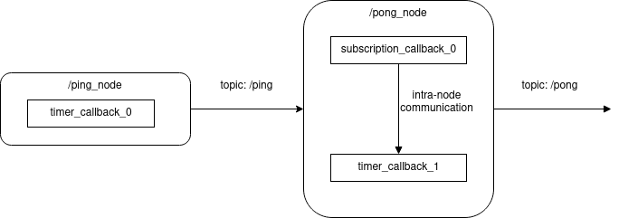

# How to define intra-node data path

In the previous section, you learned how to define inter-node data path. However, response time for path cannot be calculated with only inter-node data path definition. As you will see in the chapter, you have to define intra-node data path.

CARET assume that intra-node data path is duration from topic subscription to topic publish in a node. This is not defined simply because the definition depends on implementation.

This section will explain how to find which intra-node data path you have to define, and how to define it.

## Find which intra-node data path to define

Before defining intra-node data path, you have to check whether latency of the target path is calculable. This can be checked with `Path.verify()` method as the following sample code shows.

```python
arch = Architecture('yaml', '/path/to/architecture.yaml')

path = arch.get_path('target_path')
path.verify()
```

Here, `path.verify()` returns `True` if path latency for `path` is calculable. Otherwise, you will confront with warning messages as shown below.

```python
WARNING : 2021-12-20 19:14:03 | Detected "message_contest is None". Correct these node_path definitions.
To see node definition and procedure,execute :
>> check_procedure('yaml', '/path/to/yaml', arch, '/message_driven_node')
message_context: null
node: /message_driven_node
publish_topic_name: /topic3
subscribe_topic_name: /topic2

WARNING : 2021-12-20 19:14:03 | Detected "message_contest is None". Correct these node_path definitions.
To see node definition and procedure,execute :
>> check_procedure('yaml', '/path/to/yaml', arch, '/timer_driven_node')
message_context: null
node: /timer_driven_node
publish_topic_name: /topic4
subscribe_topic_name: /topic3
```

On the sample warning message, `/message_driven_node` and `/timer_driven_node` have undefined intra-node data path. You will add the intra-node data path in next step.

## Message Context

CARET assumes that node latency is defined as duration from subscription time to publish time. The definition looks simple, but node latency is difficult to define mechanically because some nodes have multiple inputs or multiple outputs.

CARET require users to define **`message_context`** to calculate node latency. One of the following policies is acceptable for `message_context`.

- `use_latest_message`
- `callback_chain`

They have different capability to measure node latency, and the selected `message_context` policy decides how to calculate node latency. However, `message_context` is a little difficult for the beginner of CARET without any example. The subsequence section introduces an example issue before explaining the policies.

### Example issue

An example issue on `/ping_node` and `/pong_node` is given as the below figure shows.



The next items are explaining `/ping_node` and `/pong_node`.

- `/ping_node`
  - it transmit messages of `/ping` topic to `/pong_node`
  - it is composed of a single callback function
- `/pong_node`
  - it transmits message of `/pong` topic to another node
  - it is composed of two callback functions; `subscription_callback_0` and `timer_callback_1`
  - it receives messages of `/ping` topic from `/pong_node` via `subscription_callback_0`
  - `subscription_callback_0` shares messages `/ping` topic with `timer_callback_1` via shared variable
  - `timer_callback_1` produces `/pong` with the shared messages
  - `timer_callback_1` runs about 8/5 as frequent as `timer_callback_0`

CARET is concerned which input topic message is mapped to an output message. `message_context` is provided to map input messages to output messages.

### `use_latest_message`

With `use_latest_message` policy, CARET will map a most recent input message to output message. CARET focuses on input and output,but is not concerned structure of node structure. The next figure shows how CARET defines node latency with `use_latest_message` in the example issue.


In the figure, messages of `ping` topic is mapped to messages of `/pong` topic by CARET. It is not still easy to understand with only the block figure, but the provided timing chart below help you to understand what `use_latest_message` is.


In the timing chart, colored boxes represent duration of callback running, and bold lines are message flow of topic message. Dotted lines indicates mapping between input messages and outputs. With `use_latest_message`, CARET assumes that output message is made from the most recent input message. `use_latest_message` is fairly simple and works well in most cases.

In the timing chart, red dotted lines explains a pitfall of `use_latest_message`. Using `use_latest_message` policy, CARET believes that input message, which is not even processed completely, is mapped to output message. For example, CARET interprets that `/pong[4]` is made from `/ping[2]` because `/ping[2]` is the recent input message for `/pong[4]`. However, `subscription_callback_0` is processing `/ping[2]` and does not share it with `timer_callback_1` before publishing `/pong[4]`. You have to tell CARET the node structure when you find such pitfall.

### `callback_chain`

`callback_chain` is introduced for CARET to map input message to output based on node structure. `callback_chain` is helpful to escape the pitfall of `use_latest_message` as mentioned above.

### Python API

Python API is not implemented so far. Python API support is planned in 2023.

### Architecture file editing

## Limitation

There some limitation in definition of intra-node data path.

- CARET does not know when buffered data is consumed actually because CARET is not able to trace application-level event
- CARET only supports typical cases of intra-node data path so far
  - Possibly, CARET does not support tricky implementation of ROS 2 node
