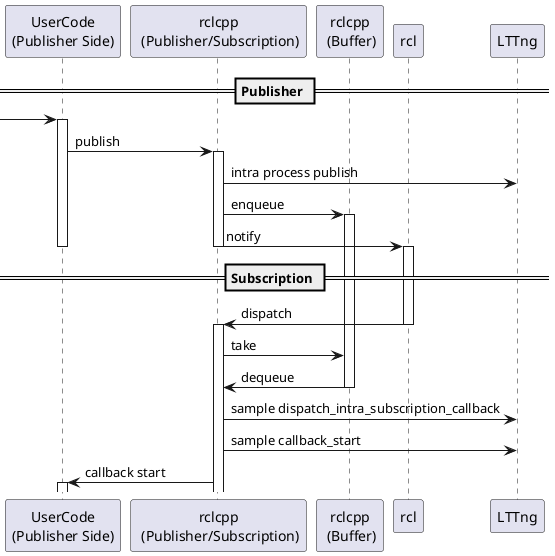
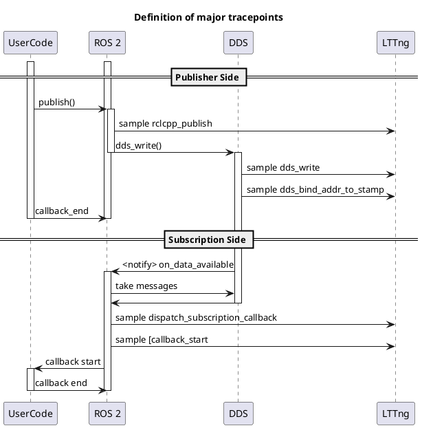

# Communication

Communication latency is an expression of how much time it takes for a topic message to travel from source callback to next callback.

$$
l_{comm} = t_{sub} - t_{pub}
$$

<prettier-ignore-start>
!!! Info
        In this definition, communication latency is affected by the scheduling of callbacks, and includes not only the communication latency of the DDS, but also the delay due to scheduling.
        For example, if multiple callbacks are dispatched simultaneously, the communication latency may include the execution time of other callbacks.
        For more information on scheduling, see [Event and latency_definitions | overview](../index.md#detailed-sequence).
<prettier-ignore-end>

ROS communication is performed by the subscription side for intra-process communication and inter-process communication.
Since ROS communication is capable of many-to-many communication, there are cases where both intra-process and inter-process communication are performed in a single publish.
In CARET, communication is divided into 1:1 pairs and latency is calculated.

## Intra process communication

A simplified sequence diagram focusing only on the relevant data flow is shown below.

`to_dataframe` API returns a table which has the following columns.

| Column                   | Type        | Description             |
| ------------------------ | ----------- | ----------------------- |
| rclcpp_publish_timestamp | System time | Publish time in rclcpp. |
| callback_start_timestamp | System time | Callback start time     |

See also

- [Trace points | rclcpp_intra_publish](../trace_points/runtime_trace_points.md#ros2rclcpp_intra_publish)
- [Trace points | dispatch_intra_process_subscription_callback](../trace_points/runtime_trace_points.md#ros2dispatch_intra_process_subscription_callback)
- [Trace points | callback start](../trace_points/runtime_trace_points.md#ros2callback_start)
- [Trace points | message_construct](../trace_points/runtime_trace_points.md#ros2message_construct)
- [RuntimeDataProvider API](https://tier4.github.io/caret_analyze/latest/infra/#caret_analyze.infra.lttng.lttng.Lttng.compose_intra_proc_comm_records)

## Inter process communication

A simplified sequence diagram focusing only on the relevant data flow is shown below.

`to_dataframe` API returns a table which has the following columns.

| Column                   | Type        | Description             |
| ------------------------ | ----------- | ----------------------- |
| rclcpp_publish_timestamp | System time | Publish time in rclcpp. |
| rcl_publish_timestamp    | System time | Publish time in rcl.    |
| dds_write_timestamp      | System time | Publish time in rmw.    |
| callback_start_timestamp | System time | Callback start time.    |

See also

- [Trace points | message_construct](../trace_points/runtime_trace_points.md#ros2message_construct)
- [Trace points | rclcpp_publish](../trace_points/runtime_trace_points.md#ros2rclcpp_publish)
- [Trace points | rcl_publish](../trace_points/runtime_trace_points.md#ros2rcl_publish)
- [Trace points | dds_write](../trace_points/runtime_trace_points.md#ros2_caretdds_write)
- [Trace points | rclcpp_ring_buffer_enqueue](../trace_points/runtime_trace_points.md#ros2rclcpp_ring_buffer_enqueue)
- [Trace points | rclcpp_ring_buffer_dequeue](../trace_points/runtime_trace_points.md#ros2rclcpp_ring_buffer_dequeue)
- [Trace points | dds_bind_addr_to_addr](../trace_points/runtime_trace_points.md#ros2_caretdds_bind_addr_to_addr)
- [Trace points | dds_bind_addr_to_stamp](../trace_points/runtime_trace_points.md#ros2_caretdds_bind_addr_to_stamp)
- [Trace points | callback start](../trace_points/runtime_trace_points.md#ros2callback_start)
- [Trace points | dispatch_subscription_callback](../trace_points/runtime_trace_points.md#ros2dispatch_subscription_callback)
- [Trace points | rmw_take](../trace_points/runtime_trace_points.md#ros2rmw_take)
- [RuntimeDataProvider API](https://tier4.github.io/caret_analyze/latest/infra/#caret_analyze.infra.lttng.lttng.Lttng.compose_inter_proc_comm_records)
