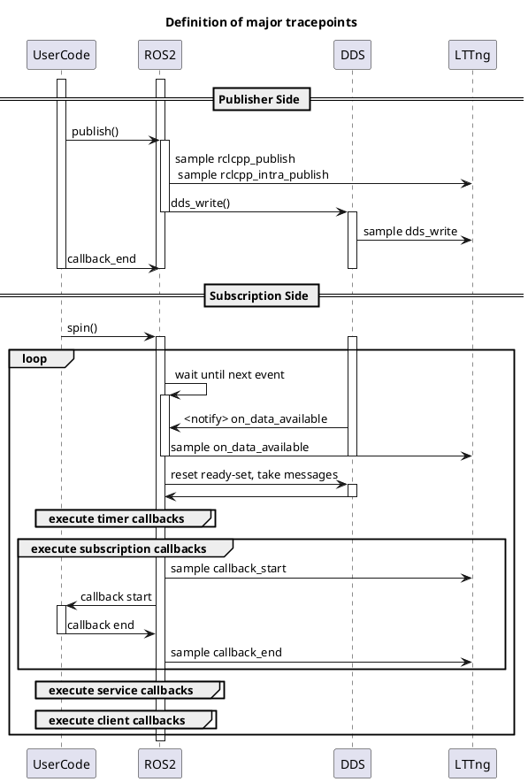

# Latency definition

CARET mainly measures the following

- Callback latency
- Communication latency
- Node latency
- Path latency

The simplified sequence diagram shown below illustrates each definition.

Here, the horizontal axis represents time and the vertical axis represents layers.
The red line represents message flow.
A message is received in the subscription callback and the processed data is published to the next node.
In this way, information is propagated from the sensor node to the actuator node.

CARET samples events for latency calculation. The following three items are main types of the events.

- Callback start
- Callback end
- Publish

Difference of timestamp between two events are corresponded to latency.

For a more detailed definition, see

- [Callback](./callback.md)
- [Communication](./communication.md)
- [Node](./node.md)
- [Path](./path.md)

CARET provides time series data of events through Python objects.
Time series data can be retrieved with the Python objects which have to_dataframe API.
All objects are capable of retrieving time-series data are listed below.

| Target                              | Configuration required? |
| ----------------------------------- | ----------------------- |
| [Path](./path.md)                   | Yes                     |
| [Node](./node.md)                   | Yes                     |
| [Communication](./communication.md) | No                      |
| [Callback](./callback.md)           | No                      |
| [Publisher](./publisher.md)         | No                      |
| [Subscription](./subscription.md)   | No                      |
| [Timer](./timer.md)                 | No                      |

Here, for Path and Node, definitions must be given manually.
For details on setting the definitions, see [Configuration](../../configuration/index.md).

## Detailed Sequence

Below is a detailed sequence diagram of the SingleThreadedExecutor, from publish in the callback to the execution of the subscription callback.

Here, each element indicates the following

- UserCode is a callback
- ROS 2 is rclcpp, rcl, and rmw
- DDS is FastDDS or CycloneDDS
- LTTng is the output destination for tracepoints

Within the spin of Subscription, the executable callbacks are executed sequentially.

In this way, the executor schedules callbacks.
If there are multiple executable callbacks, they are executed sequentially, so other callbacks may have to wait.

<prettier-ignore-start>
!!! Info
      There have been many different proposals for schedulers, and the information provided above may not be up-to-date.
      Please keep in mind that system performance will vary depending on the scheduler you choose.
<prettier-ignore-end>
