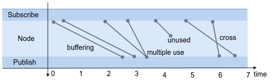

# Node

Node latency is elapsed time from message reception to message transmission in a node.

$$
l_{node} = t_{transfer} - t_{receive}
$$

As transmission is replaced by publish and reception is subscription in the context of ROS 2, the equation is translated into the next one.

$$
l_{node} = t_{pub} - t_{sub}
$$

## Message context

A node receives a message, processes it, and then publishes it to a subsequent node.  
The dependency between the subscribed and published messages is used to define node latency.  
In the following sections explain the message dependency (message context), which is the concept of node latency.

For example, consider the following callback.

```c++
auto subsription_callback = [](&msg){
        msg_ = f(msg);
        pub.publish(msg_);
}
```

In this case, the received message is processed and published immediately.  
The dependency of the message at this time is described in chronological order and is expressed as follows.


Here, the elapsed time from subscription to publish is defined as node latency.  
In this way, node latency can be calculated when message dependencies are defined.

In the previous example, we presented a case where a node is subscribed and immediately published.
Actually, the message context can be quite complex because data processing in a node is freely defined by application developers.



Examples of complex message context are described below.

- Buffered, for example, is a buffer delay process.
- Multiple inputted is for moving average processing, for example. There are multiple candidates for node latency.
- Unused is a message that has not been published and has not been used. This is evaluated as a kind of message drop.
- Crossed can occur in cases where messages are retrieved based on the timestamp of the message rather than the system time.

In any of those cases, it is difficult to automatically determine the message context.

the message context are given for some cases of them as shown in configuration.
For more information, see [Configuration](../../configuration/index.md) for details.

To enlarge coverage the others of complex cases, we are considering a mechanism to allow users to describe message dependencies in their user codes.
[TILDE](../software_architecture/tilde.md) is one of good candidates to achieve it.
