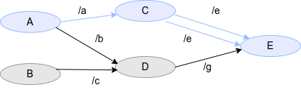

# Path

Path latency is sum of node latency and communication latency included in a certain path.
Path represents data flow which is constructed of multiple nodes connected each other.

$$
l_{path} = \sum_{\in path} l_{node} + \sum_{\in path} l_{comm} \\
l_{node} = t_{pub} - t_{sub} \\
l_{comm} = t_{sub} - t_{pub} \\
$$

In CARET, the path is defined as `[node_name]-[topic_name]-... -[topic_name]-[node_name]`.  
For example, in the following case, the path definition is `[A]-[/a]-[C]-[/e]-[E]`.


<prettier-ignore-start>
!!! Info
    In the above definition, the star time of the latency is publish of the initial node and the end time of the latency is subscription of the last node.
    When trying to measure a actual system, it is desirable to be able to define various start and end times depending on the implementation.
    For example, the start time might be more appropriately a stamp value in the sensor message.
    It's current issue to support for such more precise latency.
<prettier-ignore-end>

## Definition in Architecture file

Strictly speaking, the Architecture file describes the path for each node as follows.

```yaml
named_paths:
  - path_name: target
    node_chain:
      - node_name: /A
        publish_topic_name: /a
        subscribe_topic_name: UNDEFINED
      - node_name: /C
        publish_topic_name: /e
        subscribe_topic_name: /a
      - node_name: /E
        publish_topic_name: UNDEFINED
        subscribe_topic_name: /e
```

Cases where the same node subscribes to the same topic as shown below are currently not supported.


