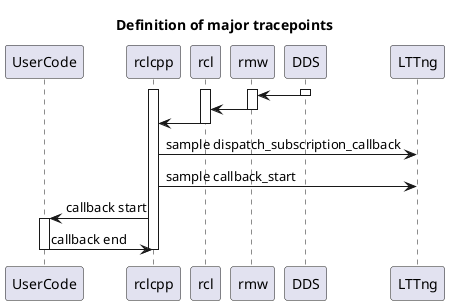
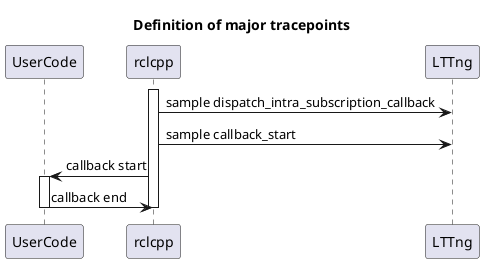

# Subscription

Topic message is received by subscription via inter-process communication or intra-process one.
Then, `Subscription` object has common data fields, but different value is filled in `source_timestamp` field.

## Inter process communication

A simplified sequence diagram focusing only on the relevant events is shown below.

`to_dataframe` API returns a table which has the following columns.

| Column                   | Type           | Description                                            |
| ------------------------ | -------------- | ------------------------------------------------------ |
| callback_start_timestamp | System time    | Callback start time                                    |
| message_timestamp        | Message data   | Time of header.stamp. Zero when header is not defined. |
| source_timestamp         | Depends on DDS | Timestamp to used for binding with subscription.       |

See also

- [Subscription API](https://tier4.github.io/caret_analyze/latest/infra/#caret_analyze.infra.lttng.records_provider_lttng.RecordsProviderLttng.subscribe_records)
- [Trace points | dispatch_subscription_callback](../trace_points/runtime_trace_points.md#ros2dispatch_subscription_callback)
- [Trace points | rmw_take](../trace_points/runtime_trace_points.md#ros2rmw_take)
- [Trace points | callback_start](../trace_points/runtime_trace_points.md#ros2callback_start)

## Intra process communication

`to_dataframe` API returns a table which has the following columns.

| Column                   | Type                      | Description                                            |
| ------------------------ | ------------------------- | ------------------------------------------------------ |
| callback_start_timestamp | System time               | Callback start time                                    |
| message_timestamp        | Message data              | Time of header.stamp. Zero when header is not defined. |
| source_timestamp         | Depends on DDS (Optional) | NaN.                                                   |

See also

- [Subscription API](https://tier4.github.io/caret_analyze/latest/infra/#caret_analyze.infra.lttng.records_provider_lttng.RecordsProviderLttng.subscribe_records)
- [Trace points | rclcpp_ring_buffer_dequeue](../trace_points/runtime_trace_points.md#ros2rclcpp_ring_buffer_dequeue)
- [Trace points | dispatch_intra_process_subscription_callback](../trace_points/runtime_trace_points.md#ros2dispatch_intra_process_subscription_callback)
- [Trace points | callback_start](../trace_points/runtime_trace_points.md#ros2callback_start)
