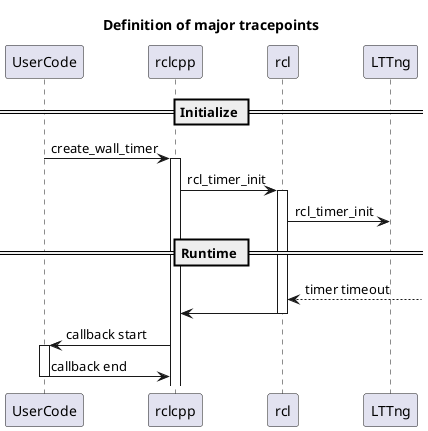

# Timer

Timer provides the time at which the Timer callback timeout and related information.

A simplified sequence diagram focusing only on the relevant events is shown below.

`to_dataframe` API returns a table which has the following columns.

| Column                   | Type        | Description         |
| ------------------------ | ----------- | ------------------- |
| timer_event_timestamp    | System time | Timer timeout.      |
| callback_start_timestamp | System time | Callback start time |
| callback_end_timestamp   | System time | Callback end time   |

Here, the timer firing time is calculated by the following,

$$
t_{timeout} = t_{init} + n \times t_{period}
$$

See also

- [Timer API](https://tier4.github.io/CARET_analyze/latest/infra/#caret_analyze.infra.lttng.records_provider_lttng.RecordsProviderLttng.timer_records)
- [Trace point | callback_start](../trace_points/runtime_trace_points.md#ros2callback_start)
- [Trace point | callback_end](../trace_points/runtime_trace_points.md#ros2callback_end)
- [Trace point | rcl_timer_init](../trace_points/initialization_trace_points.md#ros2rcl_timer_init)
