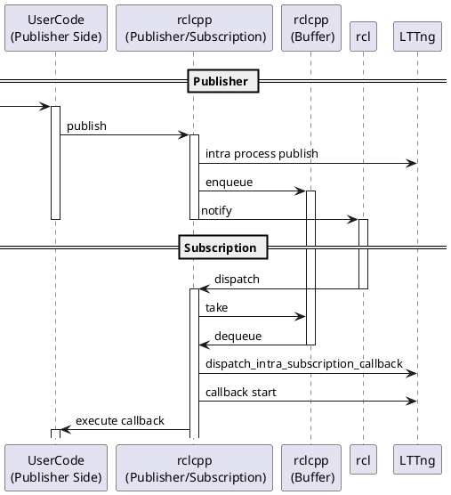
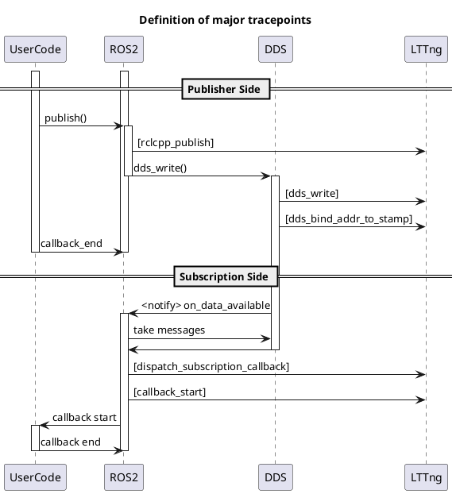

# Communication

The communication latency is the time difference between the time the message is passed from the ownership of the callback to the next callback.

$$
l_{comm} = t_{receive} - t_{transfer}
$$

In particular, if transfer of ownership is publish and receive of ownership is subscribe, it is defined as follows

$$
l_{comm} = t_{sub} - t_{pub}
$$

<prettier-ignore-start>
!!! Info
        In this definition, communication latency is now affected by scheduling.
        It is not only the communication latency of the DDS.
        If multiple callbacks can be executed at the same time, it may include the execution time of other callbacks.
        For more information on scheduling, see [Latency Definition | Overview](. /latency_definitions/index.md#detailed-sequence).
<prettier-ignore-end>

<prettier-ignore-start>
!!! Info
        You may think that the definition of communication latency is complicated.
        The reason for defining it based on callback ownership is that this same definition will apply to future latency calculations involving tf.
        Even when CARET supports latency where information is exchanged other than publish-subscribe, the responsibility of the node developer is the node and the callback is the implementation.
        In order to provide latency based on the scope of responsibility, CARET uses this definition.
<prettier-ignore-end>

ROS communication is performed by the subscription side for intra-process communication and inter-process communication.
Since ROS communication is capable of many-to-many communication, there are cases where both intra-process and inter-process communication are performed in a single publish.
In CARET, communication is divided into 1:1 pairs and latency is calculated.

## Intra process communication

A simplified sequence diagram focusing only on the relevant data flow is shown below.

`to_dataframe` API returns following columns.

| Column                   | Type        | Description             |
| ------------------------ | ----------- | ----------------------- |
| rclcpp_publish_timestamp | System time | Publish time in rclcpp. |
| callback_start_timestamp | System time | Callback start time     |

See also

- [Trace points | rclcpp_intra_publish](../trace_points/runtime_trace_points.md#ros2rclcpp_intra_publish)
- [Trace points | dispatch_intra_process_subscription_callback](../trace_points/runtime_trace_points.md#ros2dispatch_intra_process_subscription_callback)
- [Trace points | callback start](../trace_points/runtime_trace_points.md#ros2callback_start)
- [Trace points | message_construct](../trace_points/runtime_trace_points.md#ros2message_construct)
- [RuntimeDataProvider API](https://tier4.github.io/CARET_analyze/latest/infra/#caret_analyze.infra.lttng.lttng.Lttng.compose_intra_proc_comm_records)

## Inter process communication

A simplified sequence diagram focusing only on the relevant data flow is shown below.

`to_dataframe` API returns following columns.

| Column                   | Type        | Description             |
| ------------------------ | ----------- | ----------------------- |
| rclcpp_publish_timestamp | System time | Publish time in rclcpp. |
| rcl_publish_timestamp    | System time | Publish time in rcl.    |
| dds_write_timestamp      | System time | Publish time in rmw.    |
| callback_start_timestamp | System time | Callback start time.    |

See also

- [Trace points | message_construct](../trace_points/runtime_trace_points.md#ros2message_construct)
- [Trace points | rclcpp_publish](../trace_points/runtime_trace_points.md#ros2rclcpp_publish)
- [Trace points | rcl_publish](../trace_points/runtime_trace_points.md#ros2rcl_publish)
- [Trace points | dds_write](../trace_points/runtime_trace_points.md#ros2_caretdds_write)
- [Trace points | bind_addr_to_addr](../trace_points/runtime_trace_points.md#ros2_caretdds_bind_addr_to_addr)
- [Trace points | bind_addr_to_stamp](../trace_points/runtime_trace_points.md#ros2_caretdds_bind_addr_to_stamp)
- [Trace points | callback start](../trace_points/runtime_trace_points.md#ros2callback_start)
- [Trace points | dispatch_subscription_callback](../trace_points/runtime_trace_points.md#ros2dispatch_subscription_callback)
- [RuntimeDataProvider API](https://tier4.github.io/CARET_analyze/latest/infra/#caret_analyze.infra.lttng.lttng.Lttng.compose_inter_proc_comm_records)
