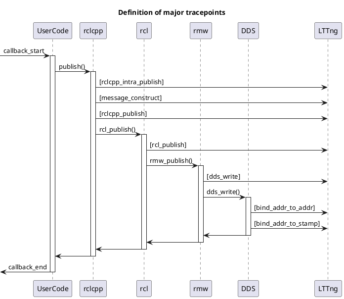

# Publisher

The Publisher provides the time and relevant information when publishing.

A simplified sequence diagram focusing only on the relevant data flow is shown below.

`to_dataframe` API returns following columns.

| Column                         | Type                      | Description                                                   |
| ------------------------------ | ------------------------- | ------------------------------------------------------------- |
| rclcpp_publish_timestamp       | System time               | min(rclcpp_intra_publish_timestamp, rclcpp_publish_timestamp) |
| rclcpp_intra_publish_timestamp | System time (Optional)    | Publish time of intra-process communication                   |
| rclcpp_publish_timestamp       | System time (Optional)    | Publish time of inter-process communication in rclcpp         |
| rcl_publish_timestamp          | System time(Optional)     | Publish time of inter-process communication in rcl            |
| dds_write_timestamp            | System time(Optional)     | Publish time of inter-process communication in rmw            |
| message_timestamp              | Message data              | Time of header.stamp. Zero when header is not defined.        |
| source timestamp               | Depends on DDS (Optional) | Timestamp to used for binding with subscription.              |

See also

- [Trace points | rclcpp_intra_publish](../trace_points/runtime_trace_points.md#ros2rclcpp_intra_publish)
- [Trace points | message_construct](../trace_points/runtime_trace_points.md#ros2message_construct)
- [Trace points | rclcpp_publish](../trace_points/runtime_trace_points.md#ros2rclcpp_publish)
- [Trace points | rcl_publish](../trace_points/runtime_trace_points.md#ros2rcl_publish)
- [Trace points | dds_write](../trace_points/runtime_trace_points.md#ros2_caretdds_write)
- [Trace points | bind_addr_to_addr](../trace_points/runtime_trace_points.md#ros2_caretdds_bind_addr_to_addr)
- [Trace points | bind_addr_to_stamp](../trace_points/runtime_trace_points.md#ros2_caretdds_bind_addr_to_stamp)
