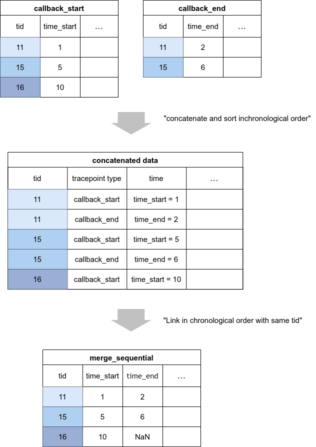

# Record Object

In CARET, trace data is stored in tables, and latency calculation is performed by processing the tables.
In addition to general table join processing, CARET defines classes which has originally defined join processing for latency calculation.

This sections describes Record object which stores trace data and latency is.

The rest of this section describes the main APIs provided by the record object.

- merge
- merge_sequential
- merge_sequential_for_addr_track
- to_dataframe

## merge

This is an inner join and outer join of general tables.
In particular, it is used to join initialization-related trace data that can be bound by address only.

See also

- [API:merge](https://tier4.github.io/CARET_analyze/latest/record/#caret_analyze.record.interface.RecordsInterface.merge)

## merge_sequential

This is a chronological merge.
It is especially used to merge sequential processing by threads.

CARET mainly performs this merging and calculates latency.

See also

- [API:merge](https://tier4.github.io/CARET_analyze/latest/record/#caret_analyze.record.interface.RecordsInterface.merge_sequential)

## merge_sequential_for_addr_track

This merge is used when binding is done based on addresses and copying occurs in the middle of the process.

See also

- [API:merge_sequential_for_addr_track](https://tier4.github.io/CARET_analyze/latest/record/#caret_analyze.record.interface.RecordsInterface.merge_sequential_for_addr_track)

<prettier-ignore-start>
!!!warning
    This merge is slow and causes inconsistencies when nodes not using caret-rclcpp are published.
    As much as possible, trace points should be designed so that merge_sequential is sufficient.
<prettier-ignore-end>

## to_dataframe

Function to convert to a pandas.DataFrame.
This is especially useful for unique visualization and evaluation by developers.
