# Runtime recording

As explained in [Tracepoint section](../trace_points/index.md), CARET records meta-information at initialization and reduces tracepoint data as much as possible at runtime.
This allows for a low overhead at runtime, but recording including meta-information requires a LTTng session before running the application.

CARET requires a set of recorded data to have meta-information and timestamps on events.  
To allow users to start session anytime when they want, CARET stores meta-information into disk when recording session starts. To stop and restart recording session, CARET holds meta-information on memory until a target application is terminated.

This section explains the details of runtime recording feature.

See also:

- [Software architecture | caret_trace](../software_architecture/caret_trace.md)

## Basic idea

Runtime recording is a feature that holds initialization information on memory and stores it to trace data after recording session starts. It let user start recording session anytime.

For this feature, each tracepoint has three states as below.

- WAIT state
  - Obtain information on running applications and store trace data in memory.
- PREPARE state
  - Record stored trace data as LTTng tracepoints (delayed recording).
- RECORD state
  - Record runtime trace data as LTTng trace points (synchronous recording).

A dedicated-node, named as trace node, is executed per ROS 2 process to manage the state.
A trace node is executed on a dedicated thread along with threads for ordinary nodes.
It is created when application is launched.

<prettier-ignore-start>
!!! Notice
    A trace node runs on a thread created via function hooking. This thread is created even if a ROS 2 process is not implemented with `rclcpp`.
    A trace node thread is created if a ROS 2 process is implemented with `rclpy`, and it control the states as well. Though the trace node runs on a Python-based node, recording events for the node is not performed correctly. Only initialization tracepoints are recorded.
    Python serves Global Interpreter Lock (GIL) mechanism, but a trace node runs on a asynchronous thead which is not blocked by GIL.
<prettier-ignore-end>

Typical use cases are shown as follows.

```bash
# Run a node at Terminal 0 first.
ros2 run pkg node
```

```bash
# Execute "record" command with Termial 1 after node startup.
ros2 caret record
```

State transition is shown below.

```plantuml
concise "Terminal 0" as User0
concise "Terminal 1" as User1
concise "trace node state" as Hook
concise "LTTng session" as Lttng

@0
User0 is "Idle"
User1 is "Idle"
Hook is "Idle"
Lttng is "Idle"

@2
User0 is "ros2 run pkg node"
Hook is WAIT : \nStore initialization \ntracepoints into memory\n.
User0 -> Hook

@6
User1 is "ros2 caret record"
Hook is PREPARE : Record stored \ninitialization tracepoints
User1 -> Hook : Start recording \n[ /caret/start_record ]\n\n
User1 -> Lttng
Lttng is "Active"

@10
Hook is RECORD : Record initialization \nand runtime tracepoints
Hook -> User1 : Notify state transition \n[ /caret/status ]\n

@15
User1 is "Idle"
Hook is WAIT
User1 -> Hook : End recording \n[ /caret/end_record ]\n\n
User1 -> Lttng
Lttng is "Destroyed"
```

Refer to the sequence diagram is written in [Sequence](#sequence) for further details.

A trace node has a topic-based interface as well as an ordinary ROS 2 node.
Topic message is used to get state from a trace node or change state of it.

Besides, to maintain compatibility of conventional usage,
CARET is able to record meta-information and runtime events when session has started in advance.

```plantuml
concise "Terminal 0" as User0
concise "trace node state" as Hook
concise "Terminal 1" as User2
concise "LTTng" as Lttng

@0
User0 is ""
User2 is ""
Hook is ""
Lttng is "idle"

@3
User2 is "ros2 caret trace"
User2 -> Lttng : Start session\n
Lttng is "Active"

@5
User0 is "launch"
Hook is RECORD : Record initialization and runtime tracepoints
User0 -> Hook


@15
User2 is ""
User2 -> Lttng : Destroy session\n
Lttng is "Destroyed"

```

Note that meta-information is recorded in each LTTng session.

The following state diagram shows state machine of the three states

```plantuml
[*] --> RECORD: An active lttng session exists
[*] --> WAIT: No active lttng session exists
WAIT : Stores initialization trace data in memory
PREPARE : Record initialization trace data with LTTng
WAIT --> PREPARE :Start recording

RECORD --> WAIT : End recording
PREPARE --> RECORD : Finished recording stored initialization trace data
RECORD : Record initialization and runtime trace data with LTTng
```

Refer to [Status](#state-definition) for further details of the state machine.

## Multi-host system

On multi-host system, typical use cases are shown as follows.

```bash
# Run a node at Terminal 0-0 on Host 0.
ros2 run pkg0 node0
```

```bash
# Run a node at Terminal 1-0 on Host 1.
ros2 run pkg1 node1
```

```bash
# Execute "record" command with Termial 0-1 on Host 0.
ros2 caret record
```

```bash
# Execute "record" command with Termial 1-1 on Host 1.
ros2 caret record
```

State transition is shown below.

```plantuml
concise "Terminal 0-0 on Host 0" as User0_0
concise "Terminal 0-1 on Host 0" as User0_1
concise "Terminal 1-0 on Host 1" as User1_0
concise "Terminal 1-1 on Host 1" as User1_1
concise "trace node state on Host 0" as Hook0
concise "LTTng session on Host 0" as Lttng0
concise "trace node state on Host 1" as Hook1
concise "LTTng session on Host 1" as Lttng1

@0
User0_0 is "Idle"
User0_1 is "Idle"
Hook0 is "Idle"
Lttng0 is "Idle"
User1_0 is "Idle"
User1_1 is "Idle"
Hook1 is "Idle"
Lttng1 is "Idle"

@2
User0_0 is "ros2 run pkg0 node0"
Hook0 is WAIT
User0_0 -> Hook0

@3
User1_0 is "ros2 run pkg1 node1"
Hook1 is WAIT
User1_0 -> Hook1

@5
User0_1 is "ros2 caret record"
Hook0 is PREPARE
User0_1 -> Hook0 : Start recording \n[ /caret/start_record ]\n\n\n\n
User0_1 -> Lttng0
Lttng0 is "Active"
User0_1 -> Hook1

@7
Hook0 is RECORD
Hook0 -> User0_1 : Notify state transition \n[ /caret/status ]

@9
User1_1 is "ros2 caret record"
Hook1 is PREPARE
User1_1 -> Hook1 : Start recording \n[ /caret/start_record ]\n\n\n\n
User1_1 -> Lttng1
Lttng1 is "Active"
User1_1 -> Hook0

@11
Hook1 is RECORD
Hook1 -> User1_1
Hook1 -> User0_1 : Notify state transition \n[ /caret/status ]\n

@16
User0_1 is "Idle"
Hook0 is WAIT
User0_1 -> Hook0 : End recording \n[ /caret/end_record ]\n\n\n\n\n\n
User0_1 -> Lttng0
User0_1 -> Hook1
Lttng0 is "Destroyed"

@17
User1_1 is "Idle"
Hook1 is WAIT
User1_1 -> Hook1 : End recording \n[ /caret/end_record ]\n\n\n\n\n\n
User1_1 -> Lttng1
User1_1 -> Hook0
Lttng1 is "Destroyed"
```

Please note that "Start recording" and "Stop recording" are sent to all trace nodes regardless of its host since it is topic messages. To prevent state transitions by messages from other hosts, trace node ignores messages as follows.

- Ignore "Start recording" when no active LTTng session exists.
- Ignore "Start recording" when its state is not WAIT.
- Ignore "End recording" when an active LTTng session exists.

## Topic

Runtime recording uses the following topic messages.

| topic name            | message type | role                                          |
| --------------------- | ------------ | --------------------------------------------- |
| `/caret/start_record` | Start.msg    | Start recording. Transition to PREPARE state. |
| `/caret/end_record`   | End.msg      | End recording. Transition to WAIT state.      |
| `/caret/status`       | Status.msg   | Sync current recording state.                 |

### Start.msg

```cpp
uint32 recording_frequency 100
string ignore_nodes  # reserved
string ignore_topics # reserved
string select_nodes  # reserved
string select_topics # reserved
```

CARET records sets of meta-information to a LTTng ring-buffer one by one rather than tries to store those meta-information at once.
CARET serves a parameter, `recording_frequency`, to control velocity to record meta-information.
`recording_frequency` is frequency at which each process records meta-information. It decides how many sets of meta-information is stored to the ring-buffer per second.
If the frequency is higher, it costs less time to complete meta-information recording, but possibility of tracer discarded is higher.

`ignore_nodes` `ignore_topics` `select_nodes`, and `select_topics` are unused fields for the future implementation.
They are reserved fields for setting [tracepoint filtering](./tracepoint_filtering.md) at the start of the measurement from CLI.

<prettier-ignore-start>
!!!Info
    Another method to avoid tracer discarded is writing meta-information with [blocking mode](https://lttng.org/blog/2017/11/22/lttng-ust-blocking-mode/). LTTng serves a function to apply blocking mode to chosen events, and chosen events are written to disks exactly. Blocking mode will reduce occurrence of data loss. In this moment, `recording_frequency` is introduced to mitigate data loss because range of influence on implementation is smaller than blocking mode.
<prettier-ignore-end>

### Status.msg

```cpp
int8 UNINITIALIZED=0
int8 WAIT=1
int8 PREPARE=2
int8 RECORD=3

string caret_node_name
int8 status
string[] node_names # reserved
int64 pid # reserved
```

A trace node name is given to `caret_node_name` field.

`status` is the WAIT, PREPARE, or RECORD status.

`node_names` field is unused in the present, it will be utilized by a future function.
It is a reserved field to represent a list of node names managed by the trace node.

`pid` field is also unused because it will be used for an unimplemented feature.
It is a reserved field to represent the process ID.

### End.msg

```cpp
(Empty)
```

The End topic is for notification, so its contents are empty.

## State definition

A detailed state transition is shown below.

```plantuml
[*] --> WAIT: No active lttng session exists
[*] --> RECORD: An active lttng session exists
WAIT : Stores initialization trace data in memory
WAIT --> PREPARE : [/caret/start_record] with \nactive LTTng session

PREPARE : Record initialization trace data with LTTng
PREPARE --> RECORD : Finished recording stored initialization trace data
PREPARE -[dotted]-> WAIT : [/caret/end_record] without \nactive LTTng session

RECORD : Record initialization and runtime trace data with LTTng
RECORD --> WAIT : [/caret/end_record] without \nactive LTTng session
```

### WAIT

| item                               | description                                                                                                                                   |
| ---------------------------------- | --------------------------------------------------------------------------------------------------------------------------------------------- |
| Transition conditions for entering | - Start application with no active LTTng session. <br> - Receive messages from `/caret/end_record` topic when no active LTTng session exists. |
| Transition conditions for exiting  | - Receive messages from `/caret/start_record` topic when an active LTTng session exists.                                                      |
| Initialization trace point         | - Store in memory. <br> - Record as LTTng tracepoint (synchronous recording).                                                                 |
| Runtime trace data                 | - Discard.                                                                                                                                    |

### PREPARE

| item                               | description                                                                                                                                                  |
| ---------------------------------- | ------------------------------------------------------------------------------------------------------------------------------------------------------------ |
| Transition conditions for entering | - Receive messages from `/caret/start_record` topic when current state is WAIT and active LTTng session exists.                                              |
| Transition conditions for exiting  | - Receive messages from `/caret/end_record` topic when no active LTTng session exists. <br> - Finish recording stored initialization trace data.             |
| Initialization trace data          | - Record as LTTng tracepoint (synchronous recording). <br> - Record stored data as LTTng tracepoint at fixed frequency from trace nodes (delayed recording). |
| Runtime trace data                 | - Discard to prevent discarding initialization trace data.                                                                                                   |

Velocity of storing initialization trace data to a LTTng's ring buffer is adjusted with `recording_frequency` in `Start.msg`.

<prettier-ignore-start>
!!!Info
    Initialization trace data are recorded synchronously in all states. In the PREPARE state, the same data are also recorded from trace nodes with delay.
    In this way, Initialization trace data are recorded as much as possible, even if the LTTng session and the application are started in the opposite order.
    Especially in the PREPARE state, there are two types of recording: synchronous recording and delayed recording from trace nodes.
    Therefore, the same data may be stored in duplicate. Duplicate data are handled on the CARET_analyze side.
<prettier-ignore-end>

### RECORD

| item                               | description                                                                                              |
| ---------------------------------- | -------------------------------------------------------------------------------------------------------- |
| Transition conditions for entering | - Start application with active LTTng session. <br> - Finish recording stored initialization trace data. |
| Transition conditions for exiting  | - Receive messages from `/caret/end_record` topic when no active LTTng session exists.                   |
| Initialization trace data          | - Record as LTTng tracepoint (synchronous recording).                                                    |
| Runtime trace data                 | - Record as LTTng tracepoint (synchronous recording).                                                    |

## Sequence

Details of the sequence diagram are shown below.

```bash
# Run a node at Terminal 0 first.
ros2 run pkg node
```

```bash
# Execute "record" command with Termial 1 after node startup.
ros2 caret record
```



```plantuml
@startuml
box Process #Azure
  participant "CLI Node" as CLI
end box

box Process #Azure
participant "Caret Node" as CARET
participant "DataContainer" as Data
participant "Application Node" as APP
end box
participant "LTTng" as LTTNG

activate Data
activate APP

APP -> APP : Initialize
activate APP
APP ->X LTTNG : Record initialization-\ntrace points data \n(synchronous recording).
APP -> Data : Store initialization-\ntrace points data.
note over LTTNG
    Initialization trace data are recorded
    if an active LTTng session exists.
end note
deactivate APP

== Start recording ==

-> CLI
activate CLI
CLI -> LTTNG : Start LTTng session
activate LTTNG
CLI -> CARET : Start message \n[/caret/start_record] \n(PENDING state)
activate CARET


CARET -> CARET : Transition to PREPARE state　\nstart timer callback
activate CARET
CARET --> CLI : Status message \n[/caret/status]  \n(PREPARE state)


loop Until recording end.
  CARET -> Data : Record
  activate Data
  Data -> LTTNG : Record initialization-\ntrace data \n(delayed recording).
  deactivate Data
  note over LTTNG
    Initialization trace data
    are recorded during PREPARE state.
   end note
end

CARET --> CLI : Status message \n[/caret/status] \n(RECORDING state)

CARET -> CARET : Transition to RECORD state \ncancel timer callback
deactivate CARET

APP -> APP : Runtime event \n(e.g. callback start)
activate APP
APP -> LTTNG: Record runtime trace data
note over LTTNG
    Runtime trace data are
    recorded during RECORD state
end note

deactivate APP

== End recording ==
CLI -> LTTNG : Stop & destroy LTTng session
deactivate LTTNG
CLI -> CARET : End message \n[/caret/end_record]
activate CARET
CARET -> CARET : Transition to WAIT state
deactivate CARET
CARET --> CLI : Send message
deactivate CARET
<-- CLI
deactivate CLI
@enduml
```

## Sequence (multi-host system)

Details of the sequence diagram on multi-host system are shown below.

```bash
# Run a node at Terminal 0-0 on Host 0.
ros2 run pkg0 node0
```

```bash
# Run a node at Terminal 1-0 on Host 1.
ros2 run pkg1 node1
```

```bash
# Execute "record" command with Termial 0-1 on Host 0.
ros2 caret record
```

```bash
# Execute "record" command with Termial 1-1 on Host 1.
ros2 caret record
```


## Tracepoint

Runtime recording feature has delayed recording which supports recording activation anytime after a target application launches. As a timestamp is given when event is recorded, that for initialization trace point is different from actual time when the trace point is called.
It is inconvenient for analysis script provided by `CARET_analyze` because it utilizes invocation time of the initialization trace point. For example, expected time when timer callback is invoked is calculated from initialization time and a given period. If only recording time is given, the expected time cannot be calculated correctly.

To tackle this inconvenience, all initialization trace points have timestamps given respectively when they are called during launch of a target application.

```cpp
[ros2:rcl_timer_init] (-> [ros2_caret:rcl_timer_init])

(context)
time (time that a lttng tracepoint is called.)
...

(tracepoint data)
void * timer_handle
int64_t period
int64_t init_timestamp (timestamp given when trace point is called during )
```

`init_timestamp` is an added argument which has original time when initialization trace point is invoked.
As the prefix of `ros2:` is for `ros2_tracing`, `ros2_caret` is prefix for representing trace points for CARET.
