# Runtime recording

As explained in [Tracepoint section](../trace_points/index.md), CARET records meta-information at initialization and reduces tracepoint data to as much as possible at runtime.
This allows for a low overhead at runtime, but recording including meta-information requires a LTTng session before running the application.

In actual operation, though, it is often desirable to start recording during executions.

Therefore, CARET stores meta-information in memory,
and record the meta-information at the start of recording.

This session explains the details of runtime recording feature.

See also:

- [Software architecture | caret_trace](../software_architecture/caret_trace.md)

## Overview

The runtime recording is a feature that stores initialization information in memory and records it to trace data after measurement starts, enabling recording even during execution.

This function consists of the following states

- WAIT state
  - Obtain information on running applications and store trace data in memory.
- PREPARE state
  - Record stored trace data as LTTng tracepoints (delayed recording).
- RECORD state
  - Record runtime trace data as LTTng trace points (synchronous recording).

These states are controlled by nodes (trace node) running in an independent thread.
trace nodes run in each process.

<prettier-ignore-start>
!!! Notice
    The thread on which a trace node runs is created via function hooking.
    This thread is created even if the Application is not implemented by rclcpp.
    This allows runtime recording as well for nodes implemented in rclpy. (Note for it cannot record runtime trace data correctly.)
    Although python has a Global Interpreter Lock (GIL) mechanism,
    it runs as an asynchronous thread that does not even get a GIL.
<prettier-ignore-end>

Typical use cases are as follows.

```bash
# Run a node at Terminal 0 first.
ros2 run pkg node
```

```bash
# Execute "record" command with Termial 1 after node startup.
ros2 caret record
```

State transition is shown below.

```plantuml
concise "Terminal 0" as User0
concise "Terminal 1" as User1
concise "trace node state" as Hook
concise "LTTng session" as Lttng

@0
User0 is "Idle"
User1 is "Idle"
Hook is "Idle"
Lttng is "Idle"

@2
User0 is "ros2 run pkg node"
Hook is WAIT : \nStore initialization \ntracepoints into memory\n.
User0 -> Hook

@6
User1 is "ros2 caret record"
Hook is PREPARE : Record stored \ninitialization tracepoints
User1 -> Hook : Start recording \n[ /caret/start_record ]\n\n
User1 -> Lttng
Lttng is "Active"

@10
Hook is RECORD : Record initialization \nand runtime tracepoints
Hook -> User1 : Notify state transition \n[ /caret/status ]\n

@15
User1 is "Idle"
Hook is WAIT
User1 -> Hook : End recording \n[ /caret/end_record ]\n\n
User1 -> Lttng
Lttng is "Destroyed"
```

A detailed sequence diagram is written in [Sequence](#sequence).

Trace nodes uses topic communication for control and notification.

In addition, to maintain compatibility of usage,
in cases where sessions are started in advance, they can record correctly.

```plantuml
concise "Terminal 0" as User0
concise "trace node state" as Hook
concise "Terminal 1" as User2
concise "LTTng" as Lttng

@0
User0 is ""
User2 is ""
Hook is ""
Lttng is "idle"

@3
User2 is "ros2 caret trace"
User2 -> Lttng : Start session\n
Lttng is "Active"

@5
User0 is "launch"
Hook is RECORD : Record initialization and runtime tracepoints
User0 -> Hook


@15
User2 is ""
User2 -> Lttng : Destroy session\n
Lttng is "Destroyed"

```

Note that Initialization trace data is recorded for each LTTng session.

The main state transitions are shown below.

```plantuml
[*] --> RECORD: An active lttng session exists
[*] --> WAIT: No active lttng session exists
WAIT : Stores initialization trace data in memory
PREPARE : Record initialization trace data with LTTng
WAIT --> PREPARE :Start recording

RECORD --> WAIT : End recording
PREPARE --> RECORD : Finished recording stored initialization trace data
RECORD : Record initialization and runtime trace data with LTTng
```

Detailed state transitions are written in [Status](#status).

## Topic

Runtime recording uses the following topic communication.

| topic name            | message type | role                                          |
| --------------------- | ------------ | --------------------------------------------- |
| `/caret/start_record` | Start.msg    | Start recording. Transition to PREPARE state. |
| `/caret/end_record`   | End.msg      | End recording. Transition to WAIT state.      |
| `/caret/status`       | Status.msg   | Sync current recording state.                 |

### Start.msg

```cpp
uint32 recording_frequency 100
string ignore_nodes  # reserved
string ignore_topics # reserved
string select_nodes  # reserved
string select_topics # reserved
```

The recording_frequency is the frequency at which each process records initialization trace data in the PREPARE state.
The higher the frequency, the shorter the time required to complete the PREPARE state, but the greater the risk of tracer discarded.

`ignore_nodes` `ignore_topics` `select_nodes` `select_topics` are unimplemented features.
They are reserved fields for setting [tracepoint filtering](./tracepoint_filtering.md) at the start of the measurement from CLI.

<prettier-ignore-start>
!!!Info
    As another method of recording_frequency,
    initialization-related trace points can be recorded in [blocking mode](https://lttng.org/blog/2017/11/22/lttng-ust-blocking-mode/) to prevent tracer discarded.
    This method reduces the occurrence of data loss, but this time we decided to improve it on the caret side to reduce implementation changes.
<prettier-ignore-end>

### Status.msg

```cpp
int8 UNINITIALIZED=0
int8 WAIT=1
int8 PREPARE=2
int8 RECORD=3

string caret_node_name
int8 status
string[] node_names # reserved
int64 pid # reserved
```

`trace_node` is a trace node name.

`status` is the WAIT, PREPARE, or RECORD status.

`node_names` is an unimplemented feature.
It is a reserved field to represent a list of node names managed by the trace node.

`pid` is an unimplemented feature.
It is a reserved field to represent the process ID.

### End.msg

```cpp
(Empty)
```

The End topic is for notification, so its contents are empty.

## Status

A detailed state transition description for each state is shown below.

```plantuml
[*] --> WAIT: No active lttng session exists
[*] --> RECORD: An active lttng session exists
WAIT : Stores initialization trace data in memory
WAIT --> PREPARE : [/caret/start_recording] \nStart recording

PREPARE : Record initialization trace data with LTTng
PREPARE -[dotted]-> WAIT : [/caret/end_record]\n Stop recording
PREPARE -[dotted]-> PREPARE : [/caret/start_record]\n Start recording again

RECORD --> WAIT : [/caret/end_record] \nStop recording
RECORD -[dotted]-> PREPARE : [/caret/start_record] \n Start recording again
WAIT -[dotted]-> WAIT : [/caret/end_record] \nNothing
PREPARE --> RECORD : Finished recording stored initialization trace data
RECORD : Record initialization and runtime trace data with LTTng
```

### WAIT

| item                               | description                                                                                             |
| ---------------------------------- | ------------------------------------------------------------------------------------------------------- |
| Transition conditions for entering | - Start application with no active LTTng session. <br> - Receive messages from /caret/end_record topic. |
| Transition conditions for exiting  | - Receive messages from `/caret/start_record` topic.                                                    |
| Initialization trace point         | - Store in memory. <br> - Record as LTTng tracepoint (synchrononus recording).                          |
| Runtime trace data                 | - Discard.                                                                                              |

### PREPARE

| item                               | description                                                                                                                                                  |
| ---------------------------------- | ------------------------------------------------------------------------------------------------------------------------------------------------------------ |
| Transition conditions for entering | - Receive messages from `/caret/start_record` topic.                                                                                                         |
| Transition conditions for exiting  | - Receive messages from `/caret/end_record` topic. <br> - Finish recording stored initialization trace data.                                                 |
| Initialization trace data          | - Record as LTTng tracepoint (synchronous recording). <br> - Record stored data as LTTng tracepoint at fixed frequency from trace nodes (delayed recording). |
| Runtime trace data                 | - Discard to prevent discarding initialization trace data.                                                                                                   |

The recording frequency of Stored initialization trace data can be changed with `recording_frequency` in Start.msg.

<prettier-ignore-start>
!!!Info
    Initialization trace data are recorded synchronously in all states. In the PREPARE state, the same data are also recorded from trace nodes with delay.
    In this way, Initialization trace data are recorded as much as possible, even if the LTTng session and the application are started in the opposite order.
    Especially in the PREPARE state, there are two types of recording: synchronous recording and delayed recording from trace nodes.
    Therefore, the same data may be stored in duplicate. Duplicate data are handled on the CARET_analyze side.
<prettier-ignore-end>

### RECORD

| item                               | description                                                                                                                                                      |
| ---------------------------------- | ---------------------------------------------------------------------------------------------------------------------------------------------------------------- |
| Transition conditions for entering | - Finish recording stored initialization trace data.                                                                                                             |
| Transition conditions for exiting  | - Start application with active LTTng session. <br> - Receive messages from `/caret/start_record` topic. <br> - Receive messages from `/caret/end_record` topic. |
| Initialization trace data          | - Record as LTTng tracepoint (synchronous recording).                                                                                                            |
| Runtime trace data                 | - Record as LTTng tracepoint (synchronous recording).                                                                                                            |

## Sequence

Details of the sequence diagram are shown below.

```cpp
# Run a node at Terminal 0 first.
ros2 run pkg node
```

```cpp
# Execute "record" command with Termial 1 after node startup.
ros2 caret record
```



```plantuml
@startuml
@startuml
box Process #Azure
  participant "CLI Node" as CLI
end box

box Process #Azure
participant "Caret Node" as CARET
participant "DataContainer" as Data
participant "Application Node" as APP
end box
participant "LTTng" as LTTNG

activate Data
activate APP

APP -> APP : Initialize
activate APP
APP ->X LTTNG : Record initialization-\ntrace points data \n(synchronous recording).
APP -> Data : Store initialization-\ntrace points data.
note over LTTNG
    Initialization trace data are recorded
    if an active LTTng session exists.
end note
deactivate APP

== Start recording ==

-> CLI
activate CLI
CLI -> LTTNG : Start LTTng session
activate LTTNG
CLI -> CARET : Start message \n[/caret/start_record] \n(PENDING state)
activate CARET


CARET -> CARET : Transition to PREPARE state　\nstart timer callback
activate CARET
CARET --> CLI : Status message \n[/caret/status]  \n(RECORDING state)


loop Until recording end.
  CARET -> Data : Record
  activate Data
  Data -> LTTNG : Record initialization-\ntrace data data \n(delayed recording).
  deactivate Data
  note over LTTNG
    Initializatopm trace data
    are recorded during PREPARE state.
   end note
end

CARET --> CLI : Status message \n[/caret/status] \n(RECORDING state)

CARET -> CARET : Transition to RECORD state \ncancel timer callback
deactivate CARET

APP -> APP : Runtime event \n(e.g. callback start)
activate APP
APP -> LTTNG: Record runtime trace data
note over LTTNG
    Runtime trace data are
    recorded during RECORD state
end note

deactivate APP

== End recording ==
CLI -> CARET : End message \n[/caret/end_record]
activate CARET
CARET -> CARET : Transition to WAIT state
deactivate CARET
CARET --> CLI : Send message
deactivate CARET
CLI -> LTTNG : Stop & destroy LTTng session
deactivate LTTNG
<-- CLI
deactivate CLI
@enduml
```

## Tracepoint

Because runtime recording feature has delayed recording, the time recorded as LTTng trace points differ from the time the ros layer tracepoint function is called.
On the CARET_analyze side, it is important the order in which some of the initialization trace data is called.
For example, CARET calculates the period of the timer from the time rcl_timer_init is called.
for CARET_analyze side, new trace point data is added to restore the time when the tracepoint function in the ros layer is called.

```cpp
[ros2:rcl_timer_init] (-> [ros2_caret:rcl_timer_init])

(context)
time (time that a lttng tracepoint is called.)
...

(tracepoint data)
void * timer_handle
int64_t period
int64_t init_timestamp (time that a ros-layer tracepoint is called)
```

The last `init_timestamp` is the added argument, which is the time the tracepoint was called from the ros layer.
The `ros2:` tracepoints defined in `ros2_tracing` are recorded by CARET as a different tracepoint called `ros2_caret`.
