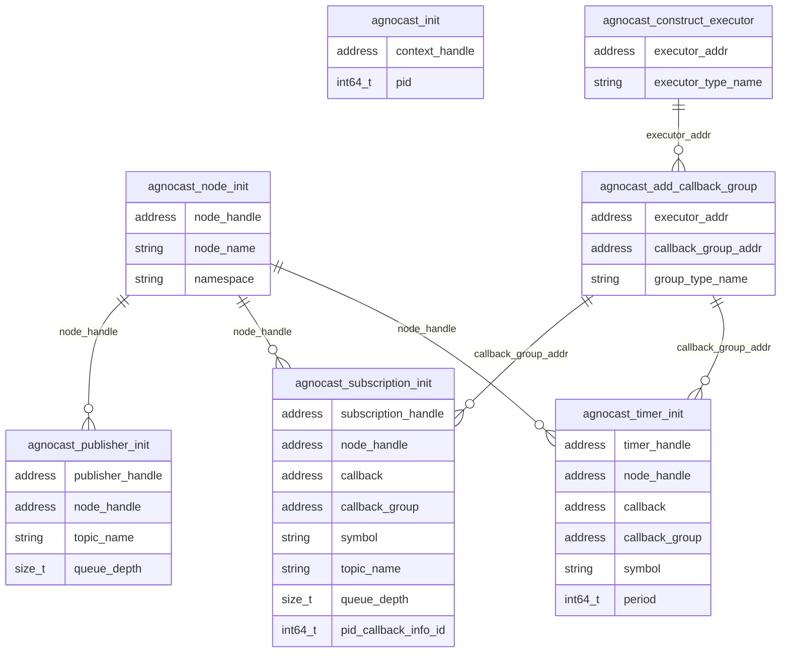

### Relationships for each Agnocast initialization trace points

Relationships of each trace point related to a single agnocast node are shown as follows.

Unlike ROS 2 initialization trace points, `agnocast_subscription_init` and `agnocast_timer_init` directly contain `callback`, `callback_group`, and `symbol` fields.
Therefore, separate trace points such as `rclcpp_callback_register`, `callback_group_add_subscription`, and `callback_group_add_timer` are not needed.
As a result, the executor/callback group structure and the node structure can be represented in a single diagram.

### Trace point definition

#### ros2_caret:agnocast_init

[Hooked tracepoints]

Sampled items

- void \* context_handle
- int64_t pid

---

#### ros2_caret:agnocast_node_init

[Hooked tracepoints]

Sampled items

- void \* node_handle
- char \* node_name
- char \* namespace

---

#### ros2_caret:agnocast_publisher_init

[Hooked tracepoints]

Sampled items

- void \* publisher_handle
- void \* node_handle
- char \* topic_name
- size_t queue_depth

---

#### ros2_caret:agnocast_subscription_init

[Hooked tracepoints]

Sampled items

- void \* subscription_handle
- void \* node_handle
- void \* callback
- void \* callback_group
- char \* symbol
- char \* topic_name
- size_t queue_depth
- int64_t pid_callback_info_id

---

#### ros2_caret:agnocast_timer_init

[Hooked tracepoints]

Sampled items

- void \* timer_handle
- void \* node_handle
- void \* callback
- void \* callback_group
- char \* symbol
- int64_t period

---

#### ros2_caret:agnocast_add_callback_group

[Hooked tracepoints]

Sampled items

- void \* executor_addr
- void \* callback_group_addr
- char \* group_type_name

---

#### ros2_caret:agnocast_construct_executor

[Hooked tracepoints]

Sampled items

- void \* executor_addr
- char \* executor_type_name
