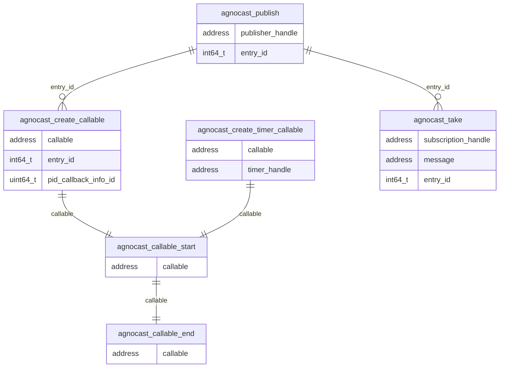

### Relationships of each Agnocast runtime trace points

In Agnocast, message passing uses `entry_id` to associate a publish event with the corresponding subscription callback execution.
`agnocast_publish` is linked to `agnocast_create_callable` and `agnocast_take` via `entry_id`.
The callable lifecycle (`agnocast_callable_start` / `agnocast_callable_end`) is tracked via `callable` address.

### Trace point definition

#### agnocast:agnocast_publish

[Built-in tracepoints]

Sampled items

- void \* publisher_handle
- int64_t entry_id

---

#### agnocast:agnocast_create_callable

[Built-in tracepoints]

Sampled items

- void \* callable
- int64_t entry_id
- uint64_t pid_callback_info_id

<prettier-ignore-start>
!!!Note
    In older versions, `pid_callback_info_id` may be recorded as `pid_ciid`.
<prettier-ignore-end>

---

#### agnocast:agnocast_create_timer_callable

[Built-in tracepoints]

Sampled items

- void \* callable
- void \* timer_handle

---

#### agnocast:agnocast_callable_start

[Built-in tracepoints]

Sampled items

- void \* callable

---

#### agnocast:agnocast_callable_end

[Built-in tracepoints]

Sampled items

- void \* callable

---

#### agnocast:agnocast_take

[Built-in tracepoints]

Sampled items

- void \* subscription_handle
- void \* message
- int64_t entry_id
