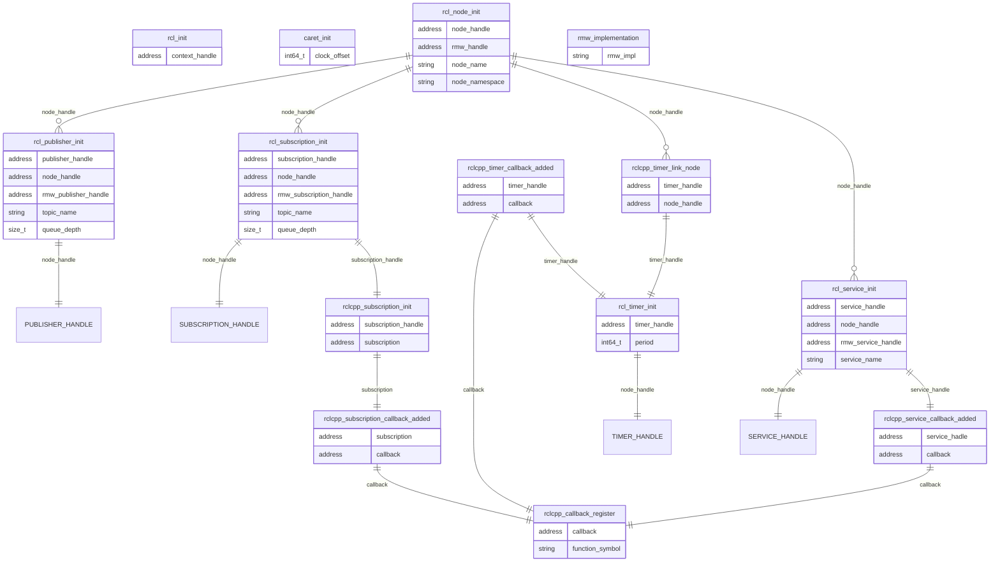

Some tracepoints share same addresses (e.g. node_handle and callback address).
By binding these addresses, CARET constructs structures of each trace point relationship.

### Relationships for each initialization trace points

Relationships of each trace point related to a single node are shown as follows.

### Tracepoints for representing structure of executor and callback group

A handler such as `timer_handle` and `subscription_handle` are assigned to a callback group. A callback group belongs to an executor.

Relationships of each trace point related to executors are shown as follows.

### Trace point definition

The following shows the definition of trace points.

Trace points with `(caret_trace added)` are hooked and added init_timestamp by caret_trace.
See [Runtime recording](../runtime_processing/runtime_recording.md#tracepoint) for detail.

#### ros2:rcl_init

[Built-in tracepoints]

Sampled items

- void \* context_handle
- int64_t init_timestamp (caret_trace added)

---

#### ros2:rcl_node_init

[Built-in tracepoints]

Sampled items

- void \* node_handle
- void \* rmw_handle
- char \* node_name
- char \* node_namespace
- int64_t init_timestamp (caret_trace added)

---

#### ros2:rcl_publisher_init

[Built-in tracepoints]

Sampled items

- void \* publisher_handle
- void \* node_handle
- void \* rmw_publisher_handle
- char \* topic_name
- size_t queue_depth
- int64_t init_timestamp (caret_trace added)

---

#### ros2:rcl_subscription_init

[Built-in tracepoints]

Sampled items

- void \* subscription_handle
- void \* node_handle
- void \* rmw_subscription_handle
- char \* topic_name
- size_t queue_depth
- int64_t init_timestamp (caret_trace added)

---

#### ros2:rclcpp_subscription_init

[Built-in tracepoints]

Sampled items

- void \* subscription_handle
- void \* subscription
- int64_t init_timestamp (caret_trace added)

---

#### ros2:rclcpp_subscription_callback_added

[Built-in tracepoints]

Sampled items

- void \* subscription
- void \* callback
- int64_t init_timestamp (caret_trace added)

---

### ros2:rcl_service_init

[Built-in tracepoints]

Sampled items

- void \* service_handle
- void \* node_handle
- void \* rmw_service_handle
- char \* service_name

---

### ros2:rclcpp_service_callback_added

[Built-in tracepoints]

Sampled items

- void \* service_handle
- void \* callback

---

#### ros2:rcl_timer_init

[Built-in tracepoints]

Sampled items

- void \* timer_handle
- int64_t period
- int64_t init_timestamp (caret_trace added)

---

#### ros2:rclcpp_timer_callback_added

[Built-in tracepoints]

Sampled items

- void \* timer_handle
- void \* callback
- int64_t init_timestamp (caret_trace added)

---

#### ros2:rclcpp_timer_link_node

[Built-in tracepoints]

Sampled items

- void \* timer_handle
- void \* node_handle
- int64_t init_timestamp (caret_trace added)

---

#### ros2:rclcpp_callback_register

[Built-in tracepoints]

Sampled items

- void \* callback
- char \* function_symbol
- int64_t init_timestamp (caret_trace added)

---

#### ros2_caret:caret_init

[Hooked tracepoints]

Sampled items

- int64_t \* clock_offset

---

#### ros2_caret:rmw_implementation

[Hooked tracepoints]

Sampled items

- char \* rmw_impl
- int64_t init_timestamp

---

#### ros2_caret:construct_executor

[Hooked tracepoints]

Sampled items

- void \* executor_addr
- char \* executor_type_name
- int64_t init_timestamp

---

#### ros2_caret:construct_static_executor

[Hooked tracepoints]

Sampled items

- void \* executor_addr
- void \* entities_collector_addr
- char \* executor_type_name
- int64_t init_timestamp

---

#### ros2_caret:add_callback_group

[Hooked tracepoints]

Sampled items

- void \* executor_addr
- void \* callback_group_addr
- char \* group_type_name
- int64_t init_timestamp

---

#### ros2_caret:add_callback_group_static_executor

[Hooked tracepoints]

Sampled items

- void \* entities_collector_addr
- void \* callback_group_addr
- char \* group_type_name
- int64_t init_timestamp

---

#### ros2_caret:callback_group_add_timer

[Hooked tracepoints]

Sampled items

- void \* callback_group_addr
- void \* timer_handle
- int64_t init_timestamp

---

#### ros2_caret:callback_group_add_subscription

[Hooked tracepoints]

Sampled items

- void \* callback_group_addr
- void \* subscription_handle
- int64_t init_timestamp

---

#### ros2_caret:callback_group_add_service

[Hooked tracepoints]

Sampled items

- void \* callback_group_addr
- void \* service_handle
- int64_t init_timestamp

---

#### ros2_caret:callback_group_add_client

[Hooked tracepoints]

Sampled items

- void \* callback_group_addr
- void \* client_handle
- int64_t init_timestamp
