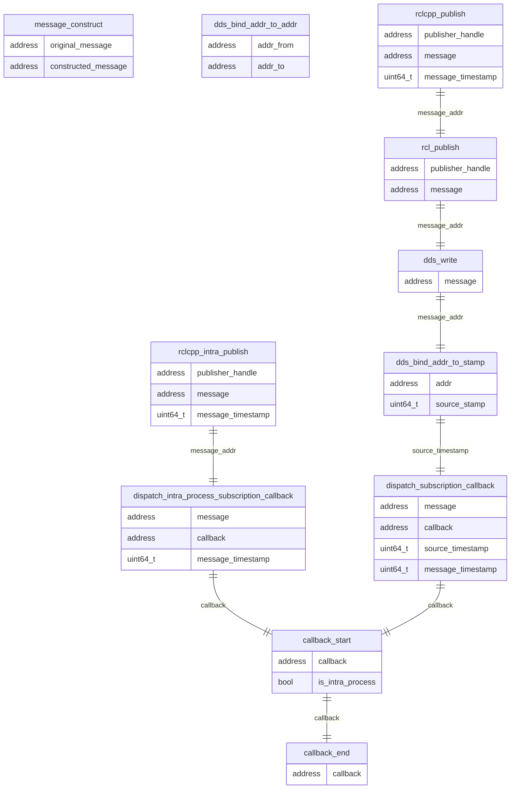
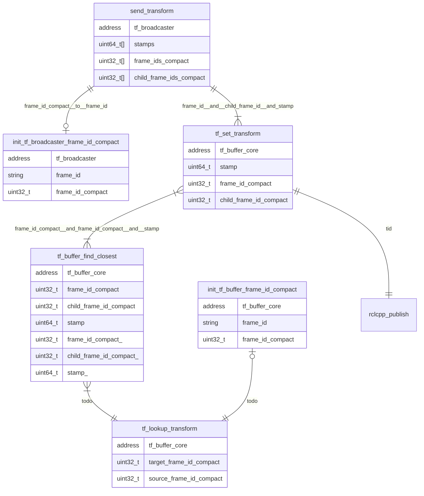

### Relationships of each runtime trace points

Using addresses, thread id (`tid`) and source timestamp, CARET is able to identify a pair of message publish and corresponding subscription.
However, it's difficult to associate a certain message publish to corresponding callback execution because mapping between callback and publish cannot be obtained automatically.

`message_construct` and `dds_bind_addr_to_addr` are trace points to adapt to copying and converting instances for binding.

### Trace point definition

#### ros2:callback_start

[Built-in tracepoints]

Sampled items

- void \* callback
- bool is_intra_process

---

#### ros2:callback_end

[Built-in tracepoints]

Sampled items

- void \* callback

---

#### ros2:message_construct

[Extended tracepoints]

Sampled items

- void \* original_message
- void \* constructed_message

---

#### ros2:rclcpp_intra_publish

[Extended tracepoints]

Sampled items

- void \* publisher_handle
- void \* message
- uint64_t message_timestamp

---

#### ros2:dispatch_subscription_callback

[Extended tracepoints]

Sampled items

- void \* message
- void \* callback
- uint64_t source_timestamp
- uint64_t message_timestamp

---

#### ros2:dispatch_intra_process_subscription_callback

[Extended tracepoints]

Sampled items

- void \* message
- void \* callback
- uint64_t message_timestamp

---

#### ros2:rcl_publish

[Built-in tracepoints]

Sampled items

- void \* publisher_handle
- void \* message

---

#### ros2:rclcpp_publish

[Built-in tracepoints]

Sampled items

- void \* publisher_handle
- void \* message
- uint64_t message_timestamp

#### ros2_caret:dds_write

[Hooked tracepoints]

Sampled items

- void \* message

---

#### ros2_caret:dds_bind_addr_to_stamp

[Hooked tracepoints]

Sampled items

- void \* addr
- uint64_t source_stamp

---

#### ros2_caret:dds_bind_addr_to_addr

[Hooked tracepoints]

Sampled items

- void \* addr_from
- void \* addr_to

#### ros2_caret:send_transform

[Hooked tracepoints]

Sampled items

- void \* tf_broadcaster
- uint64_t[] stamps
- uint32_t[] frame_ids_compact
- uint32_t[] child_frame_ids_compact

#### ros2_caret:init_tf_broadcaster_frame_id_compact

[Hooked tracepoints]

Sampled items

- void \* tf_broadcaster
- char \* frame_id
- uint32 frame_id_compact

#### lookup_transform_start

- void \* tf_buffer_core
- uint32_t target_frame_id_compact
- uint32_t source_frame_id_compact

#### tf_buffer_find_closest

- void \* tf_buffer_core
- uint32_t frame_id_compact
- uint32_t child_frame_id_compact
- uint64_t stamp
- uint32*t frame_id_compact*
- uint32*t child_frame_id_compact*
- uint64*t stamp*

#### tf_set_transform

- void \* tf_buffer_core
- uint64_t stamp
- uint32_t frame_id_compact
- uint32_t child_frame_id_compact

#### init_tf_buffer_frame_id_compact

- void \* tf_buffer_core
- char \* frame_id
- uint32_t frame_id_compact
