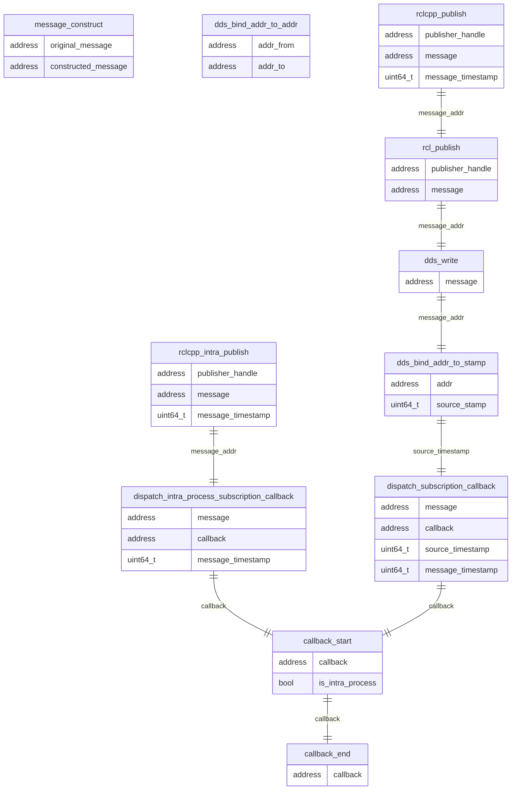

### Relationships for each runtime trace points

Using addresses, tid and source timestamp, it is possible to uniquely identify and bind from the rclcpp publish to the end of subscription node callback.
On the other hand, callback start and publish cannot be automatically bound.
This is because the relationship between callback and publish is highly implementation-dependent.

message_construct and dds_bind_addr_to_addr are trace points to adapt to copying and converting instances for binding.

### Trace point definition

| tracepoint                                     | implementation | layer  | note                                          |
| ---------------------------------------------- | -------------- | ------ | --------------------------------------------- |
| callback_start                                 | built-in       | rclcpp |                                               |
| callback_end                                   | built-in       | rclcpp |                                               |
| message_construct                              | extended       | rclcpp | これは使わずともレイテンシが出せる。          |
| rclcpp_intra_publish                           | extended       | rclcpp |                                               |
| dispatch_subscipription_callback               | extended       | rclcpp |                                               |
| dispatch_intra_process_subscipription_callback | extended       | rclcpp |                                               |
| rcl_publish                                    | built-in       | rcl    |                                               |
| rclcpp_publish                                 | built-in       | rclcpp |                                               |
| dds_write                                      | hooked         | rclcpp | これは既に組み込まれている。                  |
| dds_bind_addr_to_stamp                         | hooked         | dds    | DDSレイヤーに組み込もうという取り組みがある。 |
| dds_bind_addr_to_addr                          | hooked         | rclcpp | これは使わずともレイテンシが出せる。          |
| (enqueue_intra_process_buffer)                 | 未実装         | rclcpp | 本当は実装したいトレースポイント              |
| (dequeue_intra_process_buffer)                 | 未実装         | rclcpp | 本当は実装したいトレースポイント              |

#### ros2:callback_start

[Built-in tracepoints]

Sampled items

- void \* callback
- bool is_intra_process

---

#### ros2:callback_end

[Built-in tracepoints]

Sampled items

- void \* callback

---

#### ros2:message_construct

[Extended tracepoints]

Sampled items

- void \* original_message
- void \* constructed_message

---

#### ros2:rclcpp_intra_publish

[Extended tracepoints]

Sampled items

- void \* publisher_handle
- void \* message
- uint64_t message_timestamp

---

#### ros2:dispatch_subscription_callback

[Extended tracepoints]

Sampled items

- void \* message
- void \* callback
- uint64_t source_timestamp
- uint64_t message_timestamp

---

#### ros2:dispatch_intra_process_subscription_callback

[Extended tracepoints]

Sampled items

- void \* message
- void \* callback
- uint64_t message_timestamp

---

#### ros2:rcl_publish

[Built-in tracepoints]

Sampled items

- void \* publisher_handle
- void \* message

---

#### ros2:rclcpp_publish

[Built-in tracepoints]

Sampled items

- void \* publisher_handle
- void \* message
- uint64_t message_timestamp

#### ros2_caret:dds_write

[Hooked tracepoints]

Sampled items

- void \* message

---

#### ros2_caret:dds_bind_addr_to_stamp

[Hooked tracepoints]

Sampled items

- void \* addr
- uint64_t source_stamp

---

#### ros2_caret:dds_bind_addr_to_addr

[Hooked tracepoints]

Sampled items

- void \* addr_from
- void \* addr_to
