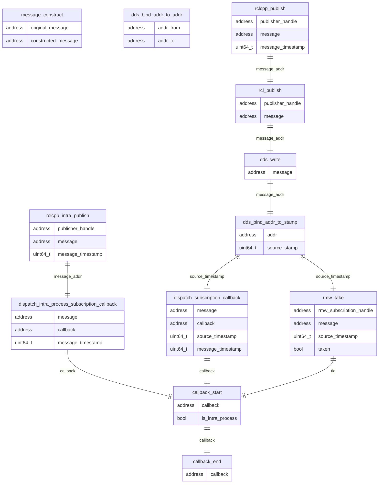

### Relationships of each runtime trace points

Using addresses, thread id (`tid`) and source timestamp, CARET is able to identify a pair of message publish and corresponding subscription.
However, it's difficult to associate a certain message publish to corresponding callback execution because mapping between callback and publish cannot be obtained automatically.

`message_construct` and `dds_bind_addr_to_addr` are trace points to adapt to copying and converting instances for binding.

### Trace point definition

#### ros2:callback_start

[Built-in tracepoints]

Sampled items

- void \* callback
- bool is_intra_process

---

#### ros2:callback_end

[Built-in tracepoints]

Sampled items

- void \* callback

---

#### ros2:message_construct

[Extended tracepoints]

Sampled items

- void \* original_message
- void \* constructed_message

---

#### ros2:rclcpp_intra_publish

[Extended tracepoints]

Sampled items

- void \* publisher_handle
- void \* message
- uint64_t message_timestamp

---

#### ros2:dispatch_subscription_callback (before v0.4.9)

[Extended tracepoints]

Sampled items

- void \* message
- void \* callback
- uint64_t source_timestamp
- uint64_t message_timestamp

This trace point is no longer used since v0.4.10.

---

#### ros2:rmw_take (after v0.4.10)

[Built-in tracepoints]

Sampled items

- void \* rmw_subscription_handle
- void \* message
- int64_t \* source_timestamp
- bool \* taken

In CARET, this trace point is used to determine the callback_start event corresponding to the rclcpp_publish event.
Until version 0.4.9, ros2:dispatch_subscription_callback was used to link rclcpp_publish and callback_start events.

---

#### ros2:dispatch_intra_process_subscription_callback

[Extended tracepoints]

Sampled items

- void \* message
- void \* callback
- uint64_t message_timestamp

---

#### ros2:rcl_publish

[Built-in tracepoints]

Sampled items

- void \* publisher_handle
- void \* message

---

#### ros2:rclcpp_publish

[Built-in tracepoints]

Sampled items

- void \* publisher_handle
- void \* message
- uint64_t message_timestamp

#### ros2_caret:dds_write

[Hooked tracepoints]

Sampled items

- void \* message

---

#### ros2_caret:dds_bind_addr_to_stamp

[Hooked tracepoints]

Sampled items

- void \* addr
- uint64_t source_stamp

---

#### ros2_caret:dds_bind_addr_to_addr

[Hooked tracepoints]

Sampled items

- void \* addr_from
- void \* addr_to
