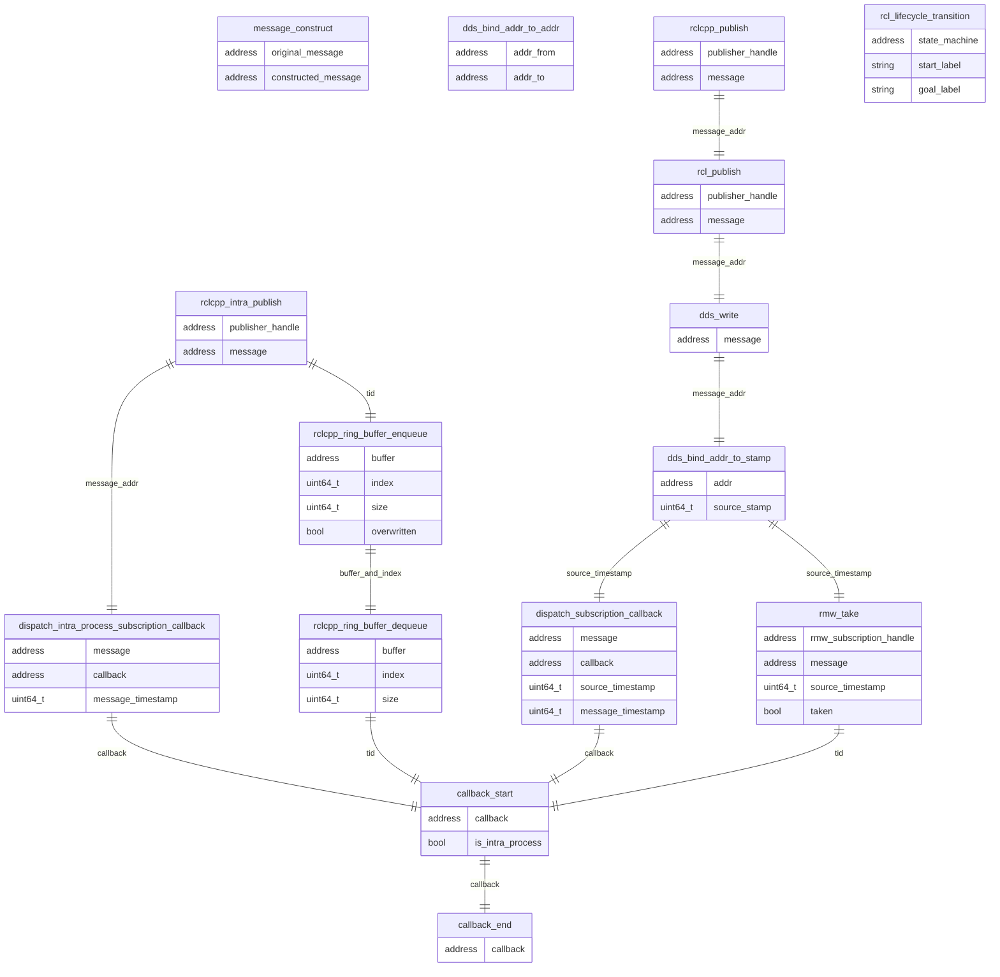

### Relationships of each runtime trace points

Using addresses, thread id (`tid`) and source timestamp, CARET is able to identify a pair of message publish and corresponding subscription.
However, it's difficult to associate a certain message publish to corresponding callback execution because mapping between callback and publish cannot be obtained automatically.

`message_construct`(Not available after iron) and `dds_bind_addr_to_addr` are trace points to adapt to copying and converting instances for binding.

### Trace point definition

#### ros2:callback_start

[Built-in tracepoints]

Sampled items

- void \* callback
- bool is_intra_process

---

#### ros2:callback_end

[Built-in tracepoints]

Sampled items

- void \* callback

---

#### ros2:message_construct

[Extended tracepoints]

Sampled items

- void \* original_message
- void \* constructed_message

<prettier-ignore-start>
!!!Note
    Not available after iron.
<prettier-ignore-end>

---

#### ros2:rclcpp_intra_publish

[Extended tracepoints]

Sampled items

- void \* publisher_handle
- void \* message

<prettier-ignore-start>
!!!Note
    In humble, they are Extended trace points, but from iron onwards they are Built-in trace points.
<prettier-ignore-end>

---

#### ros2:dispatch_subscription_callback

[Extended tracepoints]

Sampled items

- void \* message
- void \* callback
- uint64_t source_timestamp
- uint64_t message_timestamp

<prettier-ignore-start>
!!!Note
    This tracepoint is no longer used from v0.4.10 onwards.
<prettier-ignore-end>

---

#### ros2:rmw_take

[Built-in tracepoints]

Sampled items

- void \* rmw_subscription_handle
- void \* message
- int64_t \* source_timestamp
- bool \* taken

<prettier-ignore-start>
!!!Note
    In CARET, this tracepoint is used to correctly link the `callback_start` to the `rclcpp_publish` that triggered the callback.
    Until version 0.4.9, ros2:dispatch_subscription_callback was used to link `rclcpp_publish` and `callback_start` events.
<prettier-ignore-end>

---

#### ros2:dispatch_intra_process_subscription_callback

[Extended tracepoints]

Sampled items

- void \* message
- void \* callback
- uint64_t message_timestamp

---

#### ros2:rclcpp_ring_buffer_enqueue

[Built-in tracepoints]

Sampled items

- void \* buffer
- uint64_t index
- uint64_t size
- bool overwritten

<prettier-ignore-start>
!!!Note
    Only for iron or later and intra communication.
<prettier-ignore-end>

---

#### ros2:rclcpp_ring_buffer_dequeue

[Built-in tracepoints]

Sampled items

- void \* buffer
- uint64_t index
- uint64_t size

<prettier-ignore-start>
!!!Note
    Only for iron or later and intra communication.
<prettier-ignore-end>

---

#### ros2:rcl_publish

[Built-in tracepoints]

Sampled items

- void \* publisher_handle
- void \* message

---

#### ros2:rclcpp_publish

[Built-in tracepoints]

Sampled items

- void \* publisher_handle
- void \* message

#### ros2_caret:dds_write

[Hooked tracepoints]

Sampled items

- void \* message

---

#### ros2_caret:dds_bind_addr_to_stamp

[Hooked tracepoints]

Sampled items

- void \* addr
- uint64_t source_stamp

<prettier-ignore-start>
!!!Note
    In fastdds, the publish() of GenericPublisher does not output this tracepoint.
<prettier-ignore-end>

---

#### ros2_caret:dds_bind_addr_to_addr

[Hooked tracepoints]

Sampled items

- void \* addr_from
- void \* addr_to

---

#### ros2_caret:rcl_lifecycle_transition

[Built-in tracepoints]

Sampled items

- void \* state_machine
- char \* start_label
- char \* goal_label
