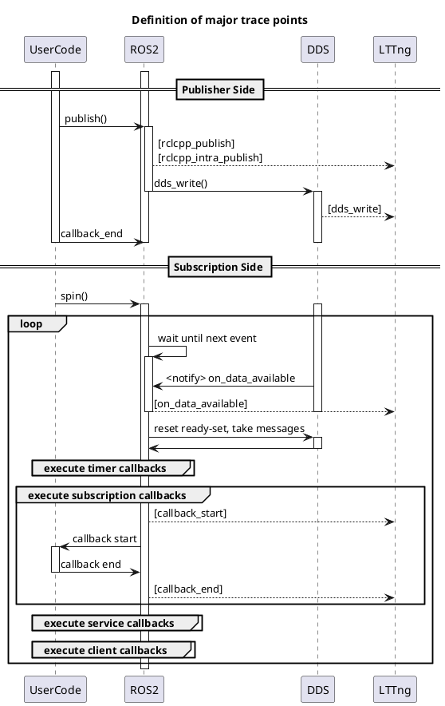
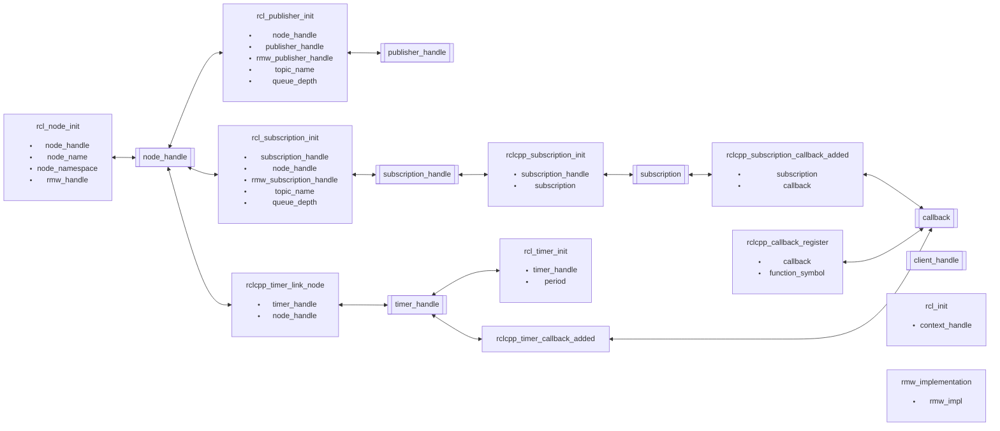
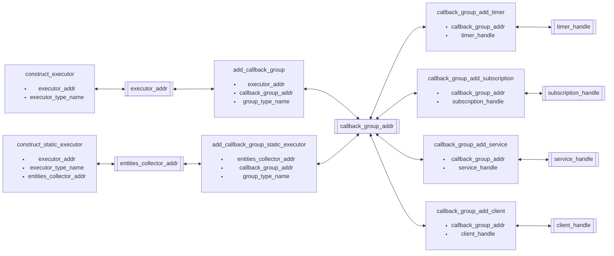
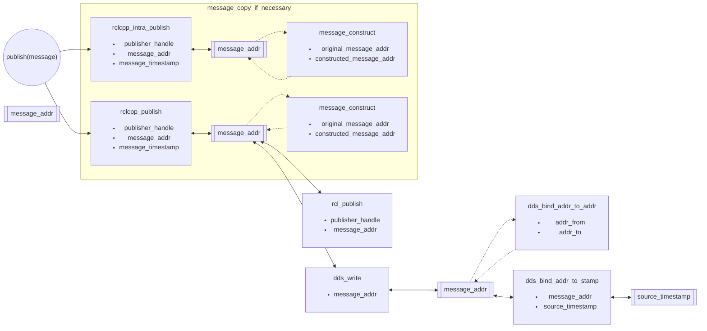
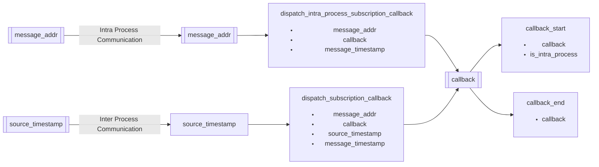

# Tracepoints definition

This section lists all tracepoints and their definition.
Before listing tracepoints.

Some tracepoints are used for collecting identification of executors, nodes, callbacks, and topics during application's initialization. They are called initialization tracepoints. The other tracepoints are embedded for sampling timestamps after completion of initialization, and called runtime tracepoints.

Almost all of tracepoints supported by CARET are embedded in ROS and DDS layer. CARET utilizes some of the tracepoints embedded in original ROS 2 middleware, which are used for ros2-tracing. Some of the rest tracepoints are added to the fork of ROS 2's rclcpp, the other are introduced by function hooking with LD_PRELOAD. AS explained, tracepoints for CARET is embedded by three ways and they are identified as below.

- Original tracepoints
  - tracepoints embedded in original ROS 2 middleware which are utilized by ros2-tracing
  - some of tracepoints, for service, action and lifecycle node, are not utilized by CARET
- Extended tracepoints
  - CARET-dedicated tracepoints added to the fork of rclcpp
- Hooked tracepoints
  - CARET-dedicated tracepoints introduced by function hooking with LD_PRELOAD

<prettier-ignore-start>
!!! info
    Please read this section if you are interested in CARET-dedicated tracepoints are extended by the forked rclcpp and LD_PRELOAD. CARET would like to add tracepoints by function hooking as possible. LD_PRELOAD is reasonable to hook functions defined in dynamic library, but it cannot be applied to functions by implemented with C++ template. Such template-based implementation is mapped into binary file after it is built or compiled. Original rclpp uses C++ template for some functions like intra-process communication, for example. The forked rclcpp is introduced to add tracepoints to the functions.
<prettier-ignore-end>

## Sequence diagram of major tracepoints

## Initialization tracepoints

---

### ros2:rcl_init

[Original tracepoints]

Sampled items

- void \* context_handle

---

### ros2:rcl_node_init

[Original tracepoints]

Sampled items

- void \* node_handle
- void \* rmw_handle
- char \* node_name
- char \* node_namespace

---

### ros2:rcl_publisher_init

[Original tracepoints]

Sampled items

- void \* publisher_handle
- void \* node_handle
- void \* rmw_publisher_handle
- char \* topic_name
- size_t queue_depth

---

### ros2:rcl_subscription_init

[Original tracepoints]

Sampled items

- void \* subscription_handle
- void \* node_handle
- void \* rmw_subscription_handle
- char \* topic_name
- size_t queue_depth

---

### ros2:rclcpp_subscription_init

[Original tracepoints]

Sampled items

- void \* subscription_handle
- void \* subscription

---

### ros2:rclcpp_subscription_callback_added

[Original tracepoints]

Sampled items

- void \* subscription
- void \* callback

---

### ros2:rcl_timer_init

[Original tracepoints]

Sampled items

- void \* timer_handle
- int64_t period

---

### ros2:rclcpp_timer_callback_added

[Original tracepoints]

Sampled items

- void \* timer_handle
- void \* callback

---

### ros2:rclcpp_timer_link_node

[Original tracepoints]

Sampled items

- void \* timer_handle
- void \* node_handle

---

### ros2:rclcpp_callback_register

[Original tracepoints]

Sampled items

- void \* callback
- char \* function_symbol

---

### ros2_caret:rmw_implementation

[Hooked tracepoints]

Sampled items

- char \* rmw_impl

---

### ros2_caret:construct_executor

[Hooked tracepoints]

Sampled items

- void \* executor_addr
- char \* executor_type_name

---

### ros2_caret:construct_static_executor

[Hooked tracepoints]

Sampled items

- void \* executor_addr
- void \* entities_collector_addr
- char \* executor_type_name

---

### ros2_caret:add_callback_group

[Hooked tracepoints]

Sampled items

- void \* executor_addr
- void \* callback_group_addr
- char \* group_type_name

---

### ros2_caret:add_callback_group_static_executor

[Hooked tracepoints]

Sampled items

- void \* entities_collector_addr
- void \* callback_group_addr
- char \* group_type_name

---

### ros2_caret:callback_group_add_timer

[Hooked tracepoints]

Sampled items

- void \* callback_group_addr
- void \* timer_handle

---

### ros2_caret:callback_group_add_subscription

[Hooked tracepoints]

Sampled items

- void \* callback_group_addr
- void \* subscription_handle

---

### ros2_caret:callback_group_add_service

[Hooked tracepoints]

Sampled items

- void \* callback_group_addr
- void \* service_handle

---

### ros2_caret:callback_group_add_client

[Hooked tracepoints]

Sampled items

- void \* callback_group_addr
- void \* client_handle

---

## Runtime tracepoints

### ros2:callback_start

[Original tracepoints]

Sampled items

- void \* callback
- bool is_intra_process

---

### ros2:callback_end

[Original tracepoints]

Sampled items

- void \* callback

---

### ros2:message_construct

[Extended tracepoints]

Sampled items

- void \* original_message
- void \* constructed_message

---

### ros2:rclcpp_intra_publish

[Extended tracepoints]

Sampled items

- void \* publisher_handle
- void \* message
- uint64_t message_timestamp

---

### ros2:dispatch_subscription_callback

[Extended tracepoints]

Sampled items

- void \* message
- void \* callback
- uint64_t source_timestamp
- uint64_t message_timestamp

---

### ros2:dispatch_intra_process_subscription_callback

[Extended tracepoints]

Sampled items

- void \* message
- void \* callback
- uint64_t message_timestamp

---

### ros2:rcl_publish

[Original tracepoints]

Sampled items

- void \* publisher_handle
- void \* message

---

### ros2:rclcpp_publish

[Original tracepoints]

Sampled items

- void \* publisher_handle
- void \* message
- uint64_t message_timestamp

### ros2_caret:dds_write

[Hooked tracepoints]

Sampled items

- void \* message

---

### ros2_caret:dds_bind_addr_to_stamp

[Hooked tracepoints]

Sampled items

- void \* addr
- uint64_t source_stamp

---

### ros2_caret:dds_bind_addr_to_addr

[Hooked tracepoints]

Sampled items

- void \* addr_from
- void \* addr_to

---

## トレースポイントの紐付け

本ページで列挙しているトレースポイントはノード ID（`node_handle`）やコールバック ID（`コールバックのインスタンスのアドレス`）などの値を元に紐付けて利用する。  
それぞれのトレースポイントの対応関係をグラフで示す。

### ノードの初期化

コールバックのインスタンスのアドレス値が一意に決まれば、`timer_callback_added`など他のトレースポイントの値を紐付いていくことでノードの情報まで得ることができる。  
逆に、node_handle が一意に決まれば、そのノードに含まれるコールバックも特定できる。

### エグゼキューターやコールバックグループの初期化

タイマーなどの各ハンドラはコールバックグループに追加され、エグゼキュータに紐付けられる。

### メッセージの publish まで

`publish`を実行した際、unique_ptr 型で複数の subscription がある場合などのケースでは、必要に応じてメッセージのコピーが発生する。  
メッセージのコピーが発生した際は`message_construct`でコピー前とコピー後の変数のアドレスを紐付けられるようにしている。  
rcl レイヤー以下ではメッセージのアドレスで対応付けられるようにし、DDS レイヤーで source_timestamp に紐付けられるようにしている。  
source_timestamp は元々は QoS の Deadline などに使われる値で、全ての DDS 通信を行うメッセージに自動的に付与される値であり、subscription 側で同じ値が受信される。  
受信側では source_timestamp の値を紐付けるための情報として利用している。

message_addr（プロセス内通信）/source_timestamp（プロセス間通信）から publish までが一意に紐付けられる。

### メッセージの受信からコールバック実行まで

プロセス内通信では publish されたメッセージのアドレスで紐づけを行う。  
プロセス間通信では source_timestamp で紐づけを行う。

callback_start から message_addr/source_timestamp までが一意に紐付けられる。  
また、publisher 側のグラフで示した通り、message_addr/source_timestamp から publish までが一意に紐付けられる。  
したがって、publish から callback_start までは一意に紐付けることができる。

ただし、コールバックの実行と publish の紐付けはできていないので注意。
