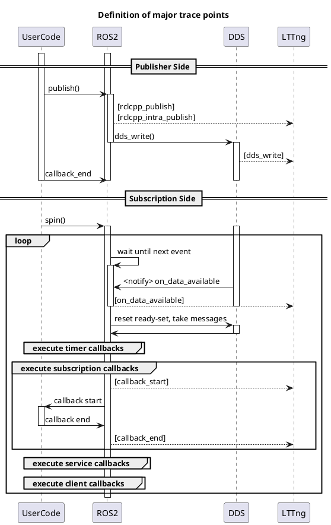

# トレースポイントの定義

CARETはトピック名などの情報を得るための「初期化時の処理に対するトレースポイント」と、  
測定をするための「ランタイムの処理に対するトレースポイント」があります。

本ページではそれぞれのトレースポイントの定義についてまとめています。

各トレースポイントには、その実装方法を区別するために以下の情報も記載しています。

- Galactic実装
  - Galactic以降のROSにはデフォルトで実装されている、ros2 tracingが使用しているトレースポイントです。
  - serviceやlifecycleなど、実装はされていてもCARETでは使われていないトレースポイントも有ります。
- CARETフォーク実装
  - rclcppリポジトリをフォークして追加しているトレースポイントです。
- CARETフック実装
  - LD_PRELOADによるフックで追加しているトレースポイントです。

> フォークとフックの２つの方法でトレースポイントを追加している理由  
>
> CARETは基本的には実装と切り離すために、LD_PRELOADを利用したフックによるトレースポイントの追加をしています。  
> ただし、rclcppには、プロセス内通信などのテンプレートによる実装を含み、LD_PRELOADではフックできない処理があります。  
> LD_PRELOADは実行時の動的リンクに対しフックできる機能であるのに対し、  
> テンプレートで実装された処理はコンパイルでバイナリ内に組み込まれてしまうためフックできません。  
> このようなテンプレートで実装された処理に対してのみ、rclcppをフォークしてトレースポイントを追加しています。  
> このような理由から、測定対象のアプリケーションを再ビルドする必要が生じています。

## シーケンスと主要なトレースポイント

## 初期化時のトレースポイント

---

### rcl_init
[Galactic実装]

付加情報

- void * context_handle

---

### rcl_node_init
[Galactic実装]

付加情報

- void * node_handle
- void * rmw_handle
- char * node_name
- char * node_namespace

---

### rcl_publisher_init
[Galactic実装]

付加情報

- void * publisher_handle
- void * node_handle
- void * rmw_publisher_handle
- char * topic_name
- size_t queue_depth

---

### rcl_subscription_init
[Galactic実装]

付加情報

- void * subscription_handle
- void * node_handle
- void * rmw_subscription_handle
- char * topic_name
- size_t queue_depth

---

### rclcpp_subscription_init
[Galactic実装]

付加情報

- void * subscription_handle
- void * subscription

---

### rclcpp_subscription_callback_added
[Galactic実装]

付加情報

- void * subscription
- void * callback

---

### rcl_timer_init
[Galactic実装]

付加情報
- void * timer_handle
- int64_t period

---

### rclcpp_timer_callback_added
[Galactic実装]

付加情報

- void * timer_handle
- void * callback

---

### rclcpp_timer_link_node
[Galactic実装]

付加情報

- void * timer_handle
- void * node_handle

---

### rclcpp_callback_register
[Galactic実装]

付加情報

- void * callback
- char * function_symbol

---

### rmw_implementation
[CARETフック実装]

付加情報

- char * rmw_impl

---

### construct_executor
[CARETフック実装]

付加情報

-  void * executor_addr
-  char * executor_type_name

---

### construct_static_executor
[CARETフック実装]

付加情報

- void * executor_addr
- void * entities_collector_addr
- char * executor_type_name

---

### add_callback_group
[CARETフック実装]

付加情報

- void * executor_addr
- void * callback_group_addr
- char * group_type_name

---

### add_callback_group_static_executor
[CARETフック実装]

付加情報

- void * entities_collector_addr
- void * callback_group_addr
- char * group_type_name

---

### callback_group_add_timer
[CARETフック実装]

付加情報

- void * callback_group_addr
- void * timer_handle

---

### callback_group_add_subscription
[CARETフック実装]

付加情報

- void * callback_group_addr
- void * subscription_handle

---

### callback_group_add_service
[CARETフック実装]

付加情報

- void * callback_group_addr
- void * service_handle

---

### callback_group_add_client
[CARETフック実装]

付加情報

- void * callback_group_addr
- void * client_handle

---

## ランタイム時のトレースポイント

### callback_start
[Galactic実装]

付加情報

- void * callback
- bool is_intra_process

---

### callback_end
[Galactic実装]

付加情報

-  void * callback

---

### message_construct
[CARETフォーク実装]

付加情報

- void * original_message
- void * constructed_message

---

### rclcpp_intra_publish
[CARETフォーク実装]

付加情報

- void * publisher_handle
- void * message
- uint64_t message_timestamp

---

### dispatch_subscription_callback
[CARETフォーク実装]

付加情報

- void * message
- void * callback
- uint64_t source_timestamp
- uint64_t message_timestamp

---

### dispatch_intra_process_subscription_callback
[CARETフォーク実装]

---

### rcl_publish
[Galactic実装]

付加情報

- void * publisher_handle
- void * message

---

### rclcpp_publish
[Galactic実装]

付加情報

- void * publisher_handle
- void * message
- uint64_t message_timestamp

### dds_write
[CARETフック実装]

付加情報

- void * message

---

### dds_bind_addr_to_stamp
[CARETフック実装]

付加情報

-  void * addr
-  uint64_t source_stamp

---

### dds_bind_addr_to_addr
[CARETフック実装]

付加情報

-  void * addr_from
-  void * addr_to

---