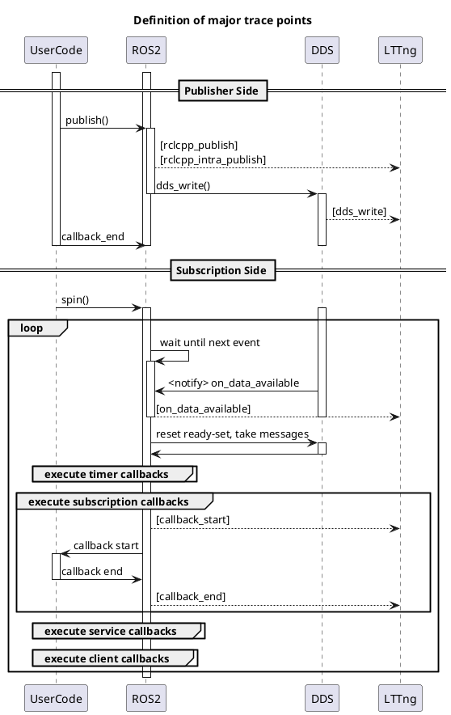

## トレースポイントの定義

|トレースポイントの実装方法|provider|呼び出し種類|トレースポイントの説明|トレースポイント名|引数１|引数２|引数３|引数４|引数５|
|--|--|--|--|--|--|--|--|--|--|
|galacticデフォルト|ros2|初期化時||rcl_init|context_handle_arg|version|
|galacticデフォルト|ros2|初期化時|ノード情報の出力用|rcl_node_init|node_handle_arg|rmw_handle_arg|node_name_arg|namespace_arg|
|galacticデフォルト|ros2|初期化時|publisher情報の出力用|rcl_publisher_init|publisher_handle_arg|node_handle_arg|rmw_publisher_handle_arg|queue_depth_arg|
|galacticデフォルト|ros2|ランタイム|publishの測定用|rcl_publish|publisher_handle_arg|message_arg|
|galacticデフォルト|ros2|ランタイム|publishの測定用|rclcpp_publish|publisher_handle_arg|message_arg|
|galacticデフォルト|ros2|初期化時|subscription情報の出力用|rcl_subscription_init|subscription_handle_arg|node_handle_arg|rmw_subscription_handle_arg|topic_name_arg|queue_depth_arg|
|galacticデフォルト|ros2|初期化時|subscription情報の出力用|rclcpp_subscription_init|subscription_handle_arg|subscription_arg|
|galacticデフォルト|ros2|初期化時|subscription情報の出力用|rclcpp_subscription_callback_added|subscription_arg|callback_arg|
|galacticデフォルト|ros2|初期化時|service情報の出力用|rcl_service_init|service_handle_arg|node_handle_arg|rmw_service_handle_arg|service_name_arg|
|galacticデフォルト|ros2|初期化時|service情報の出力用|rclcpp_service_callback_added|service_handle_arg|callback_arg|
|galacticデフォルト|ros2|初期化時|client情報の出力用|rcl_client_init|client_handle_arg|node_handle_arg|rmw_client_handle_arg|service_name_arg|
|galacticデフォルト|ros2|初期化時|client情報の出力用|rcl_timer_init|timer_handle_arg|period_arg|
|galacticデフォルト|ros2|初期化時|timer情報の出力用|rclcpp_timer_callback_added|timer_handle_arg|callback_arg|
|galacticデフォルト|ros2|初期化時|timer情報の出力用|rclcpp_timer_link_node|timer_handle_arg|node_handle_arg|
|galacticデフォルト|ros2|初期化時|timer情報の出力用|rclcpp_callback_register|callback_arg|symbol_arg|
|galacticデフォルト|ros2|ランタイム|コールバック実行の測定用|callback_start|callback_arg|is_intra_process_arg|
|galacticデフォルト|ros2|ランタイム|コールバック実行の測定用|callback_end|callback_arg|
|galacticデフォルト|ros2|初期化時||rcl_lifecycle_state_machine_init|node_handle_arg|state_machine_arg|
|rclcppパッケージ新規追加|ros2|ランタイム|publish時、ROSレイヤー内でコピーが発生した際のコピー元アドレスとコピー先アドレスの紐付け用|message_construct|original_message_arg|constructed_message_arg|
|rclcppパッケージ新規追加|ros2|ランタイム|publishの測定用|rclcpp_intra_publish|publisher_handle_arg|message_arg|
|rclcppパッケージ新規追加|ros2|ランタイム|コールバック実行の測定用（メッセージアドレスとコールバックを紐付け）|dispatch_subscription_callback|message_arg|callback_arg|stamp_arg|
|rclcppパッケージ新規追加|ros2|ランタイム|コールバック実行の測定用（メッセージアドレスとコールバックを紐付け）|dispatch_intra_process_subscription_callback|message_arg|callback_arg|stamp_arg|
|LD_PRELOADフック|ros2_caret|ランタイム|DDSがメッセージを受け取った際に呼ばれる関数|on_data_available|stamp_arg|
|LD_PRELOADフック|ros2_caret|ランタイム|DDSにメッセージを書き込んだ際に呼ばれる関数|dds_write|message_arg|
|LD_PRELOADフック|ros2_caret|ランタイム|DDS内でアドレスとstampを紐付けるためのトレースポイント。各DDSに対応が必要|dds_bind_addr_to_stamp|addr_from_arg|stamp_to_arg|
|LD_PRELOADフック|ros2_caret|ランタイム|DDS内でアドレスとアドレスを紐付けるためのトレースポイント。各DDSに対応が必要|dds_bind_addr_to_addr|addr_from_arg|addr_to_arg|

## 主要なトレースポイントのシーケンス図

## トレースポイントの実装方法・フック方法について

|トレースポイントの種類|説明|
|--|--|
|galacticデフォルト|galacticで初期から実装されているLTTngのトレースポイント|
|rclcppパッケージ新規追加|LD_PRELOADでのフックが不可な箇所へのトレースポイント。テンプレートによりヘッダー内で実装されているのがフック不可な理由|
|LD_PRELOADフック|LD_PRELOADで特定の関数をフックさせたトレースポイント。別途動的ライブラリのビルドが必要。|
