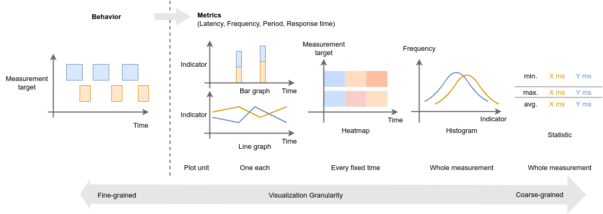

# Visualizations

CARET is a tool for performance evaluation and analysis.

For evaluation, quantification and visualization would be sufficient.  
For analysis, on the other hand, various factors are involved in behavior and performance, so it is necessary to investigate from multiple perspectives.

CARET has multiple visualizations for evaluation and analysis APIs.  
Also, CARET let you to directly acquire and evaluate the data on your own (see [Processing trace data](../processing_trace_data/index.md) for detail).

## Policy

### Evaluation flow

CARET handles a large amount of recorded events, which prevents you from investigating performance of your application smoothly.
Just displaying recorded events thoughtlessly might waste your time.
So, it is important to focus on evaluation targets with appropriate granularity according to the purpose of evaluation.

The following diagram shows the evaluation flow and analysis by adjusting the granularity.

Here, the horizontal axis represents the visualization granularity and the vertical axis represents the processing granularity.  
Those definitions will be explained subsequent sections.

CARET help you to find issues and their causes by changing the processing and visualization granularity, respectively.
You can approach an issues and its cause step by step from rough to fine granularity, from right-upper to left-lower in the figure.

1. Detect issues: Detects performance issues on the target system.
2. Identify issues: Identify the bottleneck that is causing the issue.
3. Identify causes: Identifies the cause of the bottleneck.

Processing granularity on the horizontal axis and visualization granularity on the vertical axis are explained in the following section.

### Visualization granularity

The granularity of visualizations are listed below in order of fine granularity.

- Time-series trace data
- Bar graph / Line graph
- Heatmap
- Histogram
- Statistic

The coarser granularity, the more time information is aggregated to evaluate the measurement as a whole.  
The most granular statistics are suitable for regression testing.

On the other hand, the finer granularity, the more detailed information is expressed, so it is more suitable for analysis.
Latency and response time are mainly used metrics to evaluate performance.  
The most detailed information is a time-series graph of each trace data.

### Processing granularity

The processing granularity means granularity of subsystem in an application, it is ordered in coarse order as follows.

- path
- node / communication
- callback
- function

Path is suitable for performance evaluation per system , while node and callback are suitable for performance evaluation per component or smaller subsystem.

<prettier-ignore-start>
!!! Notice
         In the present, CARET does not support measurement of arbitrary functions or DDS enqueue/dequeue or system calls.
<prettier-ignore-end>

See also

- [Event and latency definition](../event_and_latency_definitions/index.md)

### Metrics category

We described behavior and metrics in terms of visualization granularity, but there are multiple metrics, such as latency and frequency.  
Metrics for performance analysis is categorized into two types; time-related metrics and frequency-related metrics.
CARET recommends you to be aware two types.

- Time Domain Metrics (ex: callback execution time [s])
- Frequency Domain Metrics (ex: topic frequency [Hz])

Both have their pros and cons.

|        | Time Domain Metrics                      | Frequency Domain Metrics                      |
| ------ | ---------------------------------------- | --------------------------------------------- |
| Metric | Latency, Response time                   | Frequency (, Period)                          |
| Pros   | Easy to compare with system requirements | No need to define latency or path             |
| Cons   | Need to define latency or path           | Difficult to compare with system requirements |

In the table above, period is metrics that expresses the time interval between sequential cyclic events, so it is classified into the frequency-related metrics.

See also

- [Records service](../processing_trace_data/records_service.md)
