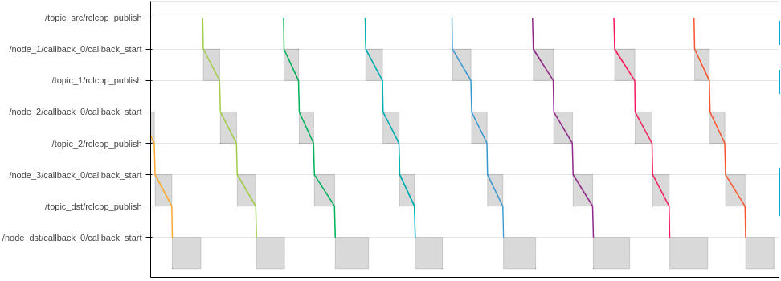
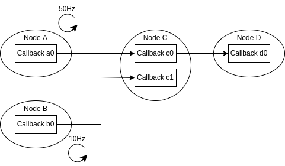
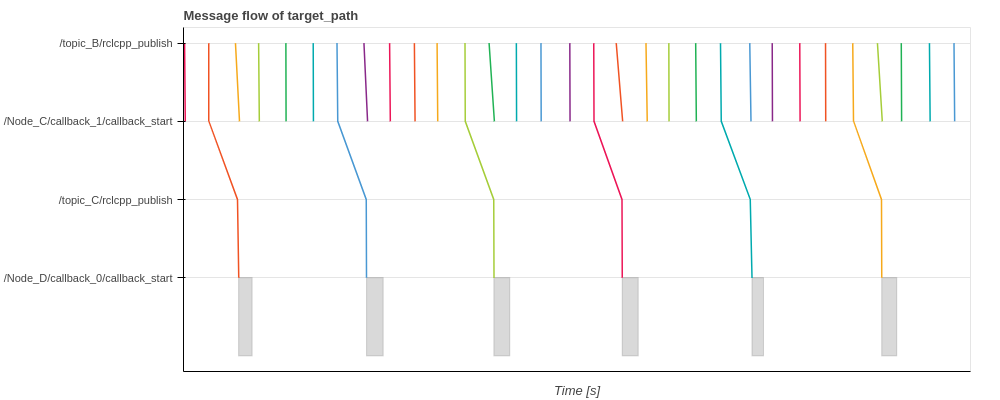

# FAQ

## Installation

### Setup fails

- In case you encounter errors during setup or build process, please make sure to use an appropriate branch for your environment
  - ROS 2 Galactic, Ubuntu 20.04: `galactic` branch
  - ROS 2 Humble, Ubuntu 22.04: main branch
- It's also important to delete `./build` `./install` and `./src` directory before rebuilding CARET if you have built CARET using wrong settings

### CLI tool doesn't work

In case CLI tool execution fails, please make sure to perform CARET environment settings

```bash
source /opt/ros/humble/setup.bash
source ~/ros2_caret_ws/install/local_setup.bash

ros2 caret check_caret_rclcpp <path-to-workspace>
```

<prettier-ignore-start>
!!!warning
      CARET CLI tool doesn't work properly in Anaconda environment. Please use pure Python.
<prettier-ignore-end>

## Recording

### LTTng session doesn't start after `ros2 caret record`

- Check detailed status for recording sequence by adding `-verbose` option (e.g. `ros2 caret record -v` )
  - You will see `N/M process started recording` , where `N` is the number of processes which have been started recording and `M` is the number of total processes to be started recording
- If `N` increases very slowly, add `--recording-frequency` option with integer greater than 100 (e.g. `ros2 caret record -f 500` )
  - Please be careful that it increases the possibility of recording failure
- If `N` remains 0, remove `~/.lttng` and start recording again
  - Please be careful that the first recorded trace data after removing `~/.lttng` tends to lack some events. So, please ignore the data
- It's also important to make sure you don't have another LTTng session running

### So many nodes named `/caret_trace_ooooooo` created

- As described in [design section](../design/runtime_processing/index.md), a node to store CARET events is created for each process. Therefore, if a target application is huge and has a lot of processes, the number of CARET nodes also becomes huge

## Visualization

### Result (plot, message_flow, etc.) is not outputted, or there seems something wrong with the result

- Please use the following commands for verification
  - `ros2 caret check_caret_rclcpp` to check if a target application is built with CARET/rclcpp
  - `ros2 caret check_ctf` to check if tracing data is recorded properly
- Please make sure the followings:
  - A target application is built with CARET/rclcpp
  - CARET environment is set properly before running a target application
    - `export LD_PRELOAD=$(readlink -f ~/ros2_caret_ws/install/caret_trace/lib/libcaret.so)`
    - `source ~/ros2_caret_ws/install/local_setup.bash`
  - LTTng trace is started before running a target application
    - `ros2 trace -s e2e_sample -k -u "ros2*"`
    - or consider to use launch file
  - Trace data is not discarded
    - In case trace data is discarded, use [Trace filter](../recording/trace_filtering.md)
  - The size of trace data is proper
    - If the size of trace data is extremely small (e.g. only few KByte) and a target application has lots of nodes, the maximum number of file descriptors may not be enough. It can be increased by `ulimit -n 65536`
- See [Recording](../recording/index.md) for more details

### Parts of results are not outputted

- If certain nodes are not traced but some nodes are traced, some packages may be built without CARET/rclcpp. Please make sure `<depend>rclcpp</depend>` is described in `package.xml`
- Another possibility is that some nodes can't be analyzed due to CARET's limitations:
  - CARET cannot analyze a node which has two or more timer callbacks with the same period time setting
  - CARET cannot analyze a node which has two or more subscription callbacks with the same topic name
- Callback information in such nodes are not outputted. Also, message flow will be discontinued at such nodes

### `TraceResultAnalyzeError: Failed to find` error occurs

- The error occurs if information in an architecture file and trace data are inconsistent with each other
- Please modify the architecture file or check recording process
- e.g.
  - `TraceResultAnalyzeError: Failed to find callback_object.node_name: /localization/pose_twist_fusion_filter/ekf_localizer, callback_name: timer_callback_0, period_ns: 19999999, symbol: void (EKFLocalizer::?)()`

## Visualization (callback)

### Callback frequency is smaller than expected value

- `Plot.create_callback_frequency_plot` calculates frequency from one second to one second. It counts how many times a callback function is called for a second, and just uses the count as frequency. Therefore, the frequency on the last term tends to small because the last term is usually shorter than one second
- Another possibility is that the frequency of a subscription callback will be small if it receives topics not periodically but infrequently. Also, the frequency of a timer callback will be small if the timer dynamically stops/starts

### Callback latency is bigger than expected value

- Some nodes may run initialization process. In this case, the latency time calculated by `Plot.create_callback_latency_plot` is huge on the first execution

## Visualization (message flow)

### Message flow is discontinued

- If parts of nodes/communications don't run at all during recording, message flow stops on the way and such nodes/communications are not displayed on y-axis
  - Please make sure that all nodes/communications in a target path run during recording, or modify a target path to analyze actually working path
- Another possibility is that a target path includes a node which CARET cannot analyze due to its limitations as explained above

### What is a gray color rectangle in a message flow diagram?

- A rectangle in a message flow diagram indicates a period from the entry to the exit of a callback function, while a line shows a flow of topics
- Note: a rectangle is not always illustrated



### Huge delay between topic publication and callback start

- In a message flow diagram, elapsed time from `ooo/rclcpp_publish` to `ooo/callback_start` means latency from when a topic is published to when the following callback starts
- It includes the following time:
  - Communication (topic) latency
  - Wait by ROS scheduler
  - Wait by OS scheduler
- In most cases, it doesn't take so much time. In case the time is huge, the followings are possible causes:
  - There is a problem in communication
  - An executor cannot wake up because other processes occupy CPU
  - A callback cannot wake up because other callbacks in the same callback group occupy the executor
  - Processing time of a callback is longer than topic subscription period

### Message flow looks split

- Take the following system for example;
  - `Node_C` publishes a topic when it receives a topic from `Node_A`
  - `Node_A` publishes a topic with a rate of 50 Hz, while `Node_B` publishes a topic at 10 Hz
- Message flow (`Node_B` -> `Node_C` -> `Node_D`) looks split at `Node_C`. It's because `Node_C` publishes 5 topics while receiving 1 topic from `Node_B`
- Note: A similar phenomenon will happen even if `Callback c0` is a timer callback




### Message flow looks dropped

- Take the following system for example;
  - `Node_C` publishes a topic when it receives a topic from `Node_A`
  - `Node_A` publishes a topic with a rate of 10 Hz, while `Node_B` publishes a topic at 50 Hz
- Message flow (`Node_B` -> `Node_C` -> `Node_D`) looks disconnected at `Node_C` four times every five messages. It's because `Node_C` publishes 1 topic while receiving 5 topics from `Node_B`. So 4 topics don't have a corresponding topic to be published to `Node_D`
- Note: A similar phenomenon will happen even if `Callback c0` is a timer callback




### How response time is calculated?

- In general, response time is the time a system or functional unit takes to react to a given input ([reference](<https://en.wikipedia.org/wiki/Response_time_(technology)>)). Response time calculated by CARET is the time it takes for input data to arrive at the last node. It doesn't include processing time at the first/last node nor latency of an actuator. It's calculated as the sum of communication latency time (from the time when a node publishes a topic to the time when the following node subscribes the topic) and node latency time (from the time when a node subscribes a topic to the time when it publishes another topic) in a path
  - In the following diagram, input data at point A is first reflected with output at point X (`ResponseTime_Best`)
  - `ResponseTime_Best` can be considered as a path (dataflow) latency time
  - `ResponseTime_Best` can be considered as a happy case, which is contrary to the following worst case scenario
- Assuming that input information is created by a sensor such as an object detection sensor, delay in a sensor should be considered. For instance, if a new object appears at point B, the time from point B to point A should added to the response time. The worst case scenario is that a new object appears just after the previous flow (point C). Response time for the worst case is shown as `ResponseTime_Worst`
- CARET can calculate both `ResponseTime_Best` and `ResponseTime_Worst` using the following APIs:
  - `response_time.to_best_case_timeseries()` , `response_time.to_best_case_histogram()`
  - `response_time.to_worst_case_timeseries()` , `response_time.to_best_worst_histogram()`
- CARET also provides `response_time.to_histogram()` API. It creates histogram assuming a new object appears from point C to point A at intervals of histogram bin size


### Message flow is broken when using RelayNode

- Message_flow is sometimes broken when using RelayNode.
RelayNode uses GenericPublisher and GenericSubscription instead of the usual Publisher and Subscription.
These classes do not have the trace points needed for analysis by CARET.

If you want to measure routes that include measuring applications that use GenericPublisher, GenericSubscription such as RelayNode, you will need to rebuild with [caret-rclcpp](https://github.com/tier4/rclcpp/tree/humble_tracepoint_added) and record with '--light' option.
The rebuild procedure is shown below.

1. Clone [topic_tools](https://github.com/ros-tooling/topic_tools) in your workspace. You may also choose ros2_caret_ws for this workspace.

```
cd /path/to/workspace
mkdir src
cd src
git clone https://github.com/ros-tooling/topic_tools -b $ROS_DISTRO
```

2. Build with caret-rclcpp.

```
cd /path/to/workspace
source /opt/ros/humble/setup.bash
source ~/ros2_caret_ws/install/local_setup.bash
colcon build --symlink-install --cmake-args -DCMAKE_BUILD_TYPE=Release
```

3. Run the RelayNode. Before executing, make sure you have run local_setup.sh in the workspace containing topic_tools.

```
source /path/to/workspace/install/local_setup.bash
ros2 run topic_tools relay <intopic> <outtopic>
```
