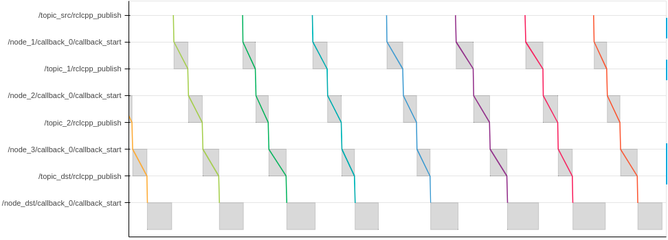
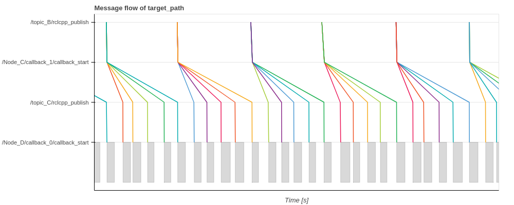

# FAQ

## Installation

### Setup fails

- In case you encounter errors during setup or build process, please make sure to use an appropriate branch for your environment
  - ROS 2 Galactic, Ubuntu 20.04: `galactic` branch
  - ROS 2 Humble, Ubuntu 22.04: main branch
- It's also important to delete `./build` `./install` and `./src` directory before rebuilding CARET if you have built CARET using wrong settings

### CLI tool doesn't work

In case CLI tool execution fails, please make sure to perform CARET environment settings

```bash
source /opt/ros/humble/setup.bash
source ~/ros2_caret_ws/install/local_setup.bash

ros2 caret check_caret_rclcpp --workspace <path-to-workspace>
```

<prettier-ignore-start>
!!!warning
      CARET CLI tool doesn't work properly in Anaconda environment. Please use pure Python.
<prettier-ignore-end>

## Recording

### LTTng session doesn't start after `ros2 caret record`

- Check detailed status for recording sequence by adding `-verbose` option (e.g. `ros2 caret record -v` )
  - You will see `N/M process started recording` , where `N` is the number of processes which have been started recording and `M` is the number of total processes to be started recording
- If `N` increases very slowly, add `--recording-frequency` option with integer greater than 100 (e.g. `ros2 caret record -f 500` )
  - Please be careful that it increases the possibility of recording failure
- If `N` remains 0, remove `~/.lttng` and start recording again
  - Please be careful that the first recorded trace data after removing `~/.lttng` tends to lack some events. So, please ignore the data
- It's also important to make sure you don't have another LTTng session running

### So many nodes named `/caret_trace_ooooooo` created

- As described in [design section](../design/runtime_processing/index.md), a node to store CARET events is created for each process. Therefore, if a target application is huge and has a lot of processes, the number of CARET nodes also becomes huge

## Visualization

### Result (plot, message_flow, etc.) is not outputted, or there seems something wrong with the result

- Please use the following commands for verification
  - `ros2 caret check_caret_rclcpp` to check if a target application is built with CARET/rclcpp
  - `ros2 caret check_ctf` to check if tracing data is recorded properly
- Please make sure the followings:
  - A target application is built with CARET/rclcpp
  - CARET environment is set properly before running a target application
    - `export LD_PRELOAD=$(readlink -f ~/ros2_caret_ws/install/caret_trace/lib/libcaret.so)`
    - `source ~/ros2_caret_ws/install/local_setup.bash`
  - LTTng trace is started before running a target application
    - `ros2 trace -s e2e_sample -k -u "ros2*"`
    - or consider to use launch file
  - Trace data is not discarded
    - In case trace data is discarded, use [Trace filter](../recording/trace_filtering.md)
  - The size of trace data is proper
    - If the size of trace data is extremely small (e.g. only few KByte) and a target application has lots of nodes, the maximum number of file descriptors may not be enough. It can be increased by `ulimit -n 65536`
- See [Recording](../recording/index.md) for more details

### Parts of results are not outputted

- If certain nodes are not traced but some nodes are traced, some packages may be built without CARET/rclcpp. Please make sure `<depend>rclcpp</depend>` is described in `package.xml`
- Another possibility is that some nodes can't be analyzed due to CARET's limitations:
  - CARET cannot analyze a node which has two or more timer callbacks with the same period time setting
  - CARET cannot analyze a node which has two or more subscription callbacks with the same topic name
- Callback information in such nodes are not outputted. Also, message flow will be discontinued at such nodes

### `TraceResultAnalyzeError: Failed to find` error occurs

- The error occurs if information in an architecture file and trace data are inconsistent with each other
- Please modify the architecture file or check recording process
- e.g.
  - `TraceResultAnalyzeError: Failed to find callback_object.node_name: /localization/pose_twist_fusion_filter/ekf_localizer, callback_name: timer_callback_0, period_ns: 19999999, symbol: void (EKFLocalizer::?)()`

## Visualization (callback)

### Callback frequency is smaller than expected value

- `Plot.create_callback_frequency_plot` calculates frequency from one second to one second. It counts how many times a callback function is called for a second, and just uses the count as frequency. Therefore, the frequency on the last term tends to small because the last term is usually shorter than one second
- Another possibility is that the frequency of a subscription callback will be small if it receives topics not periodically but infrequently. Also, the frequency of a timer callback will be small if the timer dynamically stops/starts

### Callback latency is bigger than expected value

- Some nodes may run initialization process. In this case, the latency time calculated by `Plot.create_callback_latency_plot` is huge on the first execution

## Visualization (message flow)

### Message flow is discontinued

- If parts of nodes/communications don't run at all during recording, message flow stops on the way and such nodes/communications are not displayed on y-axis
  - Please make sure that all nodes/communications in a target path run during recording, or modify a target path to analyze actually working path
- Another possibility is that a target path includes a node which CARET cannot analyze due to its limitations as explained above

### What is a gray color rectangle in a message flow diagram?

- A rectangle in a message flow diagram indicates a period from the entry to the exit of a callback function, while a line shows a flow of topics
- Note: a rectangle is not always illustrated



### Huge delay between topic publication and callback start

- In a message flow diagram, elapsed time from `ooo/rclcpp_publish` to `ooo/callback_start` means latency from when a topic is published to when the following callback starts
- It includes the following time:
  - Communication (topic) latency
  - Wait by ROS scheduler
  - Wait by OS scheduler
- In most cases, it doesn't take so much time. In case the time is huge, the followings are possible causes:
  - There is a problem in communication
  - An executor cannot wake up because other processes occupy CPU
  - A callback cannot wake up because other callbacks in the same callback group occupy the executor
  - Processing time of a callback is longer than topic subscription period

### Message flow looks split

- Take the following system for example;
  - `Node_C` publishes a topic when it receives a topic from `Node_A`
  - `Node_A` publishes a topic with a rate of 50 Hz, while `Node_B` publishes a topic at 10 Hz
- Message flow (`Node_B` -> `Node_C` -> `Node_D`) looks split at `Node_C`. It's because `Node_C` publishes 5 topics while receiving 1 topic from `Node_B`
- Note: A similar phenomenon will happen even if `Callback c0` is a timer callback




### Message flow looks dropped

- Take the following system for example;
  - `Node_C` publishes a topic when it receives a topic from `Node_A`
  - `Node_A` publishes a topic with a rate of 10 Hz, while `Node_B` publishes a topic at 50 Hz
- Message flow (`Node_B` -> `Node_C` -> `Node_D`) looks disconnected at `Node_C` four times every five messages. It's because `Node_C` publishes 1 topic while receiving 5 topics from `Node_B`. So 4 topics don't have a corresponding topic to be published to `Node_D`
- Note: A similar phenomenon will happen even if `Callback c0` is a timer callback


### How response time is calculated?

- In general, response time is the time a system or functional unit takes to react to a given input ([reference](<https://en.wikipedia.org/wiki/Response_time_(technology)>)). Response time calculated by CARET is the time it takes for input data to arrive at the last node. It doesn't include processing time at the first/last node nor latency of an actuator. It's calculated as the sum of communication latency time (from the time when a node publishes a topic to the time when the following node subscribes the topic) and node latency time (from the time when a node subscribes a topic to the time when it publishes another topic) in a path
  - In the following diagram, input data at point A is first reflected with output at point X (`ResponseTime_Best`)
  - `ResponseTime_Best` can be considered as a path (dataflow) latency time
  - `ResponseTime_Best` can be considered as a happy case, which is contrary to the following worst case scenario
- Assuming that input information is created by a sensor such as an object detection sensor, delay in a sensor should be considered. For instance, if a new object appears at point B, the time from point B to point A should added to the response time. The worst case scenario is that a new object appears just after the previous flow (point C). Response time for the worst case is shown as `ResponseTime_Worst`
- CARET can calculate both `ResponseTime_Best` and `ResponseTime_Worst` using the following APIs:
  - `response_time.to_best_case_timeseries()` , `response_time.to_best_case_histogram()`
  - `response_time.to_worst_case_timeseries()` , `response_time.to_best_worst_histogram()`
- CARET also provides `response_time.to_histogram()` API. It creates histogram assuming a new object appears from point C to point A at intervals of histogram bin size


