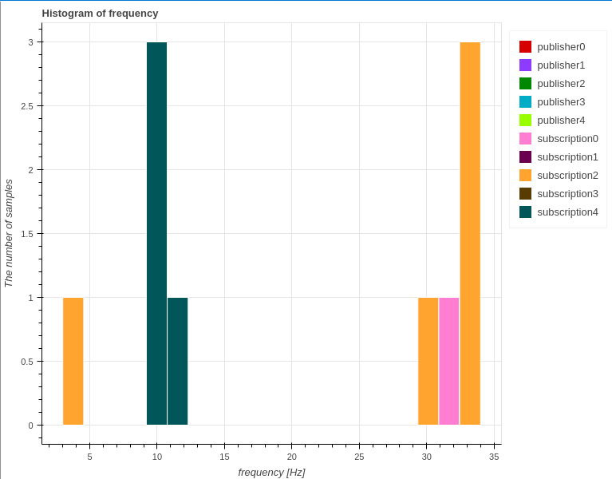

# Gallery

This page shows examples of figures that can be visualized in CARET.
If you find what you are interested in, please access to a link embedded in a headline.

## [Callback Scheduling Visualization](./visualization/scheduling/callback.md)

### [Timing chart of callback scheduling](./visualization/scheduling/callback.md)

## Timeseries

### [Callback frequency graph](./visualization/frequency/index.md)

### [Publishers and Subscriptions period graph](./visualization/period/index.md#publish-and-subscription)

### [Communication latency graph](./visualization/latency/index.md#communication)

## Histogram

### [callback latency graph](./visualization/latency/index.md)

### [Publishers and Subscriptions frequency graph](./visualization/frequency/index.md#publish-and-subscription)

### [Communication period graph](./visualization/period/index.md)

## Stacked Bar

### [Response time graph](./visualization/path/response_time.md)

## Message flow

### [Path graph](./visualization/path/message_flow.md)

## Chain latency

### [Path graph](./visualization/path/chain_latency.md)

