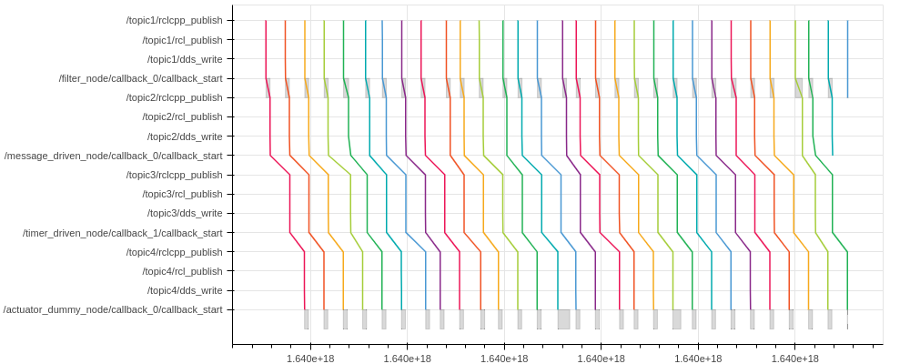
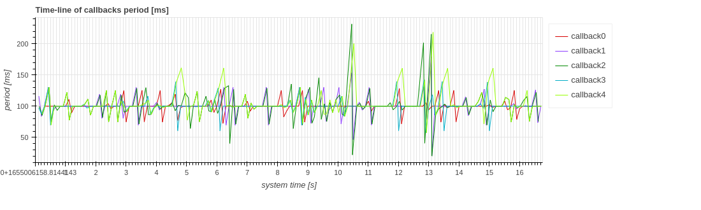

# Gallery

This page shows examples of figures that can be visualized in CARET.
CARET visualizes these figures on jupyter-notebook.

## Message flow

 
Detail : [Message flow](visualization/visualization_api/message_flow.md)

## Chain latency

 
Detail : [Chain latency](visualization/visualization_api/chain_latency.md)

## Latency timeseries

 
Detail : [Latency timeseries](visualization/visualization_api/latency_time_series.md)

## Latency histogram

 
Detail : [Latency histogram](visualization/visualization_api/latency_histogram.md)

### Execution frequency

 
Source code : [Execution frequency](visualization/visualization_api/callback_information.md#execution-frequency)

### Period

 
Detail : [Period](visualization/visualization_api/callback_information.md#period)

### Latency

 
Detail : [Latency](visualization/visualization_api/callback_information.md#latency)

## Callback Scheduling Visualization

 
Detail : [Callback Scheduling Visualization](visualization/visualization_api/callback_scheduling_visualization.md)
