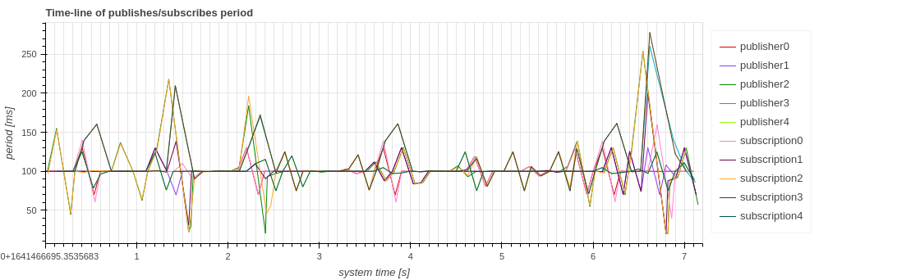

# Gallery

This page shows examples of figures that can be visualized in CARET.
If you find what you are interested in, please access to a link embedded in a headline.

## Callback

### [Execution frequency](./visualization/frequency/index.md#callback)

#### Timestamp tables

#### Time-series graph

### [Execution period](./visualization/period/index.md#callback)

#### Timestamp tables

#### Time-series graph

### [Latency (or Execution time)](./visualization/latency/index.md#callback)

#### Timestamp tables

#### Time-series graph

### [Callback Scheduling Visualization](./visualization/scheduling/callback.md)

#### Timing chart of callback scheduling

## Communication

### [Frequency](./visualization/frequency/index.md#communication)

### [Period](./visualization/period/index.md#communication)

### [Latency](./visualization/latency/index.md#communication)

### [Publish/Subscribe Frequency](./visualization/frequency/index.md#publish-and-subscription)

### [Publish/Subscribe Period](./visualization/period/index.md#publish-and-subscription)

## Path

### [Message flow](./visualization/path/message_flow.md)

### [Response Time Histogram](./visualization/path/response_time.md)

### [Chain latency](./visualization/path/chain_latency.md)

