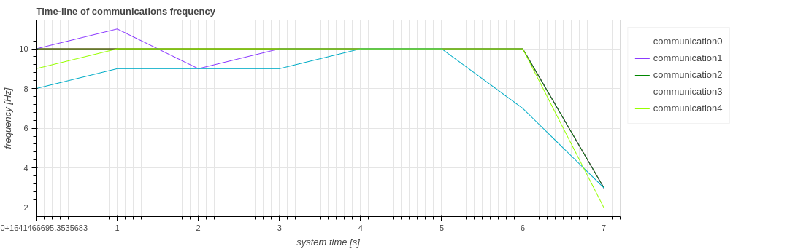

# Gallery

This page shows examples of figures that can be visualized in CARET.
CARET visualizes these figures on jupyter-notebook.

## Callback

### Frequency

 
Detail : [Frequency](./visualization/callback/callback_information.md#frequency)

### Period

 
Detail : [Period](./visualization/callback/callback_information.md#period)

### Latency

 
Detail : [Latency](./visualization/callback/callback_information.md#latency)

### Callback Scheduling Visualization

 
Detail : [Callback Scheduling Visualization](./visualization/callback/callback_scheduling_visualization.md)

## Communication

### Frequency

 
Detail : [Frequency](./visualization/communication/communication_information.md#frequency)

### Period

 
Detail : [Period](./visualization/communication/communication_information.md#period)

### Latency

 
Detail : [Latency](./visualization/communication/communication_information.md#latency)

### Publish/Subscribe Frequency

 
Detail : [Frequency](./visualization/communication/pub_sub_information.md#frequency)

### Publish/Subscribe Period

 
Detail : [Period](./visualization/communication/pub_sub_information.md#period)

## Path

### Message flow

 
Detail : [Message flow](./visualization/path/message_flow.md)

### Response Time Histogram

 
Detail : [Response Time Histogram](./visualization/path/response_time.md)

### Chain latency

 
Detail : [Chain latency](./visualization/path/chain_latency.md)

--8<-- "includes/glossary.md"
