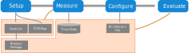

# Chain-Aware ROS Evaluation Tool (CARET)

CARET is one of performance analysis tool dedicated with ROS 2 applications. It is able to measure not only callback latency and communication latency, but also path latency, in other words, chain of node or callback. As additional tracepoints are introduced by function hook, tracing resolution is improved.

Features and capabilities are shown below.

Features:

- Low overhead with LTTng-based tracepoints for sampling events in ROS/DDS layer
- Flexible tracepoints added by function hooking with LD_PRELOAD
- Python-based API for flexible data analysis and visualization
- Application-layer events tracing by cooperation with TILDE, runtime message tracer

Capabilities:

- Performance measurement from several aspects
  - Callback latency, frequency, and period
  - Topic communication latency, frequency, and period
  - Node latency
  - Path latency
    - End-to-end latency of software if path from input to output is selected
- Visualization of scheduling for callback execution
- Filtering function to ignore specific nodes and topics
- Search of target paths to trace
- Trace of application events like consumption of buffered topic message
  - `/tf` (planned for v0.3.x release)
  - `message_filters` (supported by TILDE)
  - `image_transport` (supported by TILDE)

## Tracing flow with CARET

CARET gives you capability of tracing your application with introducing new tracepoints to ROS and DDS layer while it utilized original tracepoints for [`ros2_tracing`](https://gitlab.com/ros-tracing/ros2_tracing).

CARET is served as only source code, but not as `apt` package, so far.  
CARET hooks dedicated functions to those defined in dynamic library in order to add tracepoints.  
The fork of rclcpp which has CARET-dedicated tracepoints is delivered.
You have to build CARET and your application if you want to use.

After you run your application with CARET, you will get recorded data which includes events, metadata and timestamp. You have to write a configuration file, called architecture file, in which you defines node latency and target path, before you analyze the data set.

You will visualize trace data with the architecture file and `caret_analyze` package, including API for data analysis.
`caret_analyze` is designed on assumption that users analyze trace data on Jupyter Notebook.

## Contents list

### Installation

Installation with Ansible is provided as the following page shows.

- [Installation](./installation/installation.md)

### Tutorials

Refer to these page if you want to try.

- [Recording](./tutorials/recording.md)
- [Configuration](./tutorials/configuration.md)
- [Visualization](./tutorials/visualization.md)

### Design

- [Index](./design)
- [Software architecture](./design/software_architecture/index.md)
- [Processing trace data](./design/processing_trace_data/index.md)
- [Runtime processing](./design/runtime_processing/index.md)
- [Tracepoints](./design/trace_points/index.md)
- [Configuration](./design/configuration/index.md)
- [Limits and constraints](./design/limits_and_constraints/index.md)

### Details of each step for analysis

CARET serves helpful functions for you to analyze your application efficiently. Please refer to detailed explanation of each step for analysis.

- [Recording](./recording)
- [Configuration](./configuration)
- [Visualization](./visualization/)

### API list

CARET serves powerful API to visualize and analyze performance. API list is located on the other repository, `caret_analyze`.

- [API list](https://tier4.github.io/caret_analyze/latest/) (external link)

There are two types of APIs: [for user](https://tier4.github.io/caret_analyze/latest/architecture/) and [for developer](https://tier4.github.io/caret_analyze/latest/common/).

## Related repositories

CARET is constructed of the following packages

- [caret_trace](https://github.com/tier4/caret_trace) ｜ Define tracepoints added by function hooking
- [caret_analyze](https://github.com/tier4/caret_analyze) ｜ Library for scripts to analyze and visualize data
- [caret_analyze_cpp_impl](https://github.com/tier4/caret_analyze_cpp_impl.git) ｜ Efficient helper functions to analyze trace data written in C++
- [ros2caret](https://github.com/tier4/ros2caret.git) ｜ CLI commands like `ros2 caret`
- [caret_demos](https://github.com/tier4/caret_demos) ｜ Demo programs for CARET
- [caret_doc](https://github.com/tier4/caret_doc) ｜ Documentation
- [rclcpp](https://github.com/tier4/rclcpp/tree/rc/v0.3.0) ｜ the forked `rclcpp` including CARET-dedicated tracepoints
- [ros2_tracing](https://github.com/tier4/ros2_tracing/tree/rc/v0.3.0)｜ the forked `ros2_tracing` including definition of CARET-dedicated tracepoints

---

This software is based on results obtained from a project subsidized by the New Energy and Industrial Technology Development Organization (NEDO).
