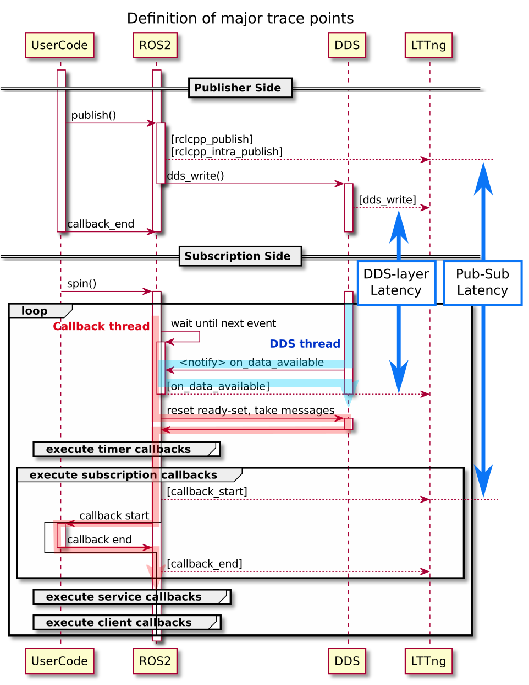

# 通信レイテンシの定義

CARET で算出される通信レイテンシについて詳細を説明します。

## レイテンシの定義



### 通信イテンシの定義

CARET が算出している通信レイテンシの定義は以下の通りです。

```text
Pub-Sub レイテンシ = Subscriptionコールバックの実行開始時刻 - Publisher::publish()実行開始時刻
```

この値は、ros2 topic delay や、topic statistics で測定される値に対応します。

```text
通信レイテンシ = 現在時刻 - msg.header.stamp
```

<!-- また、プロセス内通信とプロセス間通信で、レイテンシの構成が変わってきます。
Pub-Sub レイテンシはプロセス内通信・プロセス間通信両方で算出されます。

Pub-Sub レイテンシは、ユーザーコード（コールバック）の実行以外によるレイテンシを全て含んだ値です。
概ねコールバック終了からコールバック開始までの時間です。
publish 後、subscription コールバック実行開始までは、エグゼキューターによるスケジューリングの遅延が発生します。
プロセス間通信に対する Pub-Sub レイテンシとは、このスケジューリングによる遅延のことをさします。
大まかなシーケンス図を書きます。 -->

<!-- DDS によるレイテンシと、エグゼキューターによる遅延を指します -->
<!-- ### DDS-layer レイテンシの定義

DDS-layer レイテンシの定義は以下の通りです。

```text
DDS-layer レイテンシ = on_data_availableの実行開始時刻 - dds_writeの実行開始時刻
```

DDS-layer レイテンシは、プロセス間通信のみ算出されます。

dds_write は rmw が DDS に書き込む時刻、
on_data_available は DDS が RMW に通知する時刻になります。

※ CycloneDDS は on_data_available をエグゼキューターの起床に使用していません。
そのため、on_data_availale と subscription callback の実行開始の前後の時間関係がズレる可能性があります。

## Pub-Sub レイテンシと DDS-layer レイテンシの違い

Pub-Sub レイテンシと DDS-layer レイテンシはどちらも通信レイテンシと捉えることができます。

レイテンシの観測開始地点である、rclcpp_publish と dds_write は同じスレッドで実行されており、ほとんど差はありません。
callback_start はコールバックスレッドが実行します。そのため、他のコールバックが実行完了し、対象の Subscription コールバックの実行開始順番が回ってくるまで待たされる可能性があります。
例えば、タイマーコールバックと subscription コールバックがほぼ同時に発火した場合、Pub-sub レイテンシにはタイマーコールバックの実行時間も含まれます。

一方で、観測の終了地点である、on_data_available と callback_start は、実行するスレッドが異なります。
on_data_available は DDS スレッドが実行します。 従って、DDS-layer レイテンシは他のコールバックの実行時間は含みません。

Pub-Sub レイテンシに大きな値が算出された場合、DDS-Layer レイテンシも確認することで、他のコールバックによる影響か判断することができます。 -->

エグゼキュータのスケジューリングについては、こちらの論文も参照ください。  
[Response-Time Analysis of ROS 2 Processing
Chains Under Reservation-Based Scheduling](https://drops.dagstuhl.de/opus/volltexte/2019/10743/pdf/LIPIcs-ECRTS-2019-6.pdf)
