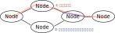

# 評価準備

CARET は、評価する際にアーキテクチャファイルの作成が必要です。

トレース結果からアーキテクチャファイルの雛形を作成できますが、一部手作業での修正が必要になります。  
ここでは、アーキテクチャファイルの作成方法とその修正方法を説明します。

## アーキテクチャファイルとは

アーキテクチャファイルとは、実際に実行されたノードの情報など、測定毎に不変な静的な情報のみを含んだ yaml 形式の設定ファイルです。  
コールバックの実行時間などの動的な情報は含みません。  
※ トピック名やタイマーの周期など、実行時のパラメータも一部含みます。

アーキテクチャファイルで記述した静的な情報と、  
コールバックの実行時間などの測定結果と合わせることで、レイテンシの算出が行えるようになります。

---

アーキテクチャファイルの主な役割は以下の通りです。

1. 測定対象のパスを定義
1. ノードおよびコールバックの実行方法（エグゼキューターの情報）を記述
1. ノードレイテンシの算出方法（ノードの情報）を指定



この内、① パスの情報は pythonAPI からの編集（直接 yaml ファイルからの編集も可）、② ノードの情報は直接 yaml ファイルの編集が必要です。

## jupyter の起動

本ページで説明する雛形の作成などの作業は、python API を使用して行います。

以下の手順で jupyter を起動してください。

```bash
mkdir -p ~/ros2_ws/evaluate && cd ~/ros2_ws/evaluate

source ~/ros2_caret_ws/install/setup.bash
jupyter-lab
```

## 雛形の作成

雛形は python 以下のコードでトレース結果から生成できます。

```python
from caret_analyze import Architecture

# トレース結果からアーキテクチャファイルの読み込み
arch = Architecture('lttng', './e2e_sample')

# アーキテクチャファイルの保存
arch.export('architecture.yaml')

# 生成されたファイルの確認
! readlink -f ./architecture.yaml
# /home/user/ros2_caret_ws/eval/architecture.yaml
```

## 測定対象のパスの指定

生成したアーキテクチャファイルは以下のようにして読み込めます。

```python
from caret_analyze import Architecture, check_procedure
arch = Architecture('yaml', './architecture.yaml')
```

読み込んだ情報を元に、始点ノードから終点ノードまでのパスを全探索します。

```python
paths = arch.search_paths(
    '/sensor_dummy_node', # パスの開始ノード
    '/actuator_dummy_node') # パスの終了ノード
```

測定対象のアプリケーションが複雑な場合、探索に時間がかることがあります。  
その際は、無関係なノードやトピックの枝刈りや、探索する深さを指定できます。 詳細は[パスの探索方法](../supplements/how_to_search_path.md)を参照ください。

探索されたパスは複数見つかることがあります。  
測定したいパスのインデックスを探すために、探索したパスの情報を確認します。

```python
path = paths[0]
path.summary.pprint()

---以下出力---

path:
  - message_context: null # ノードレイテンシの定義。
    node: /sensor_dummy_node
  - topic: /topic1
  - message_context:
      publisher_topic_name: /topic2
      subscription_topic_name: /topic1
      type: callback_chain
    node: /filter_node
  - topic: /topic2
  - message_context: null
    node: /message_driven_node
  - topic: /topic3
  - message_context: null
    node: /timer_driven_node
  - topic: /topic4
  - message_context: null
    node: /actuator_dummy_node
```

決定したパスに`target_path`と名前を付け、アーキテクチャファイルに保存します。

```python
arch.add_path('target_path', path)
arch.export('./architecture.yaml')
```

アーキテクチャファイルには、以下のように記載されます。

```yaml
named_paths:
  - path_name: target_path
    node_chain:
      - node_name: /sensor_dummy_node
        publish_topic_name: /topic1
        subscribe_topic_name: UNDEFINED
      - node_name: /filter_node
        publish_topic_name: /topic2
        subscribe_topic_name: /topic1
      - node_name: /message_driven_node
        publish_topic_name: /topic3
        subscribe_topic_name: /topic2
      - node_name: /timer_driven_node
        publish_topic_name: /topic4
        subscribe_topic_name: /topic3
      - node_name: /actuator_dummy_node
        publish_topic_name: UNDEFINED
        subscribe_topic_name: /topic4
```

## ノードレイテンシの定義指定

ノードレイテンシは、「ノードがメッセージを subscribe し、コールバックが処理開始する時刻」から「ノードがメッセージを publish する時刻」までとしています。  
ただし、ノードレイテンシはノードの実装にも大きく依存し、統一的な手法での測定は困難です。

CARET ではいくつかのノードレイテンシの算出方法を提供しています。  
ノードレイテンシの算出方法はアーキテクチャファイルでは、主に **message_context**という項目として指定します。

### 修正対象の確認

以下のように、`path.verify()`を実行し、パスに含まれるノードレイテンシの定義の情報が不足ていないか確認します。

```python
from caret_analyze import Architecture

arch = Architecture('yaml', './architecture.yaml')
path = arch.get_path('target_path')
path.verify()

---以下出力---
WARNING : 2021-12-20 19:14:03 | Detected "message_contest is None". Correct these node_path definitions.
To see node definition and procedure,execute :
>> check_procedure('yaml', '/path/to/yaml', arch, '/message_driven_node')
message_context: null
node: /message_driven_node
publish_topic_name: /topic3
subscribe_topic_name: /topic2

WARNING : 2021-12-20 19:14:03 | Detected "message_contest is None". Correct these node_path definitions.
To see node definition and procedure,execute :
>> check_procedure('yaml', '/path/to/yaml', arch, '/timer_driven_node')
message_context: null
node: /timer_driven_node
publish_topic_name: /topic4
subscribe_topic_name: /topic3
```

上記は、以下の修正が必要と警告しています

- `/message_driven_node`ノード、`/topic2`入力から`/topic3`出力のパス
- `/timer_driven_node`ノード、`/topic3`入力から`/topic4`出力のパス

警告されたノードのパスについて、アーキテクチャファイル内の対応する message_context を編集する必要が有ります。

### ノードレイテンシの算出方法指定

サンプルのアプリケーションでは、以下の修正が必要になります。

```yaml
# /message_driven_node内の項目
message_contexts:
  - context_type: use_latest_message # UNDEFINEDからuse_latest_messageへ変更
    subscription_topic_name: /topic2
    publisher_topic_name: /topic3
```

```yaml
# /message_driven_node内の項目
  message_contexts:　
  - context_type: use_latest_message # UNDEFINEDからuse_latest_messageへ変更
    subscription_topic_name: /topic3
    publisher_topic_name: /topic4

```

### 修正結果の確認

ノードレイテンシの定義を与えた後、警告がでなくなることを確認します。

```python
from caret_analyze import Architecture

arch = Architecture('yaml', './architecture.yaml')
path = arch.get_path('target_path')
path.verify()
```

警告が出なければ、パスのレイテンシが算出できるということになります。  
警告が出る箇所は、算出に必要な情報が不足している可能性があります。

最終的には以下のようなアーキテクチャファイルを用意します。

TODO: サンプルのアーキテクチャファイルへのリンクを追加。
