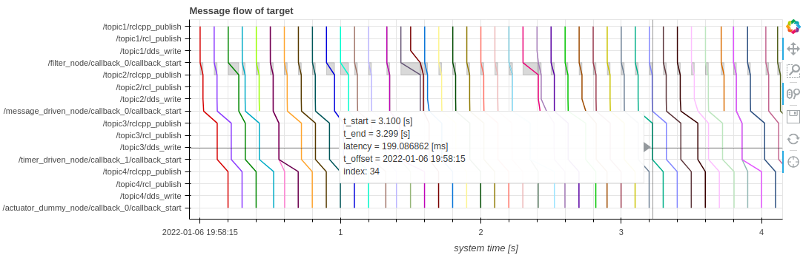

# Performance visualization

CARET serves Python APIs to visualize trace data for users to analyze applications' performance.
This section will show basic flow to visualize data with Jupyter notebook.

## How to locate trace data on Jupyter notebook

1. Launching `jupyter-lab`
   Launch `jupyter-lab` at first for learning how to visualize trace data.

   ```bash
   cd ~/ros2_ws/evaluate

   source ~/ros2_caret_ws/install/setup.bash
   jupyter-lab
   ```

   CARET uses [`bokeh`](https://bokeh.org/) for some visualization APIs.
   Execute the following code for loading `bokeh`

   ```python
   from bokeh.plotting import output_notebook
   output_notebook()
   ```

2. Loading trace data onto Jupyter notebook

   Locate trace data on Jupyter notebook as well as the architecture file.

   ```python
   from caret_analyze import Architecture, Application, Lttng

   # load the architecture file which is created in the previous page
   arch = Architecture('yaml', './architecture.yaml')

   # load measured data by CARET
   lttng = Lttng('./e2e_sample')

   # map the application architecture to measured data
   app = Application(arch, lttng)
   ```

   After execution of the code, users will often refer to the `app` object defined as `Application` class. The `app` objects provides users latency of callbacks, communication, and paths. `Application` class is similar to `Architecture` class which describes structure of the application and their interfaces are similar. In addition, `Application` class has interfaces to get latency.

## Basic API to get latency

This section will explain APIs to get callback latency. The following code is one of examples to get callback latency.

```python
# Get a callback instance, which has latency information, from app
callback = app.get_callback('/timer_driven_node/callback_0')

# Get time-series variation of latency
t, latency_ns = callback.to_timeseries()

# Get histogram of latency
bins, latency_ns = callback.to_histogram()
```

Though this example shows callback latency, CARET serves API to get communication latency.
`callback.to_dataframe()` will provides `pandas.DataFrame` based object including raw timestamps which is obtained from tracepoints.

<prettier-ignore-start>
!!! todo
        Sorry for not providing CARET's API list, but we'll provide it in the near future.
<prettier-ignore-end>

## Visualizing latency of node chain with message flow

CARET provides some APIs to visualize measured data.
With message flow, which is one of effective visualizations, users can understand what happens and where is bottleneck in target applications.
Execute the following code for visualization with message flow.

```python
from caret_analyze.plot import message_flow

path = app.get_path('target_path')
message_flow(path)
```

The following figure will appear if `message_flow` method is successful.



The horizontal axis shows time line. On the other hand, the vertical axis shows elements of the node chain (`target_path`), which include callback functions and topic messages from input to output. Each colorful line shows how a certain input message is propagated to callback functions and topic communications. Gray rectangles show execution timing of callback functions.

If your mouse pointer is put over one of gray rectangles, latency of callback functions will be shown. You can find latency of a target node chain as well if you put the mouse pointer onto one of colorful lines.

CARET serves other APIs for visualization. Refer to [ギャラリー](../visualization/gallery.md) for more details.
