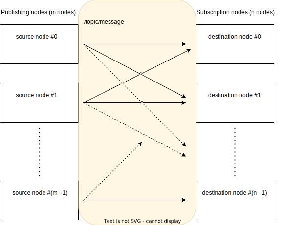

# Many to many communication

ROS 2 allows topic messages to be published from multiple nodes and to be received by multiple nodes. Topic messages who share a same topic are transmitted and received among many nodes as the following figure shows.

If you want to investigate performance of many-to-many communication, you should select a pair of 1-to-1 communications because CARET divides them into 1-to-1 communication.
You can get with executing `Application.get_communication()` per target communication.

## Caution for Many-to-1 communication

CARET requires users to take care of Many-to-1 communication. Many-to-1 communication means that topic messages are published from multiple nodes and received by a single node as the following figure shows.

In this case, invocation frequency of publish on the source node is different from that of subscription on the destination node. The destination node receives topic messages from 2 other nodes. It is expected that sum of publish frequency on three nodes is equaled to that of subscription.

If you see that publish frequency is different from subscription frequency, you may think loss of topic messages. However, it is reasonable when many-to-1 communication is performed.
