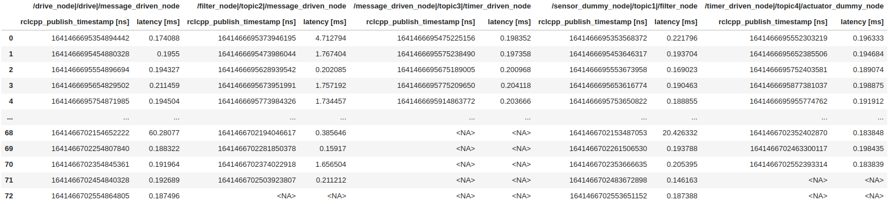

# Latency (or Execution time)

CARET is able to show you latencies of callback execution, message communication. `Plot.create_latency_timeseries_plot(target_object)` interface is provided for it.
This section describes sample visualization scripts for them.
Execute the following script code to load trace data and an architecture object before calling this method.

```python
from caret_analyze.plot import Plot
from caret_analyze import Application, Architecture, Lttng
from bokeh.plotting import output_notebook, figure, show
output_notebook()
arch = Architecture('yaml', '/path/to/architecture_file')
lttng = Lttng('/path/to/trace_data')
app = Application(arch, lttng)
```

## Callback

`Plot.create_latency_timeseries_plot(callbacks: Collections[CallbackBase])` and `Plot.create_latency_histogram_plot(callbacks: Collections[CallbackBase])` are served to see execution time of callback functions.

```python
### Timestamp tables
plot = Plot.create_latency_timeseries_plot(app.callbacks)
latency_df = plot.to_dataframe()
latency_df

# ---Output in jupyter-notebook as below---
```


### Time Series

```python
### Time-series graph
plot = Plot.create_latency_timeseries_plot(app.callbacks)
plot.show()

# ---Output in jupyter-notebook as below---
```


The horizontal axis means time, labeled as `Time [s]`. `xaxis_type` argument is prepared to select index of x-axis among Linux system time, [ROS simulation time](../../recording/sim_time.md), and 0-based ordering. One of `'system_time'`, `'sim_time'` and `'index'` is chosen as `xaxis_type` though `'system_time'` is the default value.
The vertical axis means execution time of callback function, labeled as `Latency [ms]`. It is duration from `callback_start` to `callback_end` and plotted per sample.

### Histogram

```python
### Histogram graph
plot = Plot.create_latency_histogram_plot(app.callbacks)
plot.show()

# ---Output in jupyter-notebook as below---
```


The horizontal axis represents the latency, labeled as `latency [ms]`. The vertical axis represents the number of samples executed at each latency, labeled as `The number of samples`.

## Communication

`Plot.create_latency_timeseries_plot(communications: Collection[Communication])` and `Plot.create_latency_histogram_plot(communications: Collection[Communication])` are called when you are concerned how long time is consumed from message publish to corresponding subscription.
Here, CARET takes into account communication when both transmission and reception on a message are performed successfully without being lost.
See Premise of communication for more details.

```python
### Timestamp tables
plot = Plot.create_latency_timeseries_plot(app.communications)
latency_df = plot.to_dataframe()
latency_df

# ---Output in jupyter-notebook as below---
```



### Time Series

```python
### Time-series graph
plot = Plot.create_latency_timeseries_plot(app.communications)
plot.show()

# ---Output in jupyter-notebook as below---
```


The horizontal axis means time, labeled as `Time [s]`. `xaxis_type` argument is prepared as well as the previous callback subsection.
The vertical axis means latency, labeled as `Latency [ms]`. It is plotted per sample.

<prettier-ignore-start>
!!! warning
    Communication latency is defined as elapsed time from topic message publish to subscription callback execution corresponding to the message.
    Strictly speaking, it is not not only elapsed time from message transmission to reception, but it also includes scheduling latency of callback.
<prettier-ignore-end>

### Histogram

```python
### Histogram graph
plot = Plot.create_latency_histogram_plot(app.communications)
plot.show()

# ---Output in jupyter-notebook as below---
```


The horizontal axis represents the latency, labeled as `latency [ms]`. The vertical axis represents the number of samples executed at each latency, labeled as `The number of samples`.
