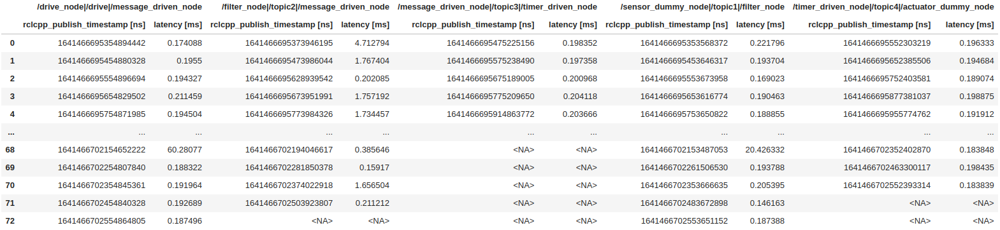

# Execution time (latency)

CARET can visualize latencies of `CallbackBase`-based objects and `Communication`-based objects.
Any object can be visualized in the same `Plot.create_latency_timeseries_plot(target_object)` interface.
This section describes sample visualization scripts for them.
Execute the following script code to load trace data and an architecture object before calling visualization API.

```python
from caret_analyze.plot import Plot
from caret_analyze import Application, Architecture, Lttng
from bokeh.plotting import output_notebook, figure, show
output_notebook()
arch = Architecture('yaml', '/path/to/architecture_file')
lttng = Lttng('/path/to/trace_data')
app = Application(arch, lttng)
```

## Callback

`Plot.create_latency_timeseries_plot(callbacks: Collections[CallbackBase])` is served to see execution time of callback functions.

```python
### Timestamp tables
plot = Plot.create_latency_timeseries_plot(app.callbacks)
latency_df = plot.to_dataframe()
latency_df

# ---Output in jupyter-notebook as below---
```


```python
### Time-line graph
plot = Plot.create_latency_timeseries_plot(app.callbacks)
plot.show()

# ---Output in jupyter-notebook as below---
```


The horizontal axis means time, labeled as `Time [s]`. `xaxis_type` argument is prepared to select index of x-axis among Linux system time, [ROS simulation time](../../recording/sim_time.md), and 0-based ordering. One of `'system_time'`, `'sim_time'` and `'index'` is chosen as `xaxis_type` though `'system_time'` is the default value.
The vertical axis means execution time of callback function, labeled as `Latency [ms]`. It is duration from `callback_start` to `callback_end` and plotted per sample.


# Communication

`Plot.create_latency_timeseries_plot(communications: Collection[Communication])` is called when you are concerned how long time is consumed from message publish to corresponding subscription.
For premise knowledge of communications, see [Premise of communication](../communication/premise_of_communication.md).

```python
### Timestamp tables
plot = Plot.create_latency_timeseries_plot(app.communications)
latency_df = plot.to_dataframe()
latency_df

# ---Output in jupyter-notebook as below---
```


```python
### Time-line graph
plot = Plot.create_communication_latency_plot(app.communications)
plot.show()

# ---Output in jupyter-notebook as below---
```


The horizontal axis means time, labeled as `Time [s]`. `xaxis_type` argument is prepared as well as the previous callback subsection.
The vertical axis means latency, labeled as `Latency [ms]`. It is plotted per sample.

<prettier-ignore-start>
!!! warning
    Communication latency is defined as elapsed time from topic message publish to subscription callback execution corresponding to the message.
    Strictly speaking, it is not not only required time from message transmission to reception, but it includes scheduling latency.
<prettier-ignore-end>
