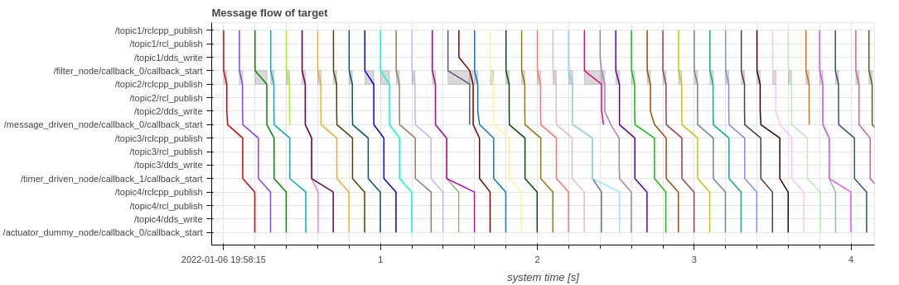

## Message flow

Visualizing the processing of each message at any point in time.

```python
from caret_analyze.plot import message_flow

path = app.get_path('target_path')

message_flow(path, granularity='node', treat_drop_as_delay=False, lstrip_s=1, rstrip_s=1)
```



The vertical axis goes from top to bottom, corresponding to the beginning to the end of the path.
Each line represents a message flow. The gray rectangular area indicates the callback execution time.

If `treat_drop_as_delay=False`, the latency of messages that reach the end point without being lost will be output.
If `treat_drop_as_delay=True`, the latency of messages calculated with the lost point as the delay.

In addition to the basic operations of bokeh, the message flow diagram allows the following operations

- Scale adjustment of xaxis/yaxis
  - Scale adjustments can be made only on the X-axis or only on the Y-axis by operating the wheel on the axis labels.
- View detailed information
  - Move the cursor over the lines in the message flow or the gray rectangular area can see the detail information of callback and message.

