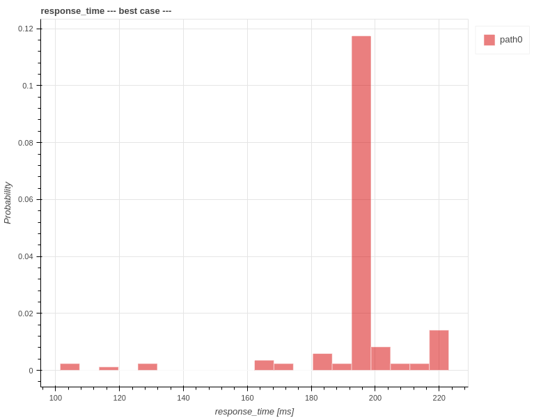
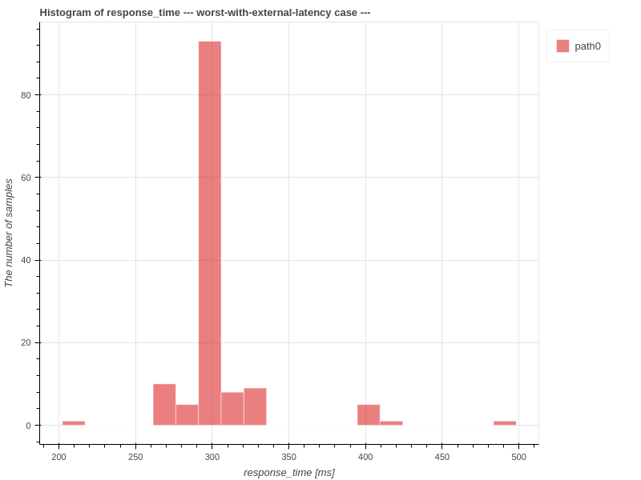
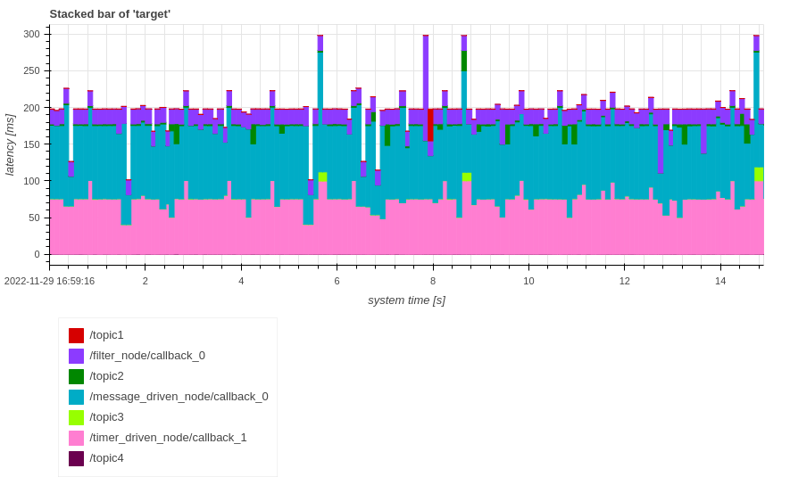

# Response Time

In context of CARET, response time is defined how much of time costs from a message input to message output of a target path.
Please refer to [FAQ](../../faq/faq.md#how-response-time-is-calculated) if you are interested in response time defined in CARET.

<prettier-ignore-start>
!!!Note
    "Response time" is generally used for the input/output of a system.
    Therefore, when analyzing a part of a system (when a target path is a part of end-to-end path), it should be referred to as "path latency (sum of node latency and communication latency)" rather than "response time".
    However, both will be referred to as "response time" for simplicity in this document.
<prettier-ignore-end>

As a visualization of the graph, four different cases can be specified in the `case` argument. Default value is 'all'; 'all', 'best', 'worst', and 'worst-with-external-latency'.

- `all` case
  - CARET displays the elapsed time from all input times in the same cycle.
- `best` case
  - CARET displays the elapsed time that is the shortest of all input times in the same cycle.
- `worst` case
  - CARET displays the elapsed time that is the longest of all input times in the same cycle.
- `worst-with-external-latency` case
  - CARET displays the elapsed time from the last input time of a previous cycle.

This section shows three methods to visualize response time, `Histogram`, `Stacked Bar` and `TimeSeries`.
Execute the following script code to load trace data and an architecture object before calling this method.

```python
from caret_analyze.plot import Plot
from caret_analyze import Application, Architecture, Lttng
from bokeh.plotting import output_notebook, figure, show
output_notebook()

arch = Architecture('yaml', '/path/to/architecture_file')
lttng = Lttng('/path/to/trace_data')
app = Application(arch, lttng)
path = app.get_path('target_path')
```

## Histogram

The following scripts generate histograms of response time. Horizontal axis of the histograms represents the response time, labeled as `response time [ms]` and vertical axis of the histograms  represents `The number of samples`.

```python
# plot all case
plot = Plot.create_response_time_histogram_plot(path)
plot.show()
# or
# plot = Plot.create_response_time_histogram_plot(path, case='all')
# plot.show()
```

<prettier-ignore-start>
!!!info
    The `output_notebook()` is needed to show figures inside Jupyter Notebook.
<prettier-ignore-end>


```python
# plot best case
plot = Plot.create_response_time_histogram_plot(path, case='best')
plot.show()
```



```python
# plot worst case
plot = Plot.create_response_time_histogram_plot(path, case='worst')
plot.show()
```


```python
# plot worst-with-external-latency case
plot = Plot.create_response_time_histogram_plot(path, case='worst-with-external-latency')
plot.show()
```



## Stacked Bar

The following scripts generate stacked bar graphs of response time.
Horizontal axis of the stacked bar graph means `system time [s]` or `index` and vertical axis means breakdown of time elapsed for each callback in `response time [s]`.

```python
# plot all case
plot = Plot.create_response_time_stacked_bar_plot(path)
plot.show()
# or
# plot = Plot.create_response_time_stacked_bar_plot(path, case='all')
# plot.show()
```



```python
# plot best case
plot = Plot.create_response_time_stacked_bar_plot(path, case='best')
plot.show()
```


```python
# plot worst case
plot = Plot.create_response_time_stacked_bar_plot(path, case='worst')
plot.show()
```


```python
# plot worst-with-external-latency case
plot = Plot.create_response_time_stacked_bar_plot(path, case='worst-with-external-latency')
plot.show()
```


The horizontal axis can be changed to `system time` or `index` by changing `plot.show()` to `plot.show(xaxis_type='index')`.

`[worst - best] response time` in legends refers to the difference in response time between the worst case and the best case.

## TimeSeries

The following scripts generate timeseries graphs of response time. The horizontal axis means `system time [s]` or `index`. The vertical axis means `Response Time [ms]`.

```python
# plot all case
plot = Plot.create_response_time_timeseries_plot(path)
plot.show()
# or
# plot = Plot.create_response_time_timeseries_plot(path, case='all')
# plot.show()
```


```python
# plot best case
plot = Plot.create_response_time_timeseries_plot(path, case='best')
plot.show()
```


```python
# plot worst case
plot = Plot.create_response_time_timeseries_plot(path, case='worst')
plot.show()
```


```python
# plot worst-with-external-latency case
plot = Plot.create_response_time_timeseries_plot(path, case='worst-with-external-latency')
plot.show()
```


The horizontal axis can be changed to `system time` or `index` by changing `plot.show()` to `plot.show(xaxis_type='index')` though `system_time` is the default value.
