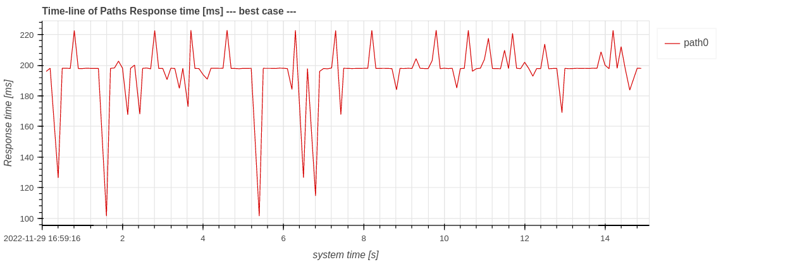
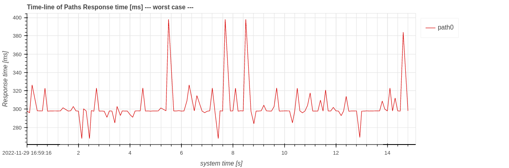
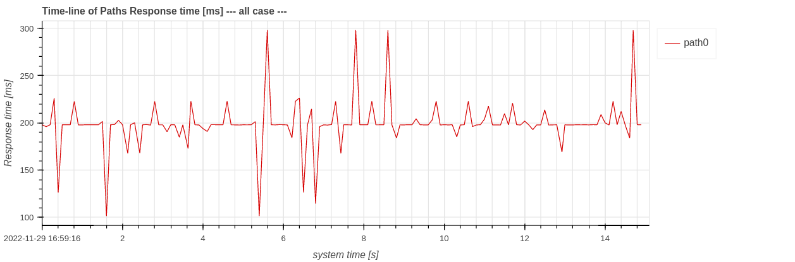

# Response Time

In context of CARET, response time is defined how much of time costs from a message input to message output of a target path.
Please refer to [FAQ](../../faq/faq.md#how-response-time-is-calculated) if you are interested in response time defined in CARET.

<prettier-ignore-start>
!!!Note
    "Response time" is generally used for the input/output of a system.
    Therefore, when analyzing a part of a system (when a target path is a part of end-to-end path), it should be referred to as "path latency (sum of node latency and communication latency)" rather than "response time".
    However, both will be referred to as "response time" for simplicity in this document.
<prettier-ignore-end>

Three cases of response time is defined; `best-to-worst`, `best`, and `worst`. With `best` case, CARET samples shortest time elapsed in a targeted path. With `worst` case, the previous message input timing is taken into account. `best-to-worst` case includes most of all cases between `best` and `worst`.

This section shows two methods to visualize response time, `Histogram` and `Stacked Bar`.
Execute the following script code to load trace data and an architecture object before calling this method.

```python
from caret_analyze.plot import Plot
from caret_analyze import Application, Architecture, Lttng
from bokeh.plotting import output_notebook, figure, show
output_notebook()

arch = Architecture('yaml', '/path/to/architecture_file')
lttng = Lttng('/path/to/trace_data')
app = Application(arch, lttng)
path = app.get_path('target_path')
```

## Histogram

The following scripts generate histograms of response time. Horizontal axis of the histograms means response time, labeled `Response Time [ms]` and vertical axis of the histograms means `Probability`.

```python
# plot best-to-worst case
plot = Plot.create_response_time_histogram_plot(path)
plot.show()
# or
# plot = Plot.create_response_time_histogram_plot(path, case='all')
# plot.show()
```

<prettier-ignore-start>
!!!info
    The `output_notebook()` is needed to show figures inside Jupyter Notebook.
<prettier-ignore-end>


```python
# plot best case
plot = Plot.create_response_time_histogram_plot(path, case='best')
plot.show()
```


```python
# plot worst case
plot = Plot.create_response_time_histogram_plot(path, case='worst')
plot.show()
```


```python
# plot worst-in-input case
plot = Plot.create_response_time_histogram_plot(path, case='worst-in-input')
plot.show()
```


## Stacked Bar

The following scripts generate stacked bar graphs of response time.
Horizontal axis of the stacked bar graph means timeseries and vertical axis means `Response time` in the worst, best, all, worst-in-input case.

```python
# plot worst case
plot = Plot.create_response_time_stacked_bar_plot(path)
plot.show()
# or
# plot = Plot.create_response_time_stacked_bar_plot(path, case='worst')
# plot.show()
```


```python
# plot best case
plot = Plot.create_response_time_stacked_bar_plot(path, case='best')
plot.show()
```


```python
# plot worst-in-input case
plot = Plot.create_response_time_stacked_bar_plot(path, case='worst-in-input')
plot.show()
```


```python
# plot all case
plot = Plot.create_response_time_stacked_bar_plot(path, case='all')
plot.show()
```


The horizontal axis can be changed to `system time` or `index` by changing `plot.show()` to `plot.show(xaxis_type='index')`.

`[worst - best] response time` in legends refers to the difference in response time between the worst case and the best case.

## TimeSeries

The following scripts generate timeseries graphs of response time. The horizontal axis means time, labeled as Time [s]. The vertical axis means `Response time` in the best case, worst case, worst-in-input case, or all case.

```python
# plot best case
plot = Plot.create_response_time_timeseries_plot(path)
plot.show()
# or
# plot = Plot.create_response_time_timeseries_plot(path, case='best')
# plot.show()
```



```python
# plot worst case
plot = Plot.create_response_time_timeseries_plot(path, case='worst')
plot.show()
```



```python
# plot worst_in_input case
plot = Plot.create_response_time_timeseries_plot(path, case='worst-in-input')
plot.show()
```


```python
# plot all case
plot = Plot.create_response_time_timeseries_plot(path, case='all')
plot.show()
```



The horizontal axis can be changed to `system time` or `index` by changing `plot.show()` to `plot.show(xaxis_type='index')` though `system_time` is the default value.
