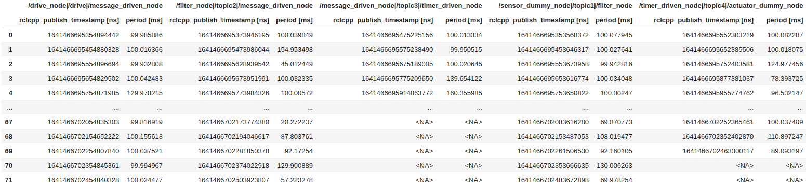
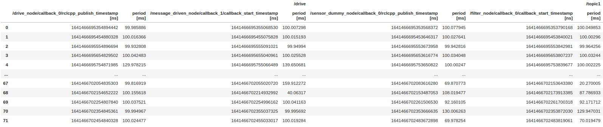

# Execution period

CARET can visualize periods of `CallbackBase`-based objects and `Communication`-based objects.
Any object can be visualized in the same `Plot.create_period_timeseries_plot(target_object)` interface.
This section describes sample visualization scripts for them.
Execute the following script code to load trace data and an architecture object before calling visualization API.

```python
from caret_analyze.plot import Plot
from caret_analyze import Application, Architecture, Lttng
from bokeh.plotting import output_notebook, figure, show
output_notebook()
arch = Architecture('yaml', '/path/to/architecture_file')
lttng = Lttng('/path/to/trace_data')
app = Application(arch, lttng)
```

## Callback

`Plot.create_period_timeseries_plot(callbacks: Collections[CallbackBase])` is introduced to check whether callback functions are called at their expected period. Period is more detailed metrics than frequency.

```python
### Timestamp tables
plot = Plot.create_period_timeseries_plot(app.callbacks)
period_df = plot.to_dataframe()
period_df

# ---Output in jupyter-notebook as below---
```


```python
### Time-line graph
plot = Plot.create_period_timeseries_plot(app.callbacks)
plot.show()

# ---Output in jupyter-notebook as below---
```


The horizontal axis means time, labeled as `Time [s]`. `xaxis_type` argument is prepared to select index of x-axis among Linux system time, [ROS simulation time](../../recording/sim_time.md), and 0-based ordering. One of `'system_time'`, `'sim_time'` and `'index'` is chosen as `xaxis_type` though `'system_time'` is the default value.
The vertical axis means period of callback execution, labeled as `Period [ms]`. It is plotted per sample.


## Communication

`Plot.create_period_timeseries_plot(communications: Collection[Communication])` is helpful if you want to see that communication period is stable or not.
For premise knowledge of communications, see [Premise of communication](../communication/premise_of_communication.md).

```python
### Timestamp tables
plot = Plot.create_period_timeseries_plot(app.communications)
period_df = plot.to_dataframe()
period_df

# ---Output in jupyter-notebook as below---
```


```python
### Time-line graph
plot = Plot.create_period_timeseries_plot(app.communications)
plot.show()

# ---Output in jupyter-notebook as below---
```


The horizontal axis means time, labeled as `Time [s]`. `xaxis_type` argument is prepared as well as the previous callback subsection.
The vertical axis means period, labeled as `Period [ms]`, from a certain execution of communication to next one.


## Publish and Subscription

`Plot.create_period_timeseries_plot(Collection[publish: Publisher or subscription: Subscriber])` is useful to check how stable invocation cycle of publisher or subscription is.

```python
### Timestamp tables
plot = Plot.create_period_timeseries_plot(*app.publishers, *app.subscriptions)
period_df = plot.to_dataframe()
period_df

# ---Output in jupyter-notebook as below---
```


```python
### Time-line graph
plot = Plot.create_period_timeseries_plot(*app.publishers, *app.subscriptions)
plot.show()

# ---Output in jupyter-notebook as below---
```


The horizontal axis means time, labeled as `Time [s]`. `xaxis_type` argument is prepared as well as the previous callback subsection.
The vertical axis means period of callback execution, labeled as `Period [ms]`. It is plotted per sample.
