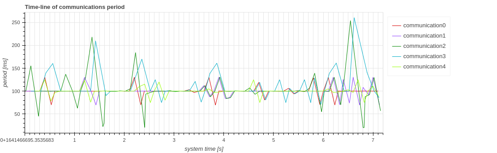
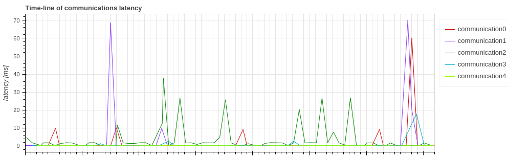

# Communication Information

Execute these commands in advance.
```python
from caret_analyze.plot import Plot
from caret_analyze import Application, Architecture, Lttng
from bokeh.plotting import output_notebook, figure, show
output_notebook()

arch = Architecture('yaml', '/path/to/architecture_file')
lttng = Lttng('/path/to/trace_data')
app = Application(arch, lttng)
comm = app.get_communications('topic_name')
comm = comm[0]
# or comm = app.get_communication('pub_node', 'sub_node', 'topic_name')
```
## Frequency

```python
plot = Plot.create_communication_frequency_plot(comm)
plot.show()
```


## Period

```python
plot = Plot.create_communication_period_plot(comm)
plot.show()
```



## Latency

```python
plot = Plot.create_communication_latency_plot(comm)
plot.show()
```

