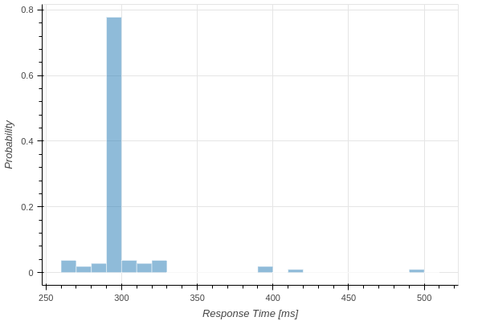
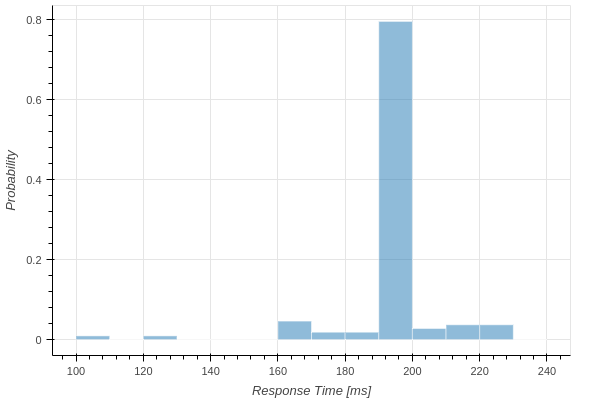

# Plot Response Time

Response Time is shown in Histogram.
Response Time has 3 cases ([default, best, worst]).
The difference is described in [Here](../../../faq/index#how-response-time-is-calculated).

```python
from caret_analyze.plot import Plot
from caret_analyze import Application, Architecture, Lttng
from bokeh.plotting import output_notebook, figure, show
output_notebook()

arch = Architecture('yaml', '/path/to/architecture_file')
lttng = Lttng('/path/to/trace_data')
app = Application(arch, lttng)
path = app.get_path('target_path')

# plot default case
plot = Plot.create_response_time_histogram_plot(path)
plot.show()
```


```python
# plot best case
plot = Plot.create_response_time_histogram_plot(path, case='best')
plot.show()
```



```python
# plot worst case
plot = Plot.create_response_time_histogram_plot(path, case='worst')
plot.show()
```


